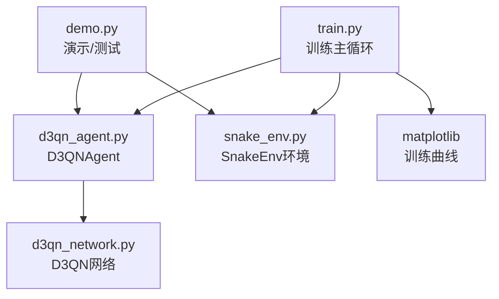
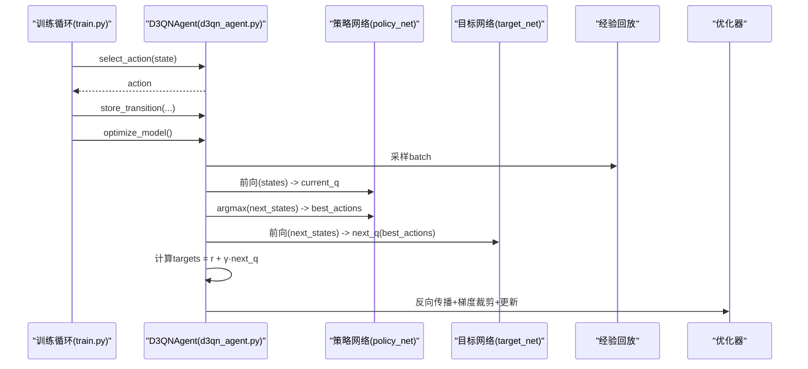
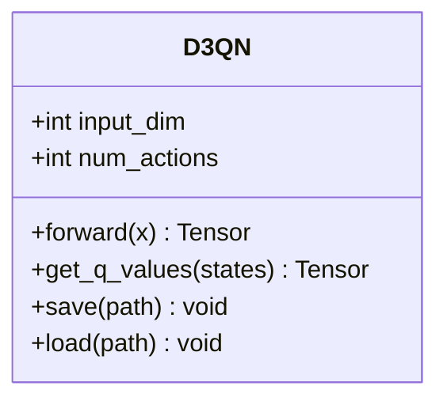
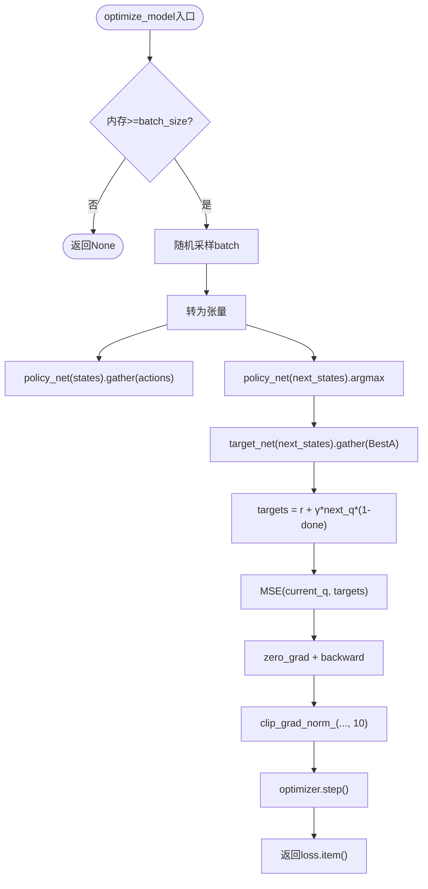
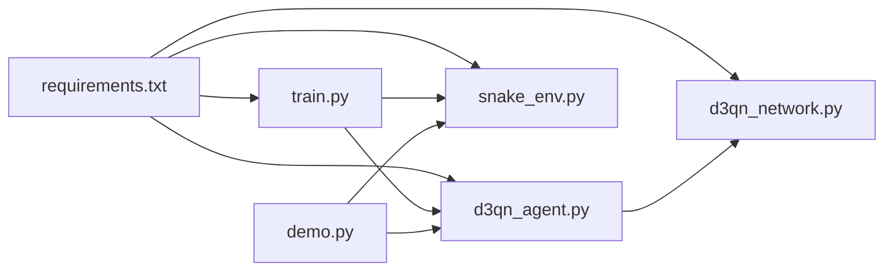

# D3QN算法实现

<cite>
**本文引用的文件**
- [README.md](file://README.md)
- [d3qn_agent.py](file://d3qn_agent.py)
- [d3qn_network.py](file://d3qn_network.py)
- [snake_env.py](file://snake_env.py)
- [train.py](file://train.py)
- [demo.py](file://demo.py)
- [requirements.txt](file://requirements.txt)
</cite>

## 目录
1. [简介](#简介)
2. [项目结构](#项目结构)
3. [核心组件](#核心组件)
4. [架构总览](#架构总览)
5. [详细组件分析](#详细组件分析)
6. [依赖关系分析](#依赖关系分析)
7. [性能与收敛性](#性能与收敛性)
8. [故障排查指南](#故障排查指南)
9. [结论](#结论)
10. [附录：超参数调优与实践建议](#附录超参数调优与实践建议)

## 简介
本项目实现了一个基于D3QN（Dueling Double Deep Q-Network）的强化学习智能体，用于在自定义的贪吃蛇环境中进行训练与测试。系统包含环境封装、D3QN网络、经验回放与目标网络机制、训练循环与可视化等完整模块，便于快速复现与扩展。

## 项目结构
- snake_env.py：自定义Gymnasium环境，提供状态观测、动作空间、奖励设计与渲染。
- d3qn_network.py：D3QN网络定义，采用Dueling架构（价值流V(s)与优势流A(s,a)）。
- d3qn_agent.py：D3QNAgent类，封装ε-贪婪探索、经验回放、Double DQN目标计算、优化与保存加载。
- train.py：Trainer类，组织训练循环、指标记录、模型保存与训练曲线绘制。
- demo.py：演示脚本，支持测试已训练模型、随机游玩与环境对比。
- requirements.txt：依赖声明。
- README.md：使用说明、配置项与常见问题。

图表来源
- [train.py:14-213](file://train.py#L14-L213)
- [d3qn_agent.py:17-157](file://d3qn_agent.py#L17-L157)
- [d3qn_network.py:10-90](file://d3qn_network.py#L10-L90)
- [snake_env.py:12-101](file://snake_env.py#L12-L101)

章节来源
- [README.md:17-31](file://README.md#L17-L31)
- [train.py:14-213](file://train.py#L14-L213)
- [d3qn_agent.py:17-157](file://d3qn_agent.py#L17-L157)
- [d3qn_network.py:10-90](file://d3qn_network.py#L10-L90)
- [snake_env.py:12-101](file://snake_env.py#L12-L101)

## 核心组件
- 环境 SnakeEnv：离散动作空间（上/下/左/右），9维视觉观测（8方向障碍距离+食物方向），奖励设计鼓励快速吃到食物并避免碰撞。
- 网络 D3QN：共享特征提取层后分叉为价值流V(s)和优势流A(s,a)，聚合得到Q(s,a)。
- 智能体 D3QNAgent：维护策略网络与目标网络、经验回放缓冲区、ε衰减、Double DQN目标计算、梯度裁剪与优化器。
- 训练器 Trainer：管理episode循环、指标统计、模型保存、收敛判断与可视化。

章节来源
- [snake_env.py:12-101](file://snake_env.py#L12-L101)
- [d3qn_network.py:10-90](file://d3qn_network.py#L10-L90)
- [d3qn_agent.py:17-157](file://d3qn_agent.py#L17-L157)
- [train.py:14-213](file://train.py#L14-L213)

## 架构总览
D3QN将Dueling与Double DQN结合：
- Dueling：分离V(s)与A(s,a)，通过Q(s,a)=V(s)+[A(s,a)-mean(A)]聚合，提升价值估计稳定性。
- Double DQN：使用当前网络选择动作，目标网络评估该动作的价值，缓解过估计偏差。

图表来源
- [train.py:39-78](file://train.py#L39-L78)
- [d3qn_agent.py:56-139](file://d3qn_agent.py#L56-L139)
- [d3qn_network.py:58-90](file://d3qn_network.py#L58-L90)

## 详细组件分析

### D3QN网络（Dueling架构）
- 输入：9维向量，经一维卷积与批归一化提取特征，再进入全连接共享层。
- 分支：
  - 价值流：输出V(s)标量。
  - 优势流：输出A(s,a)向量（长度=动作数）。
- 聚合：Q(s,a)=V(s)+(A(s,a)-mean(A))，保证平移不变性。

图表来源
- [d3qn_network.py:10-90](file://d3qn_network.py#L10-L90)

章节来源
- [d3qn_network.py:10-90](file://d3qn_network.py#L10-L90)

### D3QNAgent（ε-贪婪、经验回放、目标网络、Double DQN）
- ε-贪婪：训练时以概率ε随机探索，否则按当前策略最大化Q值选择动作；每步衰减ε至下限。
- 经验回放：固定容量deque存储Transition，采样小批量进行训练。
- 目标网络：周期性复制策略网络权重到目标网络，稳定TD目标。
- Double DQN目标：
  - 用策略网络在当前next_state选择最优动作best_a。
  - 用目标网络评估该动作的Q值next_q。
  - 目标：target = reward + γ·next_q（若未终止则乘(1-done)）。
- 损失与优化：MSE损失，Adam优化器，梯度裁剪防止爆炸。

图表来源
- [d3qn_agent.py:91-139](file://d3qn_agent.py#L91-L139)

章节来源
- [d3qn_agent.py:17-157](file://d3qn_agent.py#L17-L157)

### 环境 SnakeEnv（观测、动作、奖励）
- 观测：9维向量，8方向检测墙/身体障碍（负值表示距离），第9维编码食物相对方向。
- 动作：离散4个方向。
- 奖励：吃到食物+10，碰撞-10，超时-1，普通移动-0.1（鼓励更快找到食物）。
- 渲染：Pygame可视化网格、蛇身、食物与分数。

章节来源
- [snake_env.py:12-101](file://snake_env.py#L12-L101)
- [snake_env.py:111-158](file://snake_env.py#L111-L158)
- [snake_env.py:160-208](file://snake_env.py#L160-L208)

### 训练流程 Trainer
- 每个episode：reset→循环选择动作→step环境→存储transition→优化模型→步进计数器与ε衰减。
- 指标：记录reward、score、loss、epsilon；计算滑动平均；绘制训练曲线。
- 保存：定期保存模型checkpoint（含网络参数、优化器状态、epsilon、步数）。
- 收敛：最近100回合平均奖励超过阈值自动停止。

章节来源
- [train.py:14-213](file://train.py#L14-L213)

### 演示与测试 Demo
- 支持加载已训练模型进行无探索模式测试。
- 随机游玩验证环境基本功能。
- 不同网络结构对比（参数量与输出形状）。

章节来源
- [demo.py:11-158](file://demo.py#L11-L158)

## 依赖关系分析
- 运行时依赖：torch、numpy、gymnasium、pygame、matplotlib。
- 模块耦合：
  - train.py 依赖 d3qn_agent.py 与 snake_env.py。
  - d3qn_agent.py 依赖 d3qn_network.py。
  - demo.py 依赖 d3qn_agent.py 与 snake_env.py。
- 外部库：PyTorch用于网络与优化；Gymnasium作为环境接口；Pygame用于渲染；Matplotlib用于绘图。

图表来源
- [requirements.txt:1-15](file://requirements.txt#L1-L15)
- [train.py:1-12](file://train.py#L1-L12)
- [d3qn_agent.py:1-12](file://d3qn_agent.py#L1-L12)
- [d3qn_network.py:1-8](file://d3qn_network.py#L1-L8)
- [snake_env.py:1-10](file://snake_env.py#L1-L10)
- [demo.py:1-9](file://demo.py#L1-L9)

章节来源
- [requirements.txt:1-15](file://requirements.txt#L1-L15)
- [train.py:1-12](file://train.py#L1-L12)
- [d3qn_agent.py:1-12](file://d3qn_agent.py#L1-L12)
- [d3qn_network.py:1-8](file://d3qn_network.py#L1-L8)
- [snake_env.py:1-10](file://snake_env.py#L1-L10)
- [demo.py:1-9](file://demo.py#L1-L9)

## 性能与收敛性
- 收敛性分析
  - Double DQN通过解耦动作选择与评估降低Q值过估计，提高稳定性。
  - Dueling将状态价值与动作优势分离，有助于更稳定的价值估计。
  - 目标网络周期性更新减少TD目标的非平稳性。
  - 经验回放打破样本相关性，提升数据利用效率。
- 性能优化建议
  - 增大batch_size可平滑梯度但增加显存占用；根据GPU能力调整。
  - 适当减小grid_size或关闭渲染以提升训练速度。
  - 使用GPU加速（代码自动检测设备）。
  - 梯度裁剪防止不稳定更新。
  - 观察ε衰减曲线，确保足够探索时间。

章节来源
- [d3qn_agent.py:27-55](file://d3qn_agent.py#L27-L55)
- [d3qn_agent.py:91-139](file://d3qn_agent.py#L91-L139)
- [train.py:158-213](file://train.py#L158-L213)
- [README.md:169-184](file://README.md#L169-L184)

## 故障排查指南
- CUDA显存不足：减小batch_size或关闭渲染。
- 训练收敛慢：检查是否使用GPU、增大batch_size、缩小网格尺寸、确认ε衰减不过快。
- 智能体不学习：确认渲染未拖慢训练、检查ε衰减设置、验证环境奖励信号合理。
- 游戏无法启动：安装pygame，清理残留窗口进程。

章节来源
- [README.md:232-249](file://README.md#L232-L249)

## 结论
本实现将Dueling与Double DQN有机结合，配合经验回放与目标网络，在贪吃蛇任务中实现了稳定高效的训练流程。模块化设计便于扩展（如优先经验回放、多智能体、课程学习等），并提供完整的训练、可视化与测试工具链。

## 附录：超参数调优与实践建议
- 学习率（lr）：默认1e-4，Adam对lr较鲁棒；若训练震荡可尝试降低至5e-5或提高至2e-4。
- 折扣因子（gamma）：默认0.99，强调长期回报；对于短视任务可适当降低。
- 批量大小（batch_size）：默认64，增大可稳定梯度但需更多显存；过小可能导致噪声大。
- 经验池容量（buffer_size）：默认100000，容量越大历史经验越多，但采样可能不够新鲜；可按任务复杂度调整。
- 目标网络更新频率（target_update）：默认1000步；更新太频繁会不稳定，太稀疏会降低目标质量。
- ε调度：
  - epsilon_start=1.0，epsilon_end=0.05，epsilon_decay=0.995；可根据任务难度调整衰减速度与下限。
- 其他：
  - 梯度裁剪阈值：默认10，防止梯度爆炸。
  - 网络结构：可增加隐藏层维度或通道数以增强表达能力，但需权衡训练成本。

实践建议
- 先在小网格（如15×15）快速验证，再扩展到更大网格。
- 初期关闭渲染，待策略稳定后再开启可视化调试。
- 监控训练曲线（奖励、分数、损失、ε），出现平台期时可尝试调整上述超参数。
- 定期保存checkpoint，便于回溯最佳模型。

章节来源
- [d3qn_agent.py:27-55](file://d3qn_agent.py#L27-L55)
- [d3qn_agent.py:91-139](file://d3qn_agent.py#L91-L139)
- [train.py:158-213](file://train.py#L158-L213)
- [README.md:76-99](file://README.md#L76-L99)
- [README.md:169-184](file://README.md#L169-L184)