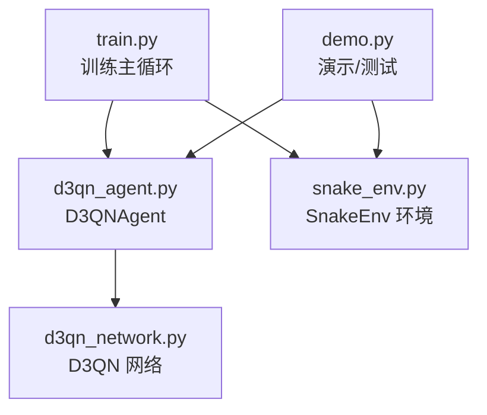
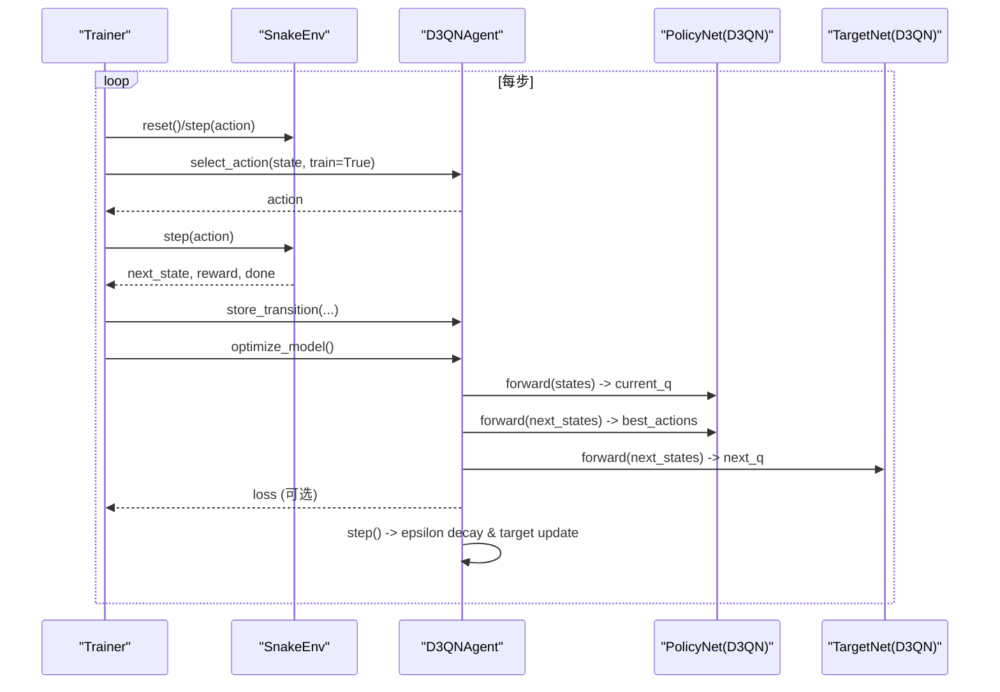
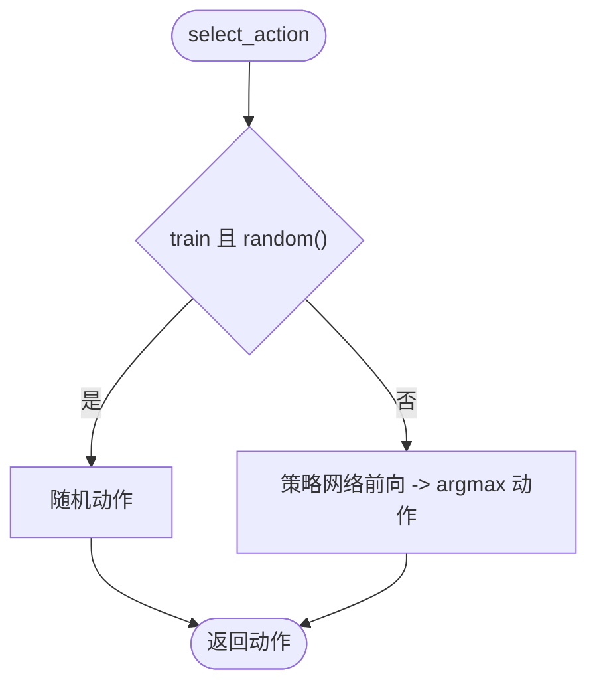
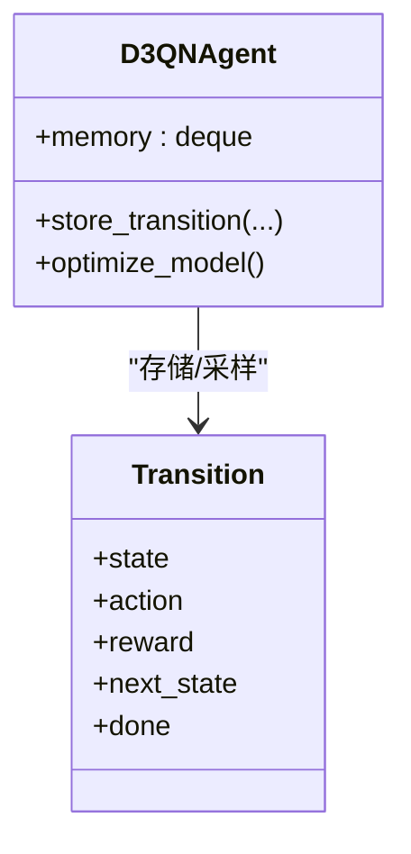
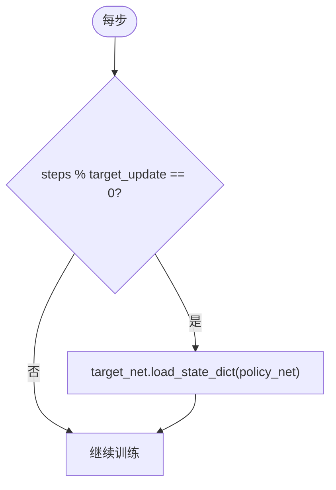
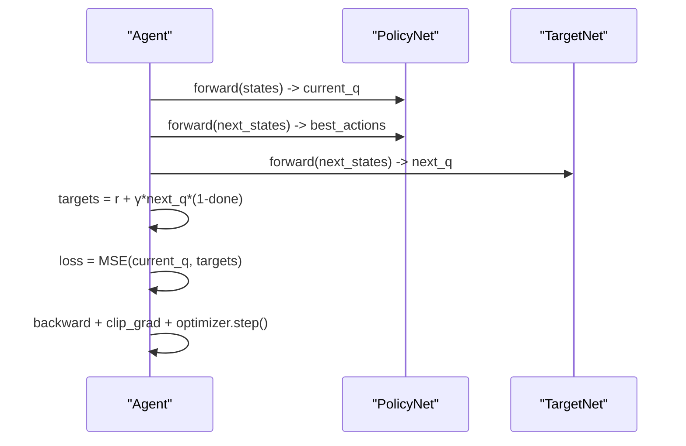
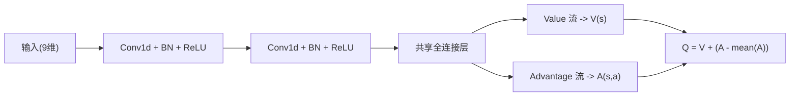
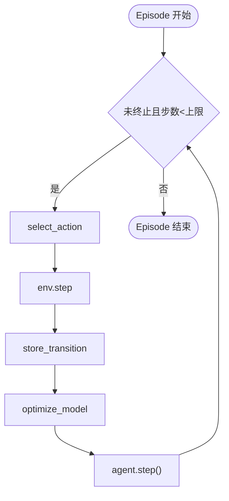
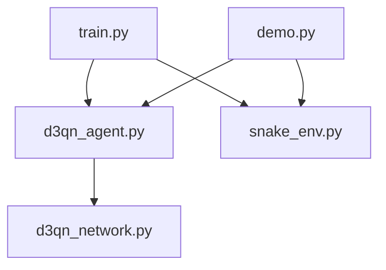

# 智能体逻辑实现

<cite>
**本文引用的文件**
- [d3qn_agent.py](file://d3qn_agent.py)
- [d3qn_network.py](file://d3qn_network.py)
- [snake_env.py](file://snake_env.py)
- [train.py](file://train.py)
- [demo.py](file://demo.py)
- [README.md](file://README.md)
</cite>

## 目录
1. [简介](#简介)
2. [项目结构](#项目结构)
3. [核心组件](#核心组件)
4. [架构总览](#架构总览)
5. [详细组件分析](#详细组件分析)
6. [依赖关系分析](#依赖关系分析)
7. [性能考量](#性能考量)
8. [故障排查指南](#故障排查指南)
9. [结论](#结论)
10. [附录：超参数配置与使用示例](#附录：超参数配置与使用示例)

## 简介
本技术文档围绕 D3QN（Dueling Double Deep Q-Network）智能体的实现，系统阐述以下要点：
- ε-贪婪探索策略的原理与参数调优
- 经验回放缓冲区的管理机制（Transition 数据结构、存储策略、采样算法）
- 目标网络更新机制（周期性同步与参数传递）
- 动作选择策略（训练模式下的探索与利用平衡）
- 优化过程（双重 Q 学习目标计算、损失函数优化、梯度裁剪）
- 超参数配置指南（学习率、折扣因子、批量大小等）
- 具体代码示例与使用模式

该实现以 PyTorch 为后端，结合自定义 Gym 环境完成蛇游戏的强化学习训练与演示。

## 项目结构
仓库采用按功能模块划分的组织方式：
- 环境与交互：snake_env.py
- 网络模型：d3qn_network.py
- 智能体与训练循环：d3qn_agent.py、train.py
- 演示与测试：demo.py
- 说明文档：README.md

图表来源
- [train.py:14-78](file://train.py#L14-L78)
- [d3qn_agent.py:17-157](file://d3qn_agent.py#L17-L157)
- [d3qn_network.py:10-94](file://d3qn_network.py#L10-L94)
- [snake_env.py:12-101](file://snake_env.py#L12-L101)

章节来源
- [README.md:17-31](file://README.md#L17-L31)
- [train.py:14-78](file://train.py#L14-L78)

## 核心组件
- D3QNAgent：封装 ε-贪婪策略、经验回放、目标网络、优化步骤与模型持久化
- D3QN：双流（Value/Advantage）网络，输出各动作的 Q 值
- SnakeEnv：提供状态空间、动作空间、奖励信号与可视化渲染
- Trainer：训练循环、指标记录、模型保存与收敛判断
- Demo：加载已训练模型进行推理演示或随机游玩

章节来源
- [d3qn_agent.py:17-157](file://d3qn_agent.py#L17-L157)
- [d3qn_network.py:10-94](file://d3qn_network.py#L10-L94)
- [snake_env.py:12-101](file://snake_env.py#L12-L101)
- [train.py:14-215](file://train.py#L14-L215)
- [demo.py:11-65](file://demo.py#L11-L65)

## 架构总览
下图展示了训练过程中关键对象之间的交互：Trainer 驱动环境步进，Agent 负责动作选择、存储转移、优化与目标网络更新；网络层由 D3QN 提供。

图表来源
- [train.py:39-78](file://train.py#L39-L78)
- [d3qn_agent.py:56-139](file://d3qn_agent.py#L56-L139)
- [d3qn_network.py:58-90](file://d3qn_network.py#L58-L90)

## 详细组件分析

### D3QNAgent：ε-贪婪探索与动作选择
- 探索策略：在训练模式下以概率 ε 随机选择动作，否则根据当前策略网络输出取最大 Q 值对应的动作；ε 随每步指数衰减至下限。
- 参数调优建议：
  - ε_start：初始探索强度，通常设为 1.0 保证充分探索
  - ε_end：最终探索下限，避免完全停止探索，常见 0.01~0.1
  - ε_decay：衰减速度，过快可能导致欠探索，过慢延长收敛时间
- 动作选择流程：
  - 训练模式：随机 vs 贪心
  - 推理模式：纯贪心（不加入噪声）

图表来源
- [d3qn_agent.py:56-75](file://d3qn_agent.py#L56-L75)

章节来源
- [d3qn_agent.py:27-85](file://d3qn_agent.py#L27-L85)

### 经验回放缓冲区：Transition 与采样
- Transition 数据结构：包含 state、action、reward、next_state、done 五元组，便于批量处理与向量化。
- 存储策略：使用固定容量队列（deque），超过容量时自动丢弃最旧样本，保证内存稳定。
- 采样算法：均匀随机采样 batch_size 个样本，构造张量后送入优化器。
- 扩展能力：提供了 MemoryReplayBuffer 类用于优先经验回放（可选）。

图表来源
- [d3qn_agent.py:14-15](file://d3qn_agent.py#L14-L15)
- [d3qn_agent.py:77-104](file://d3qn_agent.py#L77-L104)

章节来源
- [d3qn_agent.py:14-15](file://d3qn_agent.py#L14-L15)
- [d3qn_agent.py:77-104](file://d3qn_agent.py#L77-L104)

### 目标网络更新机制：周期性同步
- 更新频率：每 N 步（target_update）将策略网络的参数复制到目标网络，保持目标值稳定。
- 参数传递：通过 load_state_dict 直接拷贝权重，避免频繁反向传播带来的不稳定。
- 设计动机：降低目标值漂移，缓解 Q 值过估计问题。

图表来源
- [d3qn_agent.py:82-89](file://d3qn_agent.py#L82-L89)

章节来源
- [d3qn_agent.py:27-43](file://d3qn_agent.py#L27-L43)
- [d3qn_agent.py:82-89](file://d3qn_agent.py#L82-L89)

### 优化过程：双重 Q 学习与损失优化
- 双重 Q 学习：
  - 用策略网络选择 next_state 的最优动作
  - 用目标网络评估该动作的 Q 值，得到目标值
- 目标值计算：targets = reward + γ * next_q（考虑 done 掩码）
- 损失函数：MSE(current_q, targets)
- 梯度裁剪：clip_grad_norm_ 防止梯度爆炸
- 优化器：Adam，默认学习率 1e-4

图表来源
- [d3qn_agent.py:91-139](file://d3qn_agent.py#L91-L139)

章节来源
- [d3qn_agent.py:91-139](file://d3qn_agent.py#L91-L139)

### 网络架构：Dueling DQN
- 共享特征提取：卷积层 + 批归一化 + ReLU
- 双流分支：
  - Value 流：估计状态价值 V(s)
  - Advantage 流：估计动作优势 A(s,a)
- 聚合公式：Q(s,a) = V(s) + (A(s,a) - mean(A))
- 输入维度：9（对应环境的视觉观测）

图表来源
- [d3qn_network.py:20-90](file://d3qn_network.py#L20-L90)

章节来源
- [d3qn_network.py:10-94](file://d3qn_network.py#L10-L94)

### 训练循环与指标管理
- 训练循环：每步执行动作选择、环境步进、存储转移、优化、步计数与目标网络更新
- 指标记录：奖励、分数、损失、ε 值
- 收敛判定：最近 100 步平均奖励阈值触发早停
- 模型保存：定期保存检查点，便于后续推理

图表来源
- [train.py:39-78](file://train.py#L39-L78)

章节来源
- [train.py:39-78](file://train.py#L39-L78)
- [train.py:158-215](file://train.py#L158-L215)

## 依赖关系分析
- d3qn_agent.py 依赖 d3qn_network.py（网络定义）、torch（张量与优化）、collections（缓冲）、random（采样）
- train.py 依赖 snake_env.py（环境）、d3qn_agent.py（智能体）
- demo.py 依赖 snake_env.py、d3qn_agent.py，并可选择加载已训练模型

图表来源
- [train.py:1-12](file://train.py#L1-L12)
- [d3qn_agent.py:1-12](file://d3qn_agent.py#L1-L12)
- [demo.py:1-9](file://demo.py#L1-L9)

章节来源
- [train.py:1-12](file://train.py#L1-L12)
- [d3qn_agent.py:1-12](file://d3qn_agent.py#L1-L12)
- [demo.py:1-9](file://demo.py#L1-L9)

## 性能考量
- 设备选择：自动检测 CUDA，若可用则使用 GPU 加速
- 批量大小：增大 batch_size 可提升梯度稳定性，但需更多显存
- 目标网络更新频率：target_update 过小会增加目标值波动，过大可能延迟收敛
- 梯度裁剪：clip_grad_norm_ 防止训练不稳定
- 渲染开销：训练时关闭渲染可显著提升速度

[本节为通用指导，不直接分析具体文件]

## 故障排查指南
- CUDA 显存不足：减小 batch_size 或关闭渲染
- 训练收敛缓慢：确认 GPU 启用、适当增大 batch_size、缩短 episode 长度或调整 ε 衰减
- 智能体不学习：检查 ε 是否过早衰减到很小、确保经验回放足够大
- 游戏无法启动：安装 pygame，清理残留窗口

章节来源
- [README.md:232-249](file://README.md#L232-L249)

## 结论
本实现完整覆盖了 D3QN 的关键要素：双流网络、双重 Q 学习、经验回放与目标网络同步。通过合理的超参数设置与训练循环设计，能够在蛇游戏中学习到稳定的导航与觅食策略。建议在资源受限环境下优先调整 batch_size 与 target_update，以获得更稳健的训练曲线。

[本节为总结性内容，不直接分析具体文件]

## 附录：超参数配置与使用示例

### 关键超参数与作用
- 学习率（lr）：影响优化步长，过大易震荡，过小收敛慢
- 折扣因子（gamma）：权衡即时与远期回报，常用 0.99
- 批量大小（batch_size）：影响梯度估计方差与显存占用
- 经验回放容量（buffer_size）：决定历史样本保留数量
- 目标网络更新频率（target_update）：控制目标值稳定性与响应速度
- ε 相关（ε_start、ε_end、ε_decay）：控制探索强度与衰减速度

章节来源
- [d3qn_agent.py:27-54](file://d3qn_agent.py#L27-L54)
- [README.md:76-99](file://README.md#L76-L99)

### 使用模式与示例路径
- 训练入口：运行训练脚本，进入训练循环
  - 参考路径：[train.py:237-245](file://train.py#L237-L245)
- 单步训练流程：从环境步进到模型优化的完整调用链
  - 参考路径：[train.py:39-78](file://train.py#L39-L78)
- 动作选择（训练/推理）：
  - 训练模式（含探索）：[d3qn_agent.py:56-75](file://d3qn_agent.py#L56-L75)
  - 推理模式（纯利用）：[demo.py:43-48](file://demo.py#L43-L48)
- 经验回放与优化：
  - 存储转移：[d3qn_agent.py:77-80](file://d3qn_agent.py#L77-L80)
  - 采样与优化：[d3qn_agent.py:91-139](file://d3qn_agent.py#L91-L139)
- 目标网络同步：
  - 周期同步：[d3qn_agent.py:82-89](file://d3qn_agent.py#L82-L89)
- 模型保存与加载：
  - 保存：[d3qn_agent.py:141-148](file://d3qn_agent.py#L141-L148)
  - 加载（训练脚本中）：[train.py:142-147](file://train.py#L142-L147)
  - 加载（演示脚本中）：[demo.py:18-27](file://demo.py#L18-L27)

[本节提供使用指引与代码路径，不展示具体代码内容]