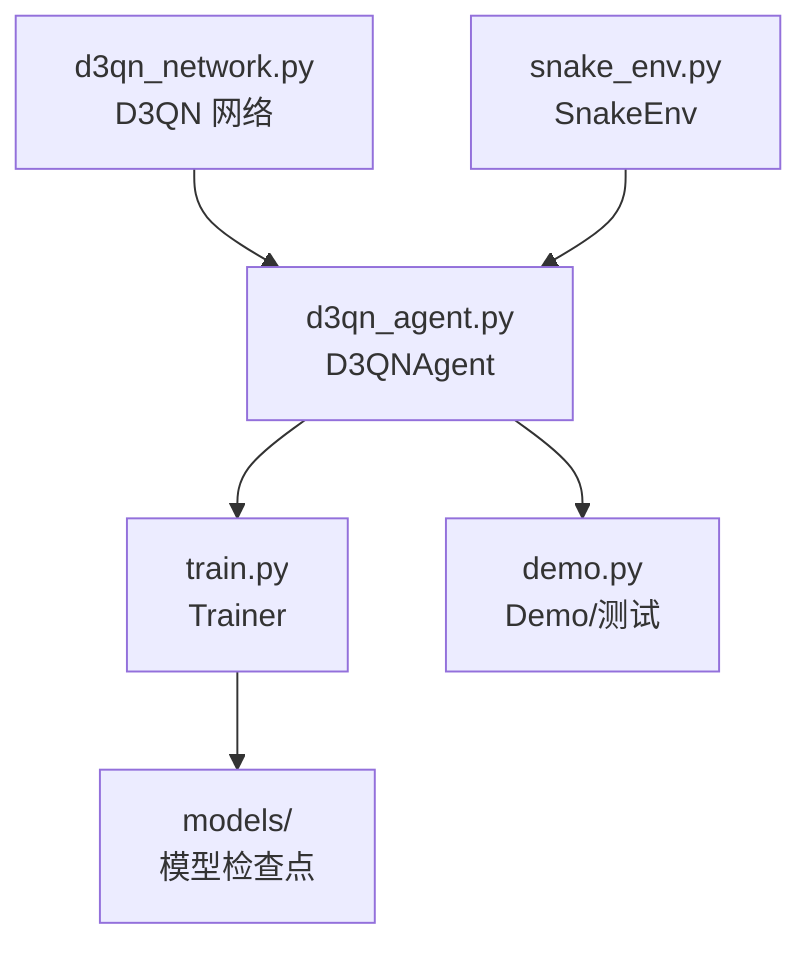
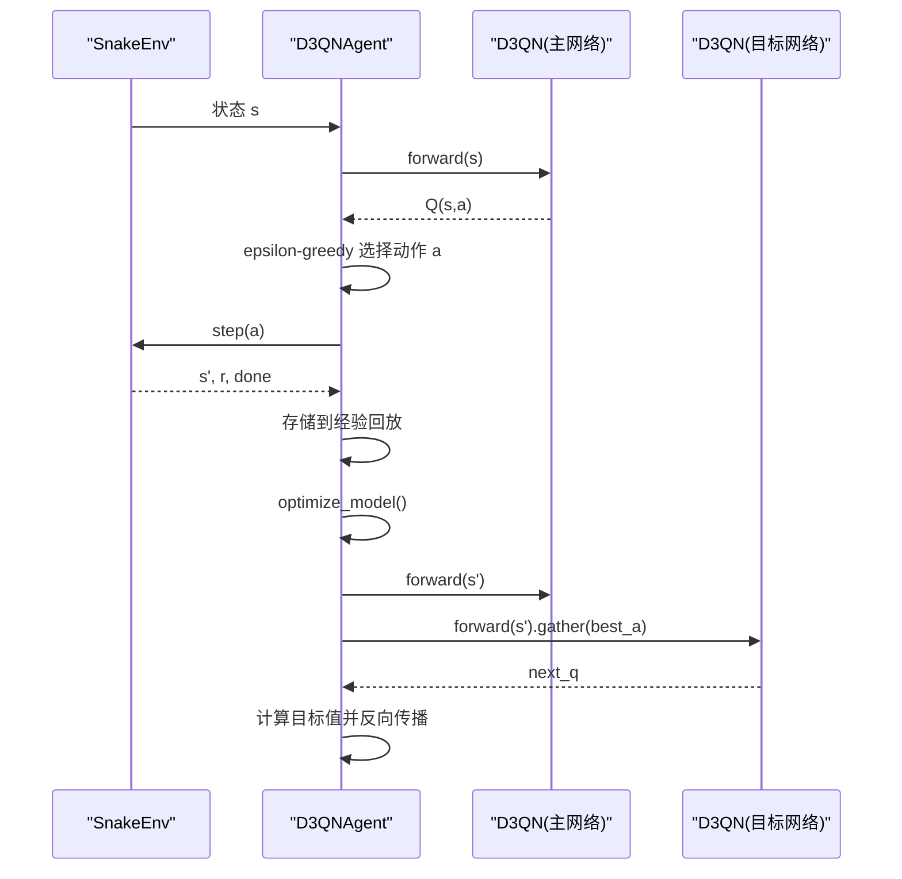
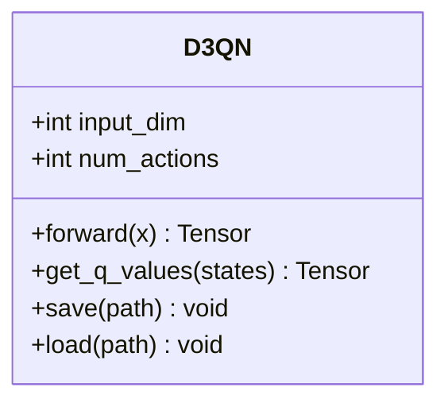
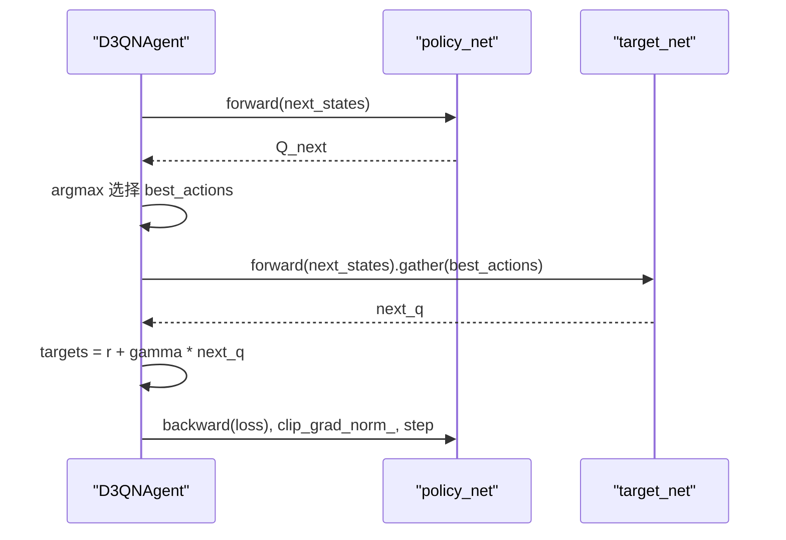
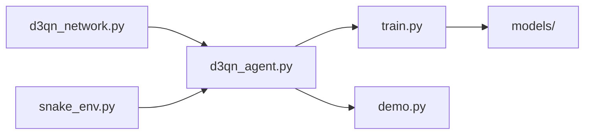
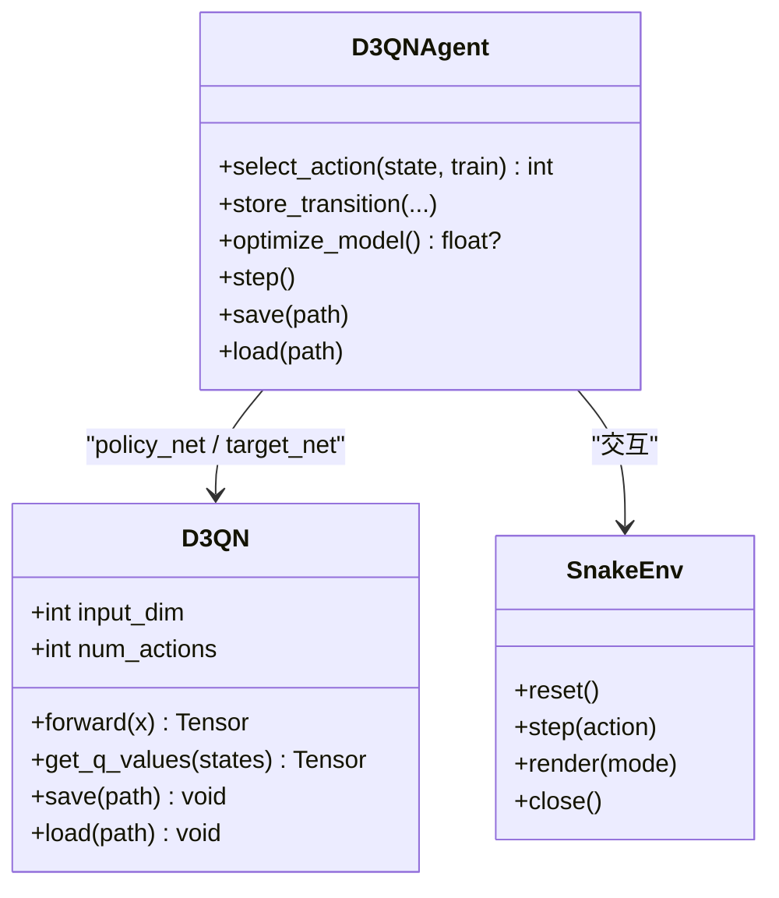

# 神经网络架构设计

<cite>
**本文引用的文件**
- [d3qn_network.py](file://d3qn_network.py)
- [d3qn_agent.py](file://d3qn_agent.py)
- [train.py](file://train.py)
- [demo.py](file://demo.py)
- [snake_env.py](file://snake_env.py)
- [README.md](file://README.md)
- [requirements.txt](file://requirements.txt)
</cite>

## 目录
1. [简介](#简介)
2. [项目结构](#项目结构)
3. [核心组件](#核心组件)
4. [架构总览](#架构总览)
5. [详细组件分析](#详细组件分析)
6. [依赖关系分析](#依赖关系分析)
7. [性能考量](#性能考量)
8. [故障排查指南](#故障排查指南)
9. [结论](#结论)
10. [附录](#附录)

## 简介
本技术文档围绕 D3QN（Dueling Double Deep Q-Network）的神经网络架构设计与实现进行系统化说明。重点包括：
- Dueling 网络的价值流与优势流的分离设计、前向传播数据流与特征提取过程
- 卷积层与全连接层的配置、输入维度处理、特征映射与输出维度设计
- 聚合公式 Q(s,a) = V(s) + (A(s,a) - mean(A)) 的数学原理与实现细节
- 网络初始化策略与参数配置选项
- 网络结构可视化图与性能分析
- 自定义网络扩展接口与最佳实践

该实现面向一个基于局部视觉观察的贪吃蛇环境，使用 PyTorch 构建并训练。

## 项目结构
仓库包含以下关键模块：
- d3qn_network.py：D3QN 网络定义（卷积+共享层+双分支+聚合）
- d3qn_agent.py：D3QN 智能体（主/目标网络、经验回放、Double Q-learning 更新）
- snake_env.py：贪吃蛇环境（9维局部视觉观测、离散动作空间）
- train.py：训练循环与指标记录
- demo.py：演示与测试脚本
- README.md：项目说明与使用说明
- requirements.txt：依赖声明

图表来源
- [d3qn_network.py:10-90](file://d3qn_network.py#L10-L90)
- [d3qn_agent.py:17-156](file://d3qn_agent.py#L17-L156)
- [snake_env.py:12-158](file://snake_env.py#L12-L158)
- [train.py:14-215](file://train.py#L14-L215)
- [demo.py:11-152](file://demo.py#L11-L152)

章节来源
- [README.md:17-31](file://README.md#L17-L31)

## 核心组件
- D3QN 网络：包含一维卷积特征提取、共享全连接层、价值流与优势流双分支、以及聚合得到 Q(s,a)
- D3QNAgent：封装主/目标网络、经验回放、epsilon-greedy 探索、Double Q-learning 目标计算与优化步骤
- SnakeEnv：提供 9 维局部视觉观测与 4 个离散动作，定义奖励与终止条件
- Trainer：训练循环、指标统计、模型保存与可视化

章节来源
- [d3qn_network.py:10-90](file://d3qn_network.py#L10-L90)
- [d3qn_agent.py:17-156](file://d3qn_agent.py#L17-L156)
- [snake_env.py:12-158](file://snake_env.py#L12-L158)
- [train.py:14-215](file://train.py#L14-L215)

## 架构总览
D3QN 采用“共享特征提取 + 双分支 + 聚合”的设计：
- 输入为 9 维向量，先 reshape 为一维序列以适配 Conv1d
- 两层 Conv1d + BatchNorm + ReLU 提取时序/方向性特征
- 展平后进入共享全连接层
- 分别通过价值流与优势流得到 V(s) 与 A(s,a)
- 聚合得到 Q(s,a) = V(s) + (A(s,a) - mean(A))

图表来源
- [d3qn_agent.py:56-139](file://d3qn_agent.py#L56-L139)
- [d3qn_network.py:58-90](file://d3qn_network.py#L58-L90)
- [snake_env.py:58-101](file://snake_env.py#L58-L101)

## 详细组件分析

### D3QN 网络：Dueling 架构与前向流程
- 输入与预处理
  - 输入形状 (batch_size, input_dim=9)
  - 在 forward 中执行 unsqueeze(1) 变为 (batch_size, 1, 9)，以适配 Conv1d
- 卷积特征提取
  - conv1: 1→16 通道，kernel=3，padding=1；bn1；ReLU
  - conv2: 16→32 通道，kernel=3，padding=1；bn2；ReLU
  - 展平后维度为 32*9
- 共享全连接层
  - Linear(32*9 → fc1_dim) + ReLU + Dropout(0.2)
- 双分支
  - 价值流：Linear(fc1_dim → fc2_dim) + ReLU + Linear(fc2_dim → 1) 输出 V(s)
  - 优势流：Linear(fc1_dim → fc2_dim) + ReLU + Linear(fc2_dim → num_actions) 输出 A(s,a)
- 聚合
  - Q = V + (A - mean(A, dim=1, keepdim=True))
  - 输出形状 (batch_size, num_actions)

图表来源
- [d3qn_network.py:20-90](file://d3qn_network.py#L20-L90)

章节来源
- [d3qn_network.py:20-90](file://d3qn_network.py#L20-L90)

#### 类与方法关系图

图表来源
- [d3qn_network.py:10-106](file://d3qn_network.py#L10-L106)

### 智能体：Double Q-learning 与经验回放
- 主/目标网络
  - policy_net 用于动作选择与当前 Q 估计
  - target_net 用于稳定目标值估计，定期同步
- 探索与利用
  - epsilon-greedy：随机探索或根据 Q 值选择最优动作
- 经验回放
  - 固定容量 deque 存储 Transition(state, action, reward, next_state, done)
- 训练步骤
  - 采样 batch，计算 current_q
  - 用 policy_net 选择 best_action，用 target_net 评估 next_q
  - 目标值 targets = r + gamma * next_q * (1-done)
  - MSE 损失，梯度裁剪，Adam 优化

图表来源
- [d3qn_agent.py:91-139](file://d3qn_agent.py#L91-L139)

章节来源
- [d3qn_agent.py:17-156](file://d3qn_agent.py#L17-L156)

### 环境：观测与奖励设计
- 观测空间
  - 9 维向量：8 个方向的障碍距离（负值表示障碍物），第 9 维为食物相对方向编码
- 动作空间
  - 离散 4 动作：上、下、左、右
- 奖励
  - 吃到食物 +10，碰撞 -10，每步 -0.1，超时 -1

章节来源
- [snake_env.py:15-158](file://snake_env.py#L15-L158)

### 聚合公式：Q(s,a) = V(s) + (A(s,a) - mean(A))
- 数学动机
  - 将状态价值 V(s) 与动作优势 A(s,a) 解耦，避免对每个动作都估计绝对 Q 值带来的方差
  - 减去 mean(A) 保证优势项均值为 0，使 V(s) 具有可解释性（状态整体价值）
- 实现细节
  - 在聚合时按动作维度求均值并保持维度以便广播
  - 最终 Q(s,a) 形状为 (batch_size, num_actions)

章节来源
- [d3qn_network.py:82-90](file://d3qn_network.py#L82-L90)

### 卷积层与全连接层配置
- 卷积层
  - 输入通道 1，第一层输出 16，第二层输出 32
  - kernel_size=3，padding=1，保持长度不变
  - 配合 BatchNorm1d 与 ReLU
- 全连接层
  - 共享层：32*9 → fc1_dim（默认 128）
  - 价值流：fc1_dim → fc2_dim（默认 128）→ 1
  - 优势流：fc1_dim → fc2_dim → num_actions（默认 4）
- 输入维度处理
  - 原始输入 (B,9) → unsqueeze(1) 成 (B,1,9) 以适配 Conv1d
  - 卷积后展平为 (B, 32*9)

章节来源
- [d3qn_network.py:20-56](file://d3qn_network.py#L20-L56)
- [d3qn_network.py:58-80](file://d3qn_network.py#L58-L80)

### 网络初始化与参数配置
- 初始化
  - 继承 nn.Module，构造各层模块
  - 超参数：input_dim、num_actions、fc1_dim、fc2_dim
- 设备与优化器
  - 智能体中将网络移动到 device（CPU/GPU）
  - Adam 优化器，学习率 1e-4
  - 梯度裁剪：clip_grad_norm_ 上限 10
- 目标网络同步
  - 每隔 target_update 步将 policy_net 权重复制到 target_net

章节来源
- [d3qn_network.py:20-56](file://d3qn_network.py#L20-L56)
- [d3qn_agent.py:27-47](file://d3qn_agent.py#L27-L47)
- [d3qn_agent.py:82-90](file://d3qn_agent.py#L82-L90)

### 训练流程与指标
- 训练循环
  - 每步选择动作、执行环境、存储转移、优化模型、更新 epsilon 与目标网络
- 指标记录
  - 奖励、分数、损失、epsilon 衰减曲线
  - 滑动平均评估收敛
- 模型保存
  - 周期性保存检查点到 models/

章节来源
- [train.py:39-215](file://train.py#L39-L215)

## 依赖关系分析
- 模块耦合
  - d3qn_agent.py 依赖 d3qn_network.py 与 snake_env.py
  - train.py 依赖 d3qn_agent.py 与 snake_env.py
  - demo.py 依赖 d3qn_agent.py、snake_env.py 与 d3qn_network.py
- 外部依赖
  - torch、numpy、gymnasium、pygame、matplotlib

图表来源
- [d3qn_agent.py:1-156](file://d3qn_agent.py#L1-L156)
- [train.py:1-215](file://train.py#L1-L215)
- [demo.py:1-152](file://demo.py#L1-L152)

章节来源
- [requirements.txt:1-15](file://requirements.txt#L1-L15)

## 性能考量
- 批大小与内存
  - 增大 batch_size 可提升梯度稳定性，但需更多显存
- 设备加速
  - 自动检测 GPU，确保网络与张量在同一设备
- 梯度裁剪
  - 防止梯度爆炸，提高训练稳定性
- 目标网络更新频率
  - target_update 越大越稳定但可能降低学习效率
- 卷积 vs 全连接
  - 当前使用 Conv1d 提取方向性特征；若改为纯 MLP 可减少参数量与计算开销

[本节为通用指导，不直接分析具体文件]

## 故障排查指南
- CUDA 显存不足
  - 减小 batch_size 或关闭渲染
- 训练收敛慢
  - 检查是否使用 GPU、适当增大 batch_size、调整 epsilon 衰减
- 游戏无法启动
  - 确认 pygame 已安装且无僵尸窗口
- 模型加载失败
  - 检查路径与版本兼容性

章节来源
- [README.md:232-249](file://README.md#L232-L249)

## 结论
本项目实现了完整的 D3QN 架构与训练流程，结合 Dueling 网络的优势分解与 Double Q-learning 的目标估计，提供了稳定的强化学习训练范式。通过清晰的模块化设计，便于扩展与定制。建议在实际应用中根据任务特性调整卷积与全连接层配置、探索策略与目标网络更新频率，以获得更好的训练效率与最终性能。

[本节为总结性内容，不直接分析具体文件]

## 附录

### 网络结构可视化图（代码级）

图表来源
- [d3qn_network.py:10-106](file://d3qn_network.py#L10-L106)
- [d3qn_agent.py:17-156](file://d3qn_agent.py#L17-L156)
- [snake_env.py:12-209](file://snake_env.py#L12-L209)

### 自定义网络扩展接口与最佳实践
- 扩展点
  - 修改卷积层通道数、核大小与层数以增强特征提取能力
  - 调整 fc1_dim/fc2_dim 改变全连接层容量
  - 替换聚合方式（如 max pooling 替代 mean）以适配不同任务
- 最佳实践
  - 保持数值稳定：使用 BatchNorm、Dropout、梯度裁剪
  - 合理设置学习率与优化器参数
  - 监控损失与奖励曲线，及时调整超参数
  - 使用目标网络与经验回放提高样本效率与稳定性

章节来源
- [d3qn_network.py:20-90](file://d3qn_network.py#L20-L90)
- [d3qn_agent.py:27-47](file://d3qn_agent.py#L27-L47)
- [d3qn_agent.py:82-139](file://d3qn_agent.py#L82-L139)