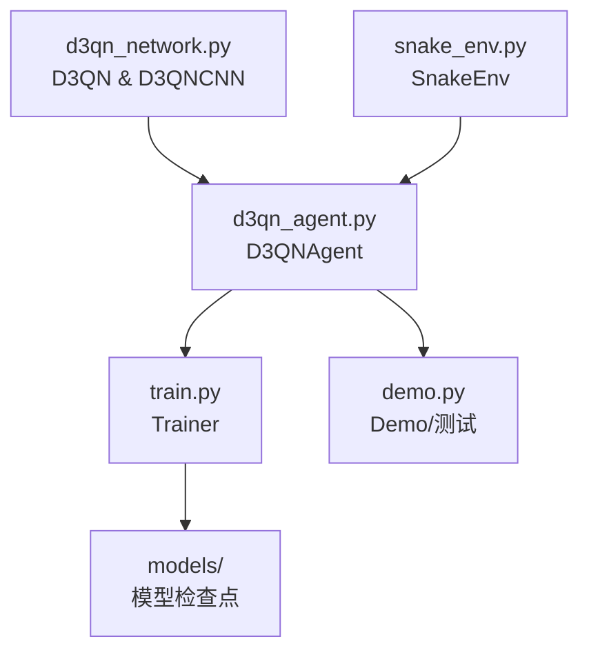
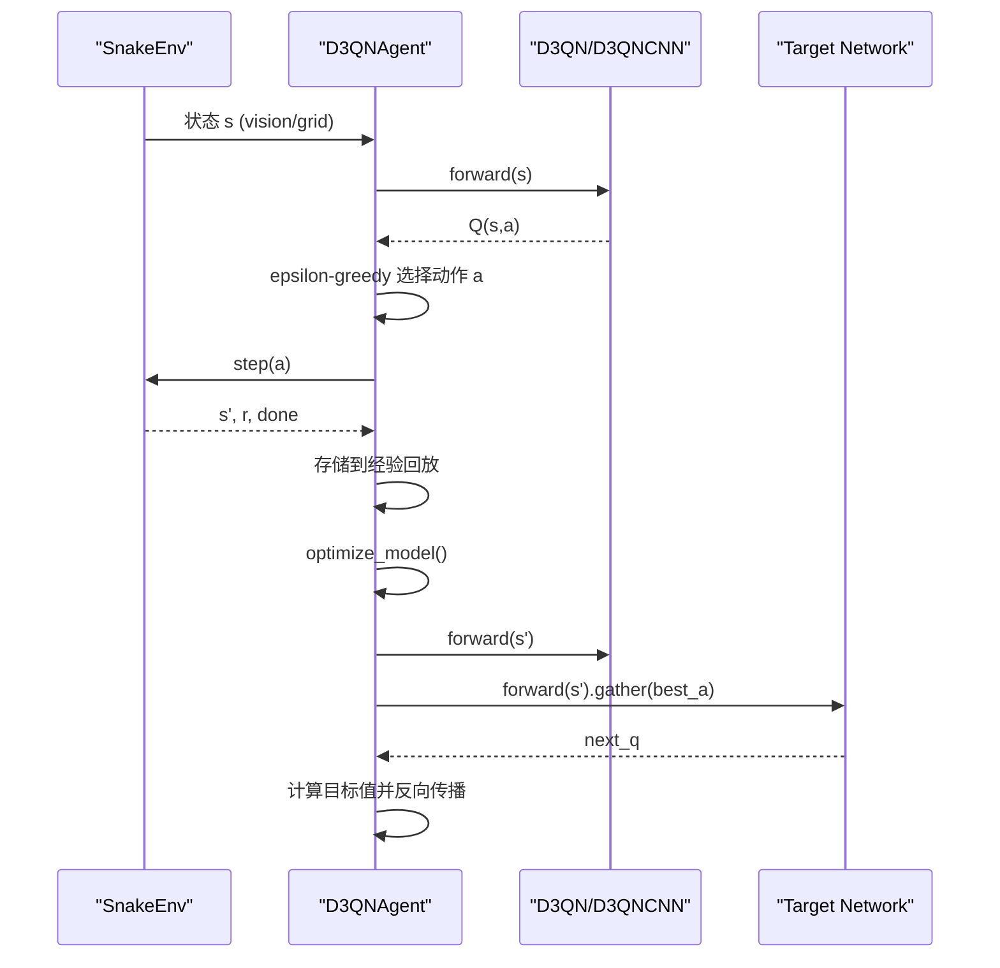
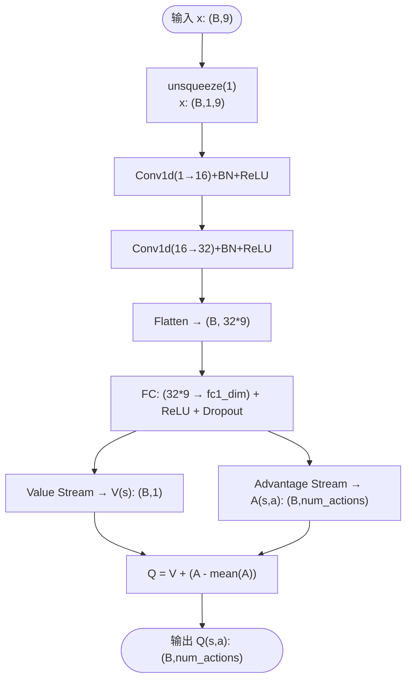
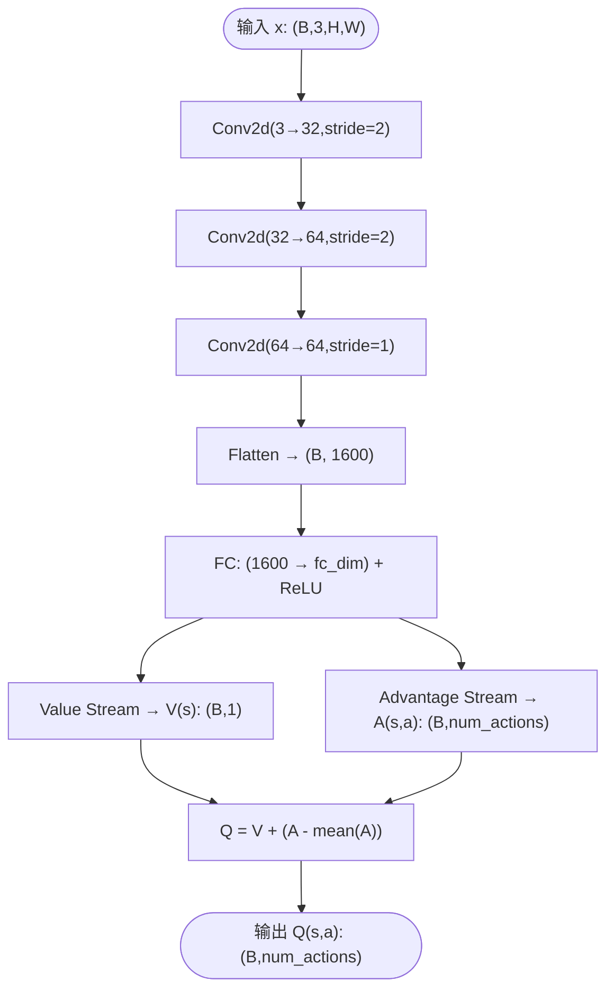
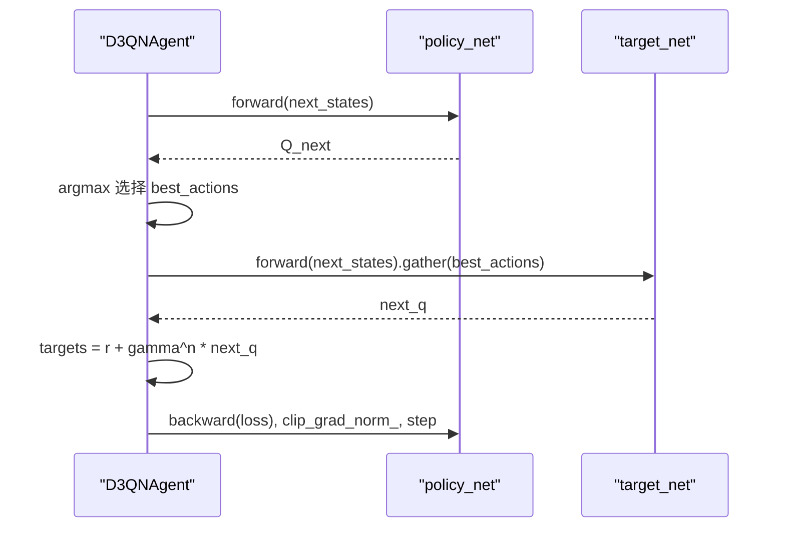
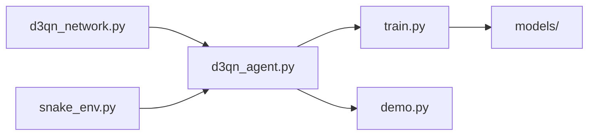
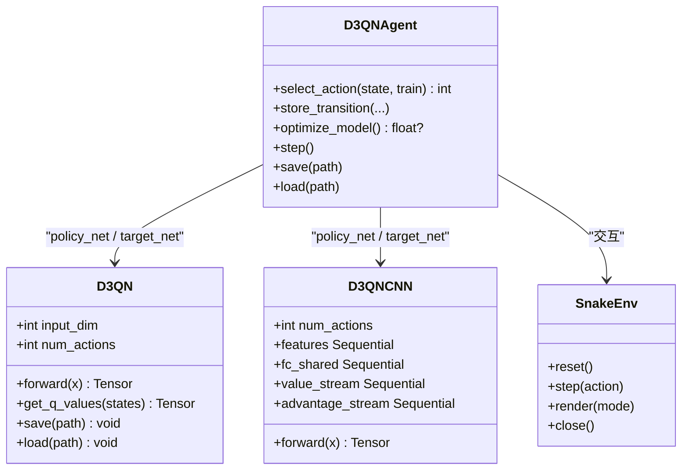

# 神经网络架构设计

<cite>
**本文引用的文件**
- [d3qn_network.py](file://src/models/d3qn_network.py)
- [d3qn_agent.py](file://src/agents/d3qn_agent.py)
- [snake_env.py](file://src/envs/snake_env.py)
- [train.py](file://scripts/train.py)
- [demo.py](file://scripts/demo.py)
- [__init__.py](file://src/models/__init__.py)
- [test_cnn_upgrade.py](file://tests/test_cnn_upgrade.py)
</cite>

## 更新摘要
**变更内容**
- 新增D3QNCNN类以支持网格观察的CNN架构
- 扩展环境支持多种观察类型（vision、grid、state）
- 智能体支持动态网络选择和配置
- 训练脚本针对CNN架构进行参数优化
- 增强测试覆盖CNN架构功能

## 目录
1. [简介](#简介)
2. [项目结构](#项目结构)
3. [核心组件](#核心组件)
4. [架构总览](#架构总览)
5. [详细组件分析](#详细组件分析)
6. [依赖关系分析](#依赖关系分析)
7. [性能考量](#性能考量)
8. [故障排查指南](#故障排查指南)
9. [结论](#结论)
10. [附录](#附录)

## 简介
本技术文档围绕 D3QN（Dueling Double Deep Q-Network）的神经网络架构设计与实现进行系统化说明。重点包括：
- Dueling 网络的价值流与优势流的分离设计、前向传播数据流与特征提取过程
- 卷积层与全连接层的配置、输入维度处理、特征映射与输出维度设计
- 聚合公式 Q(s,a) = V(s) + (A(s,a) - mean(A)) 的数学原理与实现细节
- 网络初始化策略与参数配置选项
- 网络结构可视化图与性能分析
- 自定义网络扩展接口与最佳实践

该实现支持两种观察模式：局部视觉观察（9维向量）和完整网格观察（3通道图像），使用 PyTorch 构建并训练。

## 项目结构
仓库包含以下关键模块：
- d3qn_network.py：D3QN 网络定义（传统CNN+共享层+双分支+聚合）和D3QNCNN（网格CNN）
- d3qn_agent.py：D3QN 智能体（主/目标网络、经验回放、Double Q-learning 更新）
- snake_env.py：贪吃蛇环境（支持多种观察类型、离散动作空间）
- train.py：训练循环与指标记录
- demo.py：演示与测试脚本
- __init__.py：模型包导出

**图表来源**
- [d3qn_network.py:10-184](file://src/models/d3qn_network.py#L10-L184)
- [d3qn_agent.py:17-264](file://src/agents/d3qn_agent.py#L17-L264)
- [snake_env.py:12-283](file://src/envs/snake_env.py#L12-L283)
- [train.py:41-547](file://scripts/train.py#L41-L547)
- [demo.py:18-165](file://scripts/demo.py#L18-L165)

## 核心组件
- **D3QN 网络**：包含一维卷积特征提取、共享全连接层、价值流与优势流双分支、以及聚合得到 Q(s,a)
- **D3QNCNN 网络**：专门用于网格观察的二维卷积网络，支持完整棋盘状态处理
- **D3QNAgent**：封装主/目标网络、经验回放、epsilon-greedy 探索、Double Q-learning 目标计算与优化步骤
- **SnakeEnv**：提供多种观察格式（9维向量、3通道图像、状态矩阵）与 4 个离散动作，定义奖励与终止条件
- **Trainer**：训练循环、指标统计、模型保存与可视化

**章节来源**
- [d3qn_network.py:10-184](file://src/models/d3qn_network.py#L10-L184)
- [d3qn_agent.py:17-264](file://src/agents/d3qn_agent.py#L17-L264)
- [snake_env.py:12-283](file://src/envs/snake_env.py#L12-L283)
- [train.py:41-547](file://scripts/train.py#L41-L547)

## 架构总览
系统支持两种网络架构，根据观察类型自动选择：

### 传统D3QN架构（局部视觉观察）
- 输入为 9 维向量，先 reshape 为一维序列以适配 Conv1d
- 两层 Conv1d + BatchNorm + ReLU 提取时序/方向性特征
- 展平后进入共享全连接层
- 分别通过价值流与优势流得到 V(s) 与 A(s,a)
- 聚合得到 Q(s,a) = V(s) + (A(s,a) - mean(A))

### CNN架构（网格观察）
- 输入为 3通道×H×W 的网格图像
- 三层Conv2d下采样：20×20 → 10×10 → 5×10 → 5×5
- 展平后进入共享全连接层
- 同样采用Dueling架构分离V(s)和A(s,a)

**图表来源**
- [d3qn_agent.py:56-139](file://src/agents/d3qn_agent.py#L56-L139)
- [d3qn_network.py:58-152](file://src/models/d3qn_network.py#L58-L152)
- [snake_env.py:58-101](file://src/envs/snake_env.py#L58-L101)

## 详细组件分析

### D3QN 网络：传统架构与前向流程
- **输入与预处理**
  - 输入形状 (batch_size, input_dim=9)
  - 在 forward 中执行 unsqueeze(1) 变为 (batch_size, 1, 9)，以适配 Conv1d
- **卷积特征提取**
  - conv1: 1→16 通道，kernel=3，padding=1；bn1；ReLU
  - conv2: 16→32 通道，kernel=3，padding=1；bn2；ReLU
  - 展平后维度为 32*9
- **共享全连接层**
  - Linear(32*9 → fc1_dim) + ReLU + Dropout(0.2)
- **双分支**
  - 价值流：Linear(fc1_dim → fc2_dim) + ReLU + Linear(fc2_dim → 1) 输出 V(s)
  - 优势流：Linear(fc1_dim → fc2_dim) + ReLU + Linear(fc2_dim → num_actions) 输出 A(s,a)
- **聚合**
  - Q = V + (A - mean(A, dim=1, keepdim=True))
  - 输出形状 (batch_size, num_actions)

**图表来源**
- [d3qn_network.py:20-90](file://src/models/d3qn_network.py#L20-L90)

**章节来源**
- [d3qn_network.py:20-90](file://src/models/d3qn_network.py#L20-L90)

### D3QNCNN 网络：网格观察专用架构
- **设计目标**
  - 专门处理完整棋盘的3通道图像输入
  - 避免BatchNorm在RL中的训练/评估统计不匹配问题
- **卷积架构**
  - Conv2d(3→32, kernel=3, stride=2, padding=1)：20×20 → 10×10
  - Conv2d(32→64, kernel=3, stride=2, padding=1)：10×10 → 5×5
  - Conv2d(64→64, kernel=3, stride=1, padding=1)：保持 5×5
  - 无BatchNorm以避免RL训练不稳定
- **特征融合**
  - 展平后维度：64 × 5 × 5 = 1600
  - 共享全连接层：Linear(1600 → fc_dim) + ReLU
- **Dueling架构**
  - 价值流：Linear(fc_dim → 128) + ReLU + Linear(128 → 1)
  - 优势流：Linear(fc_dim → 128) + ReLU + Linear(128 → num_actions)

**图表来源**
- [d3qn_network.py:108-152](file://src/models/d3qn_network.py#L108-L152)

**章节来源**
- [d3qn_network.py:108-152](file://src/models/d3qn_network.py#L108-L152)

### 智能体：动态网络选择与训练
- **网络选择机制**
  - 根据 obs_type 参数自动选择 D3QN 或 D3QNCNN
  - grid 模式使用 D3QNCNN，其他模式使用 D3QN
- **训练优化**
  - 支持 n-step returns 提高长期信用分配
  - Double DQN 更新减少过估计偏差
  - 自适应批大小和缓冲区大小
- **探索策略**
  - epsilon-greedy 探索，针对不同架构调整衰减率
  - CNN架构使用更慢的衰减（0.999 vs 0.995）

**图表来源**
- [d3qn_agent.py:91-139](file://src/agents/d3qn_agent.py#L91-L139)

**章节来源**
- [d3qn_agent.py:17-264](file://src/agents/d3qn_agent.py#L17-L264)

### 环境：多模态观察支持
- **观察空间**
  - vision模式：10维向量（8方向障碍距离 + 食物方向编码）
  - grid模式：3通道×H×W图像（身体/食物/头部）
  - state模式：H×W状态矩阵
- **动作空间**
  - 离散 4 动作：上、下、左、右
- **奖励设计**
  - 吃到食物 +10，碰撞 -10，每步 -0.1，超时 -1

**章节来源**
- [snake_env.py:15-283](file://src/envs/snake_env.py#L15-L283)

### 聚合公式：Q(s,a) = V(s) + (A(s,a) - mean(A))
- **数学动机**
  - 将状态价值 V(s) 与动作优势 A(s,a) 解耦，避免对每个动作都估计绝对 Q 值带来的方差
  - 减去 mean(A) 保证优势项均值为 0，使 V(s) 具有可解释性（状态整体价值）
- **实现细节**
  - 在聚合时按动作维度求均值并保持维度以便广播
  - 最终 Q(s,a) 形状为 (batch_size, num_actions)

**章节来源**
- [d3qn_network.py:82-90](file://src/models/d3qn_network.py#L82-L90)
- [d3qn_network.py:144-152](file://src/models/d3qn_network.py#L144-L152)

### 网络初始化与参数配置
- **D3QN配置**
  - 输入维度：input_dim（默认10）
  - 动作数量：num_actions（默认4）
  - 全连接层：fc1_dim=128, fc2_dim=128
- **D3QNCNN配置**
  - 输入通道：in_channels=3
  - 网格尺寸：grid_size=20
  - 全连接层：fc_dim=256
- **训练参数**
  - 学习率：1e-4
  - 梯度裁剪：clip_grad_norm_ 上限 10
  - 目标网络同步：每1000步更新

**章节来源**
- [d3qn_network.py:20-56](file://src/models/d3qn_network.py#L20-L56)
- [d3qn_network.py:116-142](file://src/models/d3qn_network.py#L116-L142)
- [d3qn_agent.py:27-47](file://src/agents/d3qn_agent.py#L27-L47)
- [d3qn_agent.py:82-90](file://src/agents/d3qn_agent.py#L82-L90)

### 训练流程与指标
- **训练循环**
  - 每步选择动作、执行环境、存储转移、优化模型、更新 epsilon 与目标网络
- **CNN优化**
  - 更大的批大小（128 vs 64）
  - 更长的探索期（epsilon_decay=0.999）
  - n-step returns（n=3）提高长期信用分配
- **指标记录**
  - 奖励、分数、损失、epsilon 衰减曲线
  - 滑动平均评估收敛
  - 最佳模型自动保存

**章节来源**
- [train.py:41-547](file://scripts/train.py#L41-L547)

## 依赖关系分析
- **模块耦合**
  - d3qn_agent.py 依赖 d3qn_network.py 与 snake_env.py
  - train.py 依赖 d3qn_agent.py 与 snake_env.py
  - demo.py 依赖 d3qn_agent.py、snake_env.py 与 d3qn_network.py
- **外部依赖**
  - torch、numpy、gymnasium、pygame、matplotlib

**图表来源**
- [d3qn_agent.py:1-264](file://src/agents/d3qn_agent.py#L1-L264)
- [train.py:1-547](file://scripts/train.py#L1-L547)
- [demo.py:1-165](file://scripts/demo.py#L1-L165)

## 性能考量
- **批大小与内存**
  - CNN架构需要更大批大小（128）以提高稳定性
  - 网格观察占用更多显存
- **设备加速**
  - 自动检测 GPU，确保网络与张量在同一设备
- **梯度裁剪**
  - 防止梯度爆炸，提高训练稳定性
- **目标网络更新频率**
  - target_update 越大越稳定但可能降低学习效率
- **架构选择**
  - 简单任务：D3QN（更快训练）
  - 复杂任务：D3QNCNN（更好性能）

## 故障排查指南
- **CUDA 显存不足**
  - 减小 batch_size 或关闭渲染
  - 对于CNN架构，考虑减小网格尺寸
- **训练收敛慢**
  - 检查是否使用 GPU、适当增大 batch_size、调整 epsilon 衰减
  - CNN架构需要更多训练时间和更大批大小
- **游戏无法启动**
  - 确认 pygame 已安装且无僵尸窗口
- **模型加载失败**
  - 检查路径与版本兼容性
  - 确保网络架构与保存的模型匹配

## 结论
本项目实现了完整的 D3QN 架构与训练流程，支持两种观察模式：
- **D3QN**：适用于局部视觉观察的快速训练场景
- **D3QNCNN**：适用于完整网格观察的高性能场景

通过 Dueling 网络的优势分解与 Double Q-learning 的目标估计，提供了稳定的强化学习训练范式。动态网络选择机制使得系统能够根据任务需求自动选择最优架构。建议在实际应用中根据任务特性调整网络配置、探索策略与目标网络更新频率，以获得更好的训练效率与最终性能。

## 附录

### 网络结构可视化图（代码级）

**图表来源**
- [d3qn_network.py:10-184](file://src/models/d3qn_network.py#L10-L184)
- [d3qn_agent.py:17-264](file://src/agents/d3qn_agent.py#L17-L264)
- [snake_env.py:12-283](file://src/envs/snake_env.py#L12-L283)

### 自定义网络扩展接口与最佳实践
- **扩展点**
  - 修改卷积层通道数、核大小与层数以增强特征提取能力
  - 调整 fc1_dim/fc2_dim 改变全连接层容量
  - 替换聚合方式（如 max pooling 替代 mean）以适配不同任务
  - 添加新的观察编码器支持
- **最佳实践**
  - 保持数值稳定：使用 BatchNorm、Dropout、梯度裁剪
  - 合理设置学习率与优化器参数
  - 监控损失与奖励曲线，及时调整超参数
  - 使用目标网络与经验回放提高样本效率与稳定性
  - 对于CNN架构，注意避免BatchNorm在RL中的训练/评估统计不匹配

**章节来源**
- [d3qn_network.py:20-90](file://src/models/d3qn_network.py#L20-L90)
- [d3qn_network.py:108-152](file://src/models/d3qn_network.py#L108-L152)
- [d3qn_agent.py:27-47](file://src/agents/d3qn_agent.py#L27-L47)
- [d3qn_agent.py:82-139](file://src/agents/d3qn_agent.py#L82-L139)

### 测试覆盖与验证
- **网格观察测试**
  - 验证3通道图像的形状和语义正确性
  - 测试重置和步骤过程中的观察一致性
- **CNN网络测试**
  - 验证前向传播的形状处理（批量和单帧）
  - 测试不同网格尺寸的兼容性
- **智能体集成测试**
  - 验证网格模式下的动作选择和优化
  - 测试n-step返回的正确性
- **n-step返回数学验证**
  - 验证时间步组合的数学正确性
  - 测试终端状态的边界情况

**章节来源**
- [test_cnn_upgrade.py:1-108](file://tests/test_cnn_upgrade.py#L1-L108)