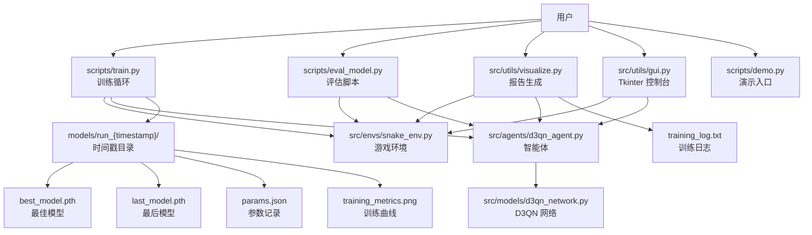
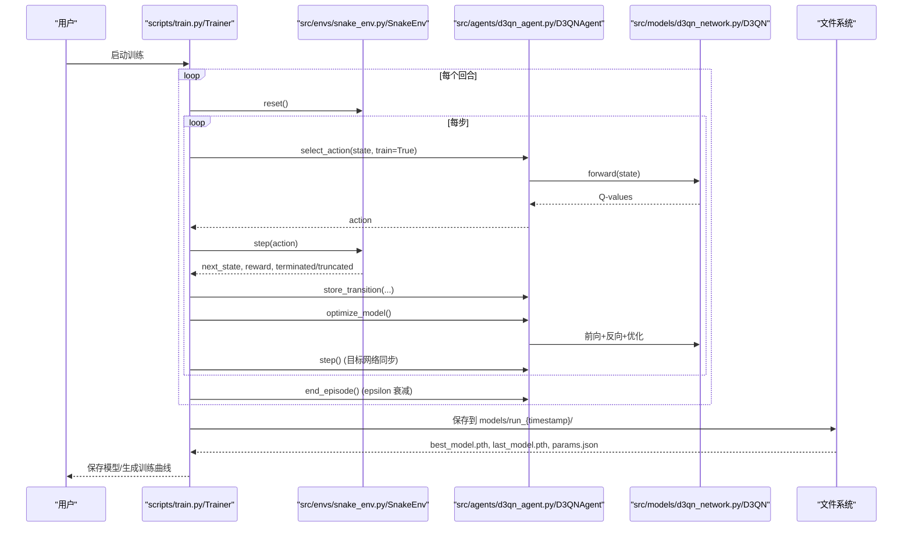
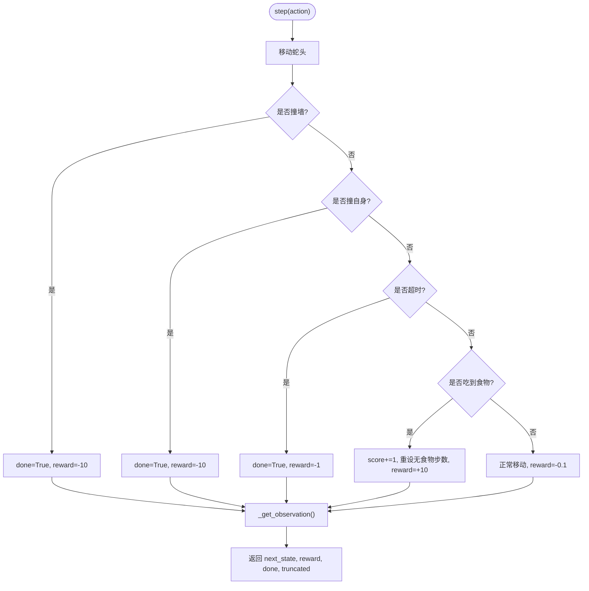
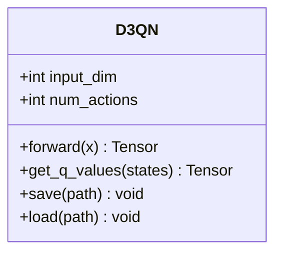
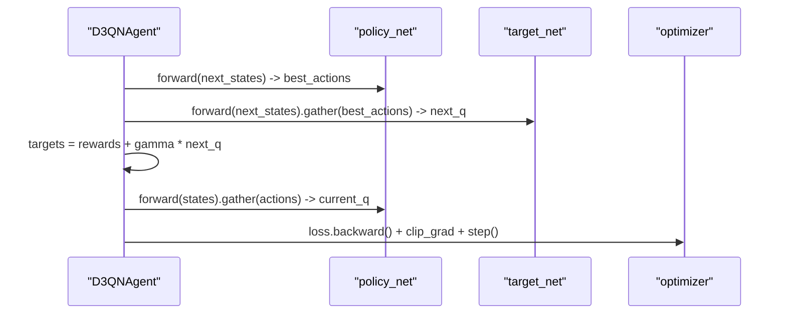
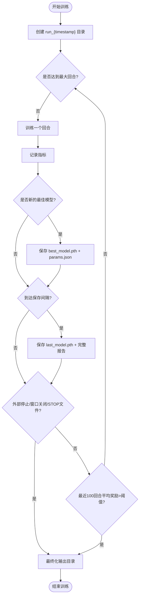
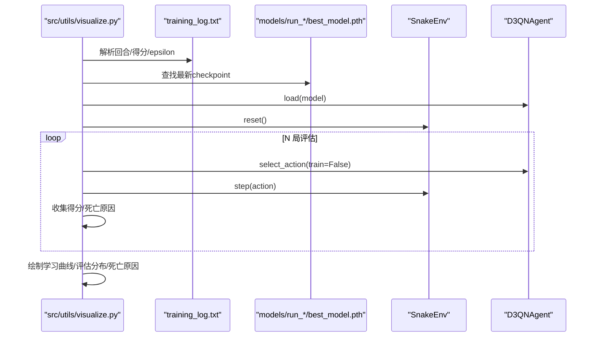
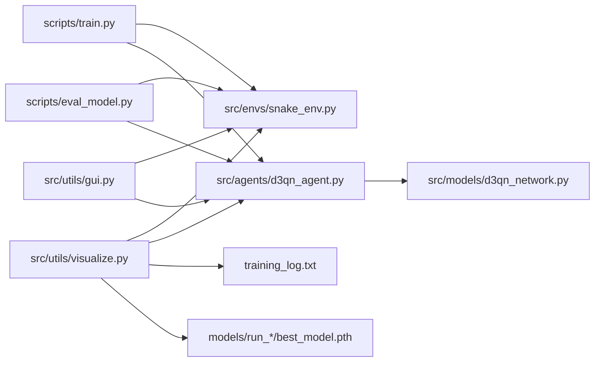

# 可视化报告系统

<cite>
**本文引用的文件**
- [README.md](file://README.md)
- [snake_env.py](file://src/envs/snake_env.py)
- [d3qn_network.py](file://src/models/d3qn_network.py)
- [d3qn_agent.py](file://src/agents/d3qn_agent.py)
- [train.py](file://scripts/train.py)
- [eval_model.py](file://scripts/eval_model.py)
- [visualize.py](file://src/utils/visualize.py)
- [gui.py](file://src/utils/gui.py)
- [demo.py](file://scripts/demo.py)
- [requirements.txt](file://requirements.txt)
- [启动指南.md](file://docs/启动指南.md)
</cite>

## 更新摘要
**变更内容**
- 可视化组件重构：GUI和可视化工具移至 `src/utils/` 目录
- 输出管理改进：引入时间戳目录结构，每个训练会话独立存储
- 增强的模型组织：支持最佳模型和最后模型的自动保存
- 改进的参数管理：结构化参数记录与元数据跟踪

## 目录
1. [简介](#简介)
2. [项目结构](#项目结构)
3. [核心组件](#核心组件)
4. [架构总览](#架构总览)
5. [详细组件分析](#详细组件分析)
6. [依赖关系分析](#依赖关系分析)
7. [性能与可观测性](#性能与可观测性)
8. [故障排查](#故障排查)
9. [结论](#结论)
10. [附录](#附录)

## 简介
本仓库实现了一个基于 D3QN（Dueling Double Deep Q-Network）的贪吃蛇强化学习训练与可视化系统。系统包含环境、网络、智能体、训练循环、评估脚本、可视化报告生成以及 Tkinter GUI 验证控制台，支持实时渲染、断点续训、模型持久化与训练曲线/评估报告的自动生成。**最新更新**包括可视化组件的重构和组织改进，以及增强的输出管理功能。

## 项目结构
- **环境与交互**
  - snake_env.py：Gymnasium 风格的贪吃蛇环境，提供状态空间、动作空间、奖励机制与 Pygame 渲染。
- **模型与算法**
  - d3qn_network.py：D3QN 网络（卷积特征提取 + Dueling 双分支）。
  - d3qn_agent.py：D3QN 智能体（经验回放、目标网络、Double DQN 更新）。
- **训练与评估**
  - train.py：主训练循环、指标记录、自动保存与收敛判定。
  - eval_model.py：贪婪策略评估、随机基线对比、死亡原因统计。
- **可视化与报告** ⭐ **已重构**
  - src/utils/visualize.py：解析训练日志并绘制学习曲线、评估得分分布与死亡原因饼图。
  - src/utils/gui.py：Tkinter 验证控制台，加载已训练模型进行连续运行与统计展示。
  - scripts/demo.py：演示入口，支持测试已训练智能体、随机游玩与网络结构对比。
- **配置与说明**
  - requirements.txt：核心依赖声明。
  - README.md：功能概览、快速开始、参数说明与常见问题。
  - 启动指南.md：Windows 环境下的虚拟环境、依赖安装与 pygame 兼容性处理。

**图表来源**
- [train.py:264-373](file://scripts/train.py#L264-L373)
- [visualize.py:58-155](file://src/utils/visualize.py#L58-L155)
- [gui.py:64-345](file://src/utils/gui.py#L64-L345)
- [snake_env.py:12-227](file://src/envs/snake_env.py#L12-L227)
- [d3qn_agent.py:17-162](file://src/agents/d3qn_agent.py#L17-L162)
- [d3qn_network.py:10-106](file://src/models/d3qn_network.py#L10-L106)

**章节来源**
- [README.md:5-59](file://README.md#L5-L59)
- [requirements.txt:1-15](file://requirements.txt#L1-L15)

## 核心组件
- **环境 SnakeEnv**
  - 观察空间：视觉型 10 维向量（8 方向障碍物距离 + 食物相对方向），或全网格状态。
  - 动作空间：离散 4 方向。
  - 奖励：吃食物 +10，碰撞 -10，超时 -1，每步 -0.1 鼓励更快解。
  - 渲染：Pygame 窗口，支持关闭事件触发训练停止。
- **网络 D3QN**
  - 一维卷积特征提取 + BatchNorm + ReLU。
  - Dueling 双分支：值流 V(s) 与优势流 A(s,a)，聚合为 Q(s,a)。
- **智能体 D3QNAgent**
  - 经验回放缓冲、目标网络周期性同步、Double DQN 目标计算。
  - Epsilon 衰减策略，训练/推理模式切换。
- **训练器 Trainer** ⭐ **增强功能**
  - 回合循环、指标收集、收敛判定、断点续训、自动保存模型与训练曲线。
  - **新增**：时间戳目录管理，每个训练会话独立存储。
  - **新增**：最佳模型自动追踪与保存。
  - **新增**：结构化参数记录与元数据管理。
- **评估与可视化** ⭐ **重构**
  - scripts/eval_model.py：贪婪评估、随机基线对比、死亡原因统计。
  - src/utils/visualize.py：从 training_log.txt 解析学习曲线，叠加 epsilon；对最新模型执行 N 局评估并输出综合报告图。
  - src/utils/gui.py：Tkinter 界面，选择模型、控制速度、显示统计与日志。

**章节来源**
- [snake_env.py:12-164](file://src/envs/snake_env.py#L12-L164)
- [d3qn_network.py:10-90](file://src/models/d3qn_network.py#L10-L90)
- [d3qn_agent.py:17-162](file://src/agents/d3qn_agent.py#L17-L162)
- [train.py:41-506](file://scripts/train.py#L41-L506)
- [eval_model.py:27-174](file://scripts/eval_model.py#L27-L174)
- [visualize.py:17-160](file://src/utils/visualize.py#L17-L160)
- [gui.py:41-350](file://src/utils/gui.py#L41-L350)

## 架构总览
系统采用"环境-智能体-训练/评估-可视化"的分层架构。训练时，Trainer 驱动环境回合，智能体选择动作并更新网络；评估时，使用贪婪策略在固定局数内统计得分与死亡原因；可视化模块将训练日志与评估结果整合成统一报告图；GUI 提供交互式验证与控制。**更新后的架构**支持时间戳目录管理和增强的输出组织。

**图表来源**
- [train.py:79-123](file://scripts/train.py#L79-L123)
- [d3qn_agent.py:56-143](file://src/agents/d3qn_agent.py#L56-L143)
- [d3qn_network.py:58-90](file://src/models/d3qn_network.py#L58-L90)
- [snake_env.py:44-102](file://src/envs/snake_env.py#L44-L102)
- [train.py:264-373](file://scripts/train.py#L264-L373)

## 详细组件分析

### 环境 SnakeEnv
- 观察编码：8 方向探测障碍物距离（负值表示障碍），2 维食物方向（上下左右）。
- 终止条件：撞墙/撞自身/超时。
- 渲染：初始化 Pygame 窗口，绘制网格、蛇身、食物、分数、步数、当前回合与 epsilon。
- 退出信号：关闭窗口设置 close_requested，供训练循环检测以优雅停止。

**图表来源**
- [snake_env.py:59-102](file://src/envs/snake_env.py#L59-L102)
- [snake_env.py:112-164](file://src/envs/snake_env.py#L112-L164)

**章节来源**
- [snake_env.py:12-227](file://src/envs/snake_env.py#L12-L227)

### 网络 D3QN
- 输入形状：(batch, input_dim)，经unsqueeze转为( batch, 1, input_dim )以便 Conv1d。
- 特征提取：两层 Conv1d + BatchNorm + ReLU，展平后进入共享全连接层。
- Dueling 分支：
  - 值流：输出标量 V(s)。
  - 优势流：输出 num_actions 维 A(s,a)。
- 聚合：Q = V + (A - mean(A))，稳定优势估计。

**图表来源**
- [d3qn_network.py:10-106](file://src/models/d3qn_network.py#L10-L106)

**章节来源**
- [d3qn_network.py:10-138](file://src/models/d3qn_network.py#L10-L138)

### 智能体 D3QNAgent
- 探索利用：epsilon-greedy，训练模式随机探索，推理模式纯利用。
- 经验回放：deque 缓冲，采样 mini-batch 进行训练。
- 目标网络：按 target_update 频率复制策略网络权重。
- 更新规则：Double DQN，策略网络选最优动作，目标网络评估该动作。
- 保存/加载：包含 epsilon、steps、网络与优化器状态。

**图表来源**
- [d3qn_agent.py:94-143](file://src/agents/d3qn_agent.py#L94-L143)

**章节来源**
- [d3qn_agent.py:17-162](file://src/agents/d3qn_agent.py#L17-L162)

### 训练器 Trainer ⭐ **重大更新**
- 回合训练：reset -> 选择动作 -> step -> 存储转移 -> 优化 -> 步计数 -> 结束判断。
- 指标记录：reward、score、loss、epsilon。
- 收敛判定：最近 100 回合平均奖励 > 阈值则提前停止。
- 断点续训：自动查找最新 checkpoint 并恢复 epsilon/steps。
- **新增**：时间戳目录管理 - 每个训练会话创建独立的 `models/run_{timestamp}/` 目录。
- **新增**：最佳模型追踪 - 自动保存表现最佳的模型快照。
- **新增**：结构化参数记录 - 完整的超参数、运行信息和元数据保存。
- **新增**：自动保存机制 - 定期保存 last_model.pth、params.json 和训练曲线。

**图表来源**
- [train.py:79-123](file://scripts/train.py#L79-L123)
- [train.py:264-373](file://scripts/train.py#L264-L373)
- [train.py:384-506](file://scripts/train.py#L384-L506)

**章节来源**
- [train.py:41-506](file://scripts/train.py#L41-L506)

### 评估与可视化 ⭐ **重构更新**
- **scripts/eval_model.py**
  - 贪婪策略评估：关闭 Dropout，不探索，统计得分、奖励、步数与死亡原因。
  - 随机基线：相同局数的随机动作对比，给出比值与结论。
- **src/utils/visualize.py** ⭐ **移动到 utils 目录**
  - 解析 training_log.txt：提取回合、得分、epsilon，绘制学习曲线与 epsilon 叠加。
  - 评估最新模型：N 局贪婪评估，绘制得分序列、均值线、分布直方图与死亡原因饼图。
- **src/utils/gui.py** ⭐ **移动到 utils 目录**
  - Tkinter 控制台：选择模型、控制 FPS、显示统计卡片与日志，线程安全的消息队列更新 UI。
  - **增强功能**：更好的错误处理、更直观的界面设计、改进的模型选择功能。

**图表来源**
- [visualize.py:58-155](file://src/utils/visualize.py#L58-L155)
- [eval_model.py:51-81](file://scripts/eval_model.py#L51-L81)
- [d3qn_agent.py:154-162](file://src/agents/d3qn_agent.py#L154-L162)
- [snake_env.py:44-102](file://src/envs/snake_env.py#L44-L102)

**章节来源**
- [eval_model.py:27-174](file://scripts/eval_model.py#L27-L174)
- [visualize.py:17-160](file://src/utils/visualize.py#L17-L160)
- [gui.py:41-350](file://src/utils/gui.py#L41-L350)

### 演示与入口
- **scripts/demo.py**：提供三种模式——测试已训练智能体、随机游玩、网络结构对比。
- **启动方式**：PowerShell 脚本或批处理文件，自动检查虚拟环境与依赖。

**章节来源**
- [demo.py:11-165](file://scripts/demo.py#L11-L165)
- [启动指南.md:9-153](file://docs/启动指南.md#L9-L153)

## 依赖关系分析
- **运行时依赖**
  - torch：深度学习框架与 GPU 加速。
  - numpy：数值计算。
  - gymnasium：环境接口。
  - matplotlib：训练曲线与报告绘图。
  - pygame：游戏渲染（Python 3.14 需手动 wheel 安装）。
- **模块耦合** ⭐ **更新**
  - scripts/train.py 依赖 src/envs/snake_env.py、src/agents/d3qn_agent.py。
  - src/agents/d3qn_agent.py 依赖 src/models/d3qn_network.py。
  - scripts/eval_model.py、src/utils/visualize.py、src/utils/gui.py 均依赖 src/envs/snake_env.py 与 src/agents/d3qn_agent.py。
  - src/utils/visualize.py 额外依赖 training_log.txt 与 models/run_*/best_model.pth。

**图表来源**
- [train.py:14-21](file://scripts/train.py#L14-L21)
- [d3qn_agent.py:6-11](file://src/agents/d3qn_agent.py#L6-L11)
- [eval_model.py:23-33](file://scripts/eval_model.py#L23-L33)
- [visualize.py:17-28](file://src/utils/visualize.py#L17-L28)
- [gui.py:11-20](file://src/utils/gui.py#L11-L20)

**章节来源**
- [requirements.txt:1-15](file://requirements.txt#L1-L15)

## 性能与可观测性
- **训练性能**
  - 设备选择：自动检测 CUDA，优先 GPU 加速。
  - 批量大小与缓冲区：增大 batch_size 提升梯度稳定性；buffer_size 影响样本多样性。
  - 渲染开销：render_training 开启会显著降低训练速度，建议仅演示时启用。
- **收敛与监控** ⭐ **增强**
  - 收敛判定：最近 100 回合平均奖励阈值。
  - 指标可视化：训练曲线（奖励、得分、损失、epsilon）、评估得分序列与分布、死亡原因饼图。
  - 日志解析：training_log.txt 中的回合行被 visualize.py 解析用于报告。
  - **新增**：时间戳目录组织 - 每个训练会话独立存储，便于版本管理和比较。
  - **新增**：最佳模型自动追踪 - 基于滑动平均的最佳性能模型保存。
- **可扩展性**
  - 观察类型：支持 vision/state 两种观察，便于不同任务适配。
  - 评估基线：随机动作对比，量化模型学习效果。

## 故障排查
- **训练无法开始或窗口未出现**
  - 确认 pygame 已正确安装（Python 3.14 需 wheel 包）。
  - 若仅需训练，可暂时禁用 render 以避免渲染阻塞。
- **训练过慢**
  - 关闭实时渲染或使用更小的 grid_size。
  - 增加 batch_size，减少 log_interval。
- **模型不收敛**
  - 检查 epsilon 衰减是否过快。
  - 确保 GPU 可用且未被其他进程占用。
- **评估失败**
  - 确认 models/run_{timestamp}/ 中存在有效 checkpoint。
  - 使用 --model 指定路径或先运行训练。
- **GUI 卡死或无法关闭**
  - 通过"停止"按钮触发 stop_event，等待线程退出。
  - 关闭窗口时会提示是否停止验证线程。
- **输出文件混乱** ⭐ **新场景**
  - 检查 models/run_{timestamp}/ 目录结构是否正确。
  - 确认 params.json 文件包含完整的元数据信息。

**章节来源**
- [启动指南.md:45-82](file://docs/启动指南.md#L45-L82)
- [train.py:456-461](file://scripts/train.py#L456-L461)
- [gui.py:286-334](file://src/utils/gui.py#L286-L334)

## 结论
该系统完整实现了 D3QN 在贪吃蛇环境中的训练、评估与可视化，具备断点续训、自动保存、学习曲线与评估报告生成能力。**最新的重构**将可视化组件移至 src/utils/ 目录，改进了代码组织结构，同时引入了时间戳目录管理系统，提供更好的输出组织和版本控制能力。通过增强的可视化报告与 GUI 控制台，用户可以直观地监控训练过程、评估模型表现并进行交互式验证。建议在 Windows 环境下解决 pygame 兼容性问题以获得最佳体验。

## 附录
- **快速开始**
  - 使用 PowerShell 脚本：.\scripts\start.ps1 -Train
  - 或使用批处理：.\scripts\start_training.bat
- **参数调整**
  - 训练参数：scripts/train.py 中 n_episodes、max_steps_per_episode、log_interval、save_interval。
  - 超参数：src/agents/d3qn_agent.py 中 gamma、epsilon_*、batch_size、buffer_size、target_update。
- **输出管理** ⭐ **新功能**
  - 时间戳目录：models/run_{YYYYMMDD_HHMMSS}/
  - 最佳模型：best_model.pth（基于滑动平均最佳性能）
  - 最后模型：last_model.pth（每次保存间隔）
  - 参数记录：params.json（完整元数据和超参数）
  - 训练曲线：training_metrics.png（训练指标可视化）
- **参考文档**
  - README.md：功能与使用说明。
  - 启动指南.md：环境搭建与问题排查。

**章节来源**
- [README.md:70-189](file://README.md#L70-L189)
- [启动指南.md:9-153](file://docs/启动指南.md#L9-L153)
- [train.py:264-373](file://scripts/train.py#L264-L373)
- [models/run_20260903_231928/params.json:1-60](file://models/run_20260903_231928/params.json#L1-L60)