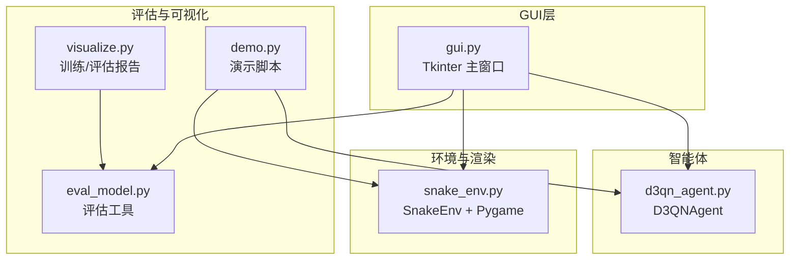
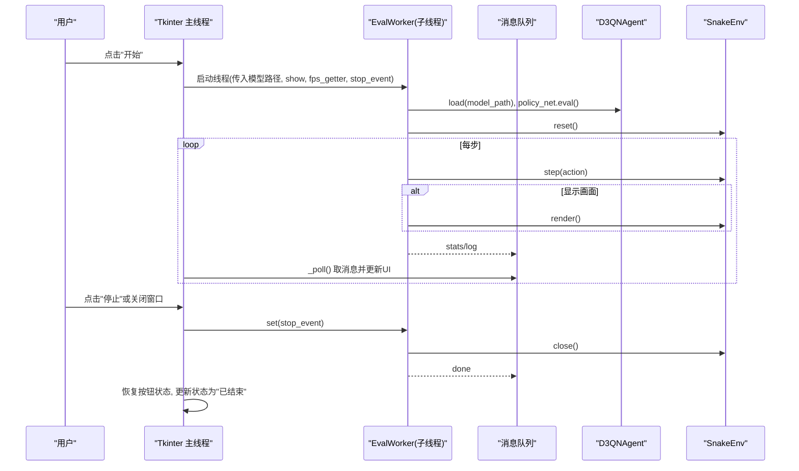
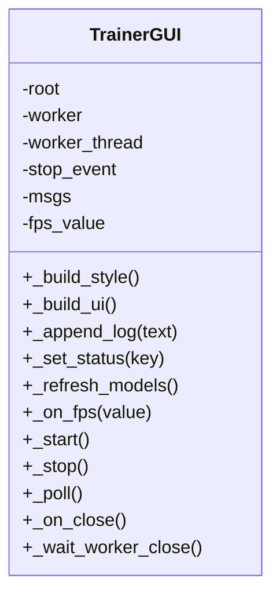
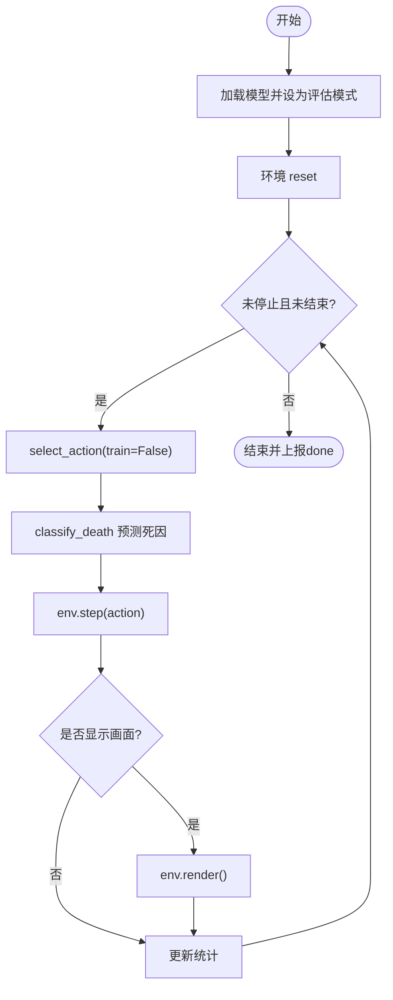
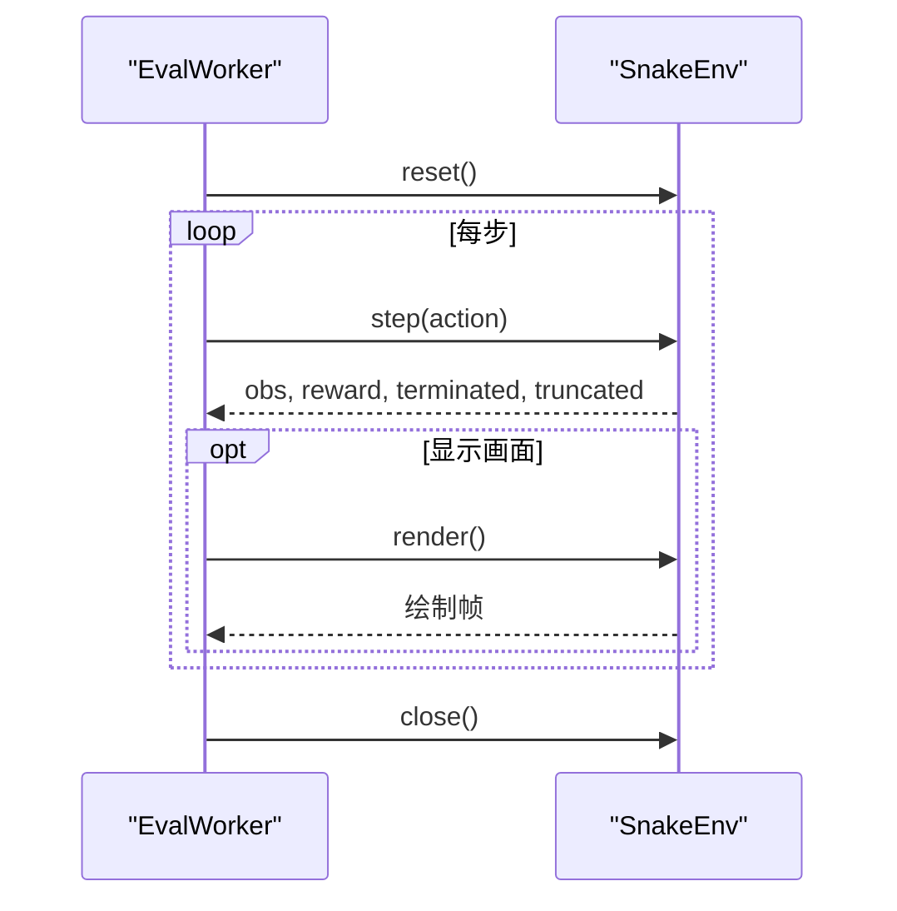
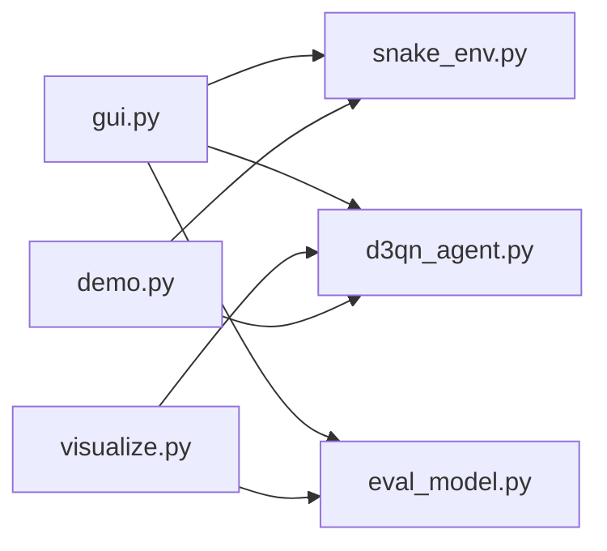

# 图形用户界面

<cite>
**本文引用的文件**
- [gui.py](file://gui.py)
- [snake_env.py](file://snake_env.py)
- [d3qn_agent.py](file://d3qn_agent.py)
- [eval_model.py](file://eval_model.py)
- [visualize.py](file://visualize.py)
- [demo.py](file://demo.py)
- [README.md](file://README.md)
</cite>

## 目录
1. [简介](#简介)
2. [项目结构](#项目结构)
3. [核心组件](#核心组件)
4. [架构总览](#架构总览)
5. [详细组件分析](#详细组件分析)
6. [依赖关系分析](#依赖关系分析)
7. [性能与交互特性](#性能与交互特性)
8. [故障排查指南](#故障排查指南)
9. [结论](#结论)
10. [附录](#附录)

## 简介
本项目的图形用户界面（GUI）用于加载已训练的 D3QN 模型，以贪心策略（关闭探索、关闭 Dropout）连续运行蛇游戏，并提供开始/停止控制、实时统计面板与日志输出。GUI 基于 Python 标准库 Tkinter 构建，不引入额外第三方 GUI 框架；游戏渲染由 Pygame 负责，二者通过线程与队列解耦，保证 UI 响应性。

## 项目结构
围绕 GUI 的关键文件与职责：
- gui.py：Tkinter 主窗口、控件布局、状态管理、消息泵、启动/停止逻辑
- snake_env.py：Gymnasium 风格环境，提供游戏逻辑与 Pygame 渲染
- d3qn_agent.py：D3QN 智能体，提供 select_action/load/policy_net.eval 等接口
- eval_model.py：评估工具，包含“最近模型查找”和“死亡原因分类”等通用函数
- visualize.py：训练/评估可视化报告生成（非 GUI，但复用评估流程）
- demo.py：演示脚本，展示环境与智能体的基本用法
- README.md：项目说明与使用指引

图表来源
- [gui.py:1-350](file://gui.py#L1-L350)
- [snake_env.py:1-257](file://snake_env.py#L1-L257)
- [d3qn_agent.py:1-200](file://d3qn_agent.py#L1-L200)
- [eval_model.py:1-165](file://eval_model.py#L1-L165)
- [visualize.py:1-160](file://visualize.py#L1-L160)
- [demo.py:1-158](file://demo.py#L1-L158)

章节来源
- [README.md:17-31](file://README.md#L17-L31)

## 核心组件
- 评估工作线程 EvalWorker：在独立线程中加载模型、创建环境、循环执行贪心策略、统计得分与死因，并通过队列向 UI 发送消息
- 主界面 TrainerGUI：Tkinter 窗口，包含模型选择、开始/停止按钮、FPS 滑块、指标卡片、日志区；维护状态与消息泵
- 环境 SnakeEnv：提供 reset/step/render/close，支持 FPS 动态调节与窗口关闭事件检测
- 智能体 D3QNAgent：提供 select_action(train=False) 的贪心推理、load() 加载权重、policy_net.eval() 关闭 Dropout
- 评估工具 eval_model：提供 find_latest_checkpoint、classify_death、evaluate 等通用能力

章节来源
- [gui.py:64-127](file://gui.py#L64-L127)
- [gui.py:129-350](file://gui.py#L129-L350)
- [snake_env.py:12-227](file://snake_env.py#L12-L227)
- [d3qn_agent.py:17-162](file://d3qn_agent.py#L17-L162)
- [eval_model.py:27-81](file://eval_model.py#L27-L81)

## 架构总览
GUI 采用“UI 线程 + 评估线程 + 队列”的异步架构：
- UI 线程：处理用户输入、刷新控件、轮询消息队列
- 评估线程：加载模型与环境，按 FPS 步进执行，将统计与日志通过队列回传
- 环境渲染：Pygame 窗口独立于 Tkinter，支持运行时调整 FPS 与关闭窗口触发退出

图表来源
- [gui.py:265-316](file://gui.py#L265-L316)
- [gui.py:64-127](file://gui.py#L64-L127)
- [snake_env.py:166-227](file://snake_env.py#L166-L227)
- [d3qn_agent.py:154-162](file://d3qn_agent.py#L154-L162)

## 详细组件分析

### 组件A：Tkinter 主界面 TrainerGUI
- 功能要点
  - 主题与样式：深色主题、卡片式布局、统一字体与颜色
  - 模型选择：自动扫描 models 目录下的 checkpoint，支持手动刷新
  - 控制面板：开始/停止按钮、是否显示游戏画面复选框、FPS 滑块
  - 指标卡片：局数、最近得分、最高分、平均分、死因分布
  - 日志区：滚动文本框，限制最大行数避免内存增长
  - 状态栏：待机/验证中/停止中/已结束
  - 消息泵：_poll 定时从队列取消息并更新 UI，避免阻塞
  - 安全关闭：关闭窗口时提示并等待线程结束

图表来源
- [gui.py:129-350](file://gui.py#L129-L350)

章节来源
- [gui.py:152-237](file://gui.py#L152-L237)
- [gui.py:265-316](file://gui.py#L265-L316)
- [gui.py:320-334](file://gui.py#L320-L334)

### 组件B：评估工作线程 EvalWorker
- 功能要点
  - 加载模型并进入评估模式（关闭 Dropout）
  - 创建环境，设置 FPS
  - 每步选择动作、预测死因、执行 step、可选渲染
  - 统计得分、最高分、平均分与死因分布
  - 通过队列上报 stats/log/done
  - 支持外部停止信号与游戏窗口关闭信号

图表来源
- [gui.py:64-127](file://gui.py#L64-L127)
- [eval_model.py:39-48](file://eval_model.py#L39-L48)

章节来源
- [gui.py:64-127](file://gui.py#L64-L127)

### 组件C：环境 SnakeEnv（渲染与交互）
- 功能要点
  - 观察空间：视觉型 10 维向量（8方向障碍距离 + 食物相对方向）
  - 动作空间：离散 4 方向
  - 奖励设计：吃食物+10，碰撞-10，超时-1，每步小惩罚鼓励效率
  - 渲染：Pygame 绘制网格、蛇身、食物、分数、步数、当前回合与 epsilon
  - 交互：支持运行时 FPS 调节，关闭窗口时设置 close_requested 通知上层退出

图表来源
- [snake_env.py:44-102](file://snake_env.py#L44-L102)
- [snake_env.py:166-227](file://snake_env.py#L166-L227)

章节来源
- [snake_env.py:12-227](file://snake_env.py#L12-L227)

### 组件D：智能体 D3QNAgent（推理模式）
- 功能要点
  - select_action(train=False)：纯利用策略，无随机探索
  - load(path)：加载权重、优化器状态、epsilon 与步数
  - policy_net.eval()：关闭 Dropout，确保确定性输出

章节来源
- [d3qn_agent.py:17-162](file://d3qn_agent.py#L17-L162)

### 组件E：评估工具 eval_model（被 GUI 与可视化复用）
- 功能要点
  - find_latest_checkpoint：查找最新检查点
  - classify_death：根据下一步位置判断死因
  - evaluate：批量贪心评估，收集得分、奖励、步数与死因

章节来源
- [eval_model.py:27-81](file://eval_model.py#L27-L81)

### 组件F：可视化 visualize（非 GUI，但共享评估流程）
- 功能要点
  - 解析训练日志，绘制学习曲线与 epsilon 衰减
  - 对最新模型进行贪心评估，绘制评估得分趋势、分布与死因饼图
  - 保存报告图片

章节来源
- [visualize.py:45-155](file://visualize.py#L45-L155)

### 组件G：演示 demo（快速体验）
- 功能要点
  - 加载模型或创建未训练智能体
  - 多局测试或随机游玩
  - 调用环境渲染与智能体推理

章节来源
- [demo.py:11-100](file://demo.py#L11-L100)

## 依赖关系分析
- 模块耦合
  - gui.py 强依赖 snake_env.py 与 d3qn_agent.py，弱依赖 eval_model.py（仅用其工具函数）
  - visualize.py 依赖 eval_model.py 的工具函数与 d3qn_agent.py
  - demo.py 直接依赖 snake_env.py 与 d3qn_agent.py
- 外部依赖
  - Tkinter：Python 标准库，无需安装
  - Pygame：用于游戏渲染
  - NumPy/Torch：数值计算与神经网络
  - Matplotlib：可视化报告生成（非 GUI 必需）

图表来源
- [gui.py:11-21](file://gui.py#L11-L21)
- [visualize.py:17-28](file://visualize.py#L17-L28)
- [demo.py:6-8](file://demo.py#L6-L8)

章节来源
- [gui.py:11-21](file://gui.py#L11-L21)
- [visualize.py:17-28](file://visualize.py#L17-L28)
- [demo.py:6-8](file://demo.py#L6-L8)

## 性能与交互特性
- 线程与消息泵
  - 评估在独立线程执行，UI 通过队列轮询更新，避免卡顿
  - _poll 每 150ms 检查一次队列，兼顾响应性与开销
- 渲染与 FPS
  - 通过滑块实时调整 env.render_fps，影响 Pygame 帧率
  - 可关闭画面显示以提升评估速度
- 资源清理
  - 停止或关闭窗口时设置 stop_event，等待线程结束后销毁窗口
  - 环境 close() 释放 Pygame 资源
- 可扩展性
  - 可通过修改 GUI 控件增加更多参数（如网格大小、观察类型）
  - 可在 EvalWorker 中扩展更多统计指标

[本节为通用指导，不直接分析具体文件]

## 故障排查指南
- 模型加载失败
  - 现象：日志提示模型加载失败
  - 可能原因：路径不存在、权重损坏、设备不匹配
  - 处理：确认 models 目录下存在有效 .pth，重新训练或更换模型
  - 参考
    - [gui.py:75-84](file://gui.py#L75-L84)
- 无法找到模型文件
  - 现象：点击开始后弹出“模型无效”
  - 处理：刷新模型列表或手动选择正确路径
  - 参考
    - [gui.py:265-271](file://gui.py#L265-L271)
- 游戏窗口关闭导致退出
  - 现象：关闭窗口后验证停止
  - 机制：环境检测到 QUIT 事件设置 close_requested，EvalWorker 收到后退出
  - 参考
    - [snake_env.py:176-180](file://snake_env.py#L176-L180)
    - [gui.py:98-110](file://gui.py#L98-L110)
- 渲染卡顿或性能低
  - 建议：降低 FPS、关闭画面显示、减少网格尺寸
  - 参考
    - [gui.py:208-213](file://gui.py#L208-L213)
    - [snake_env.py:220-221](file://snake_env.py#L220-L221)
- 训练/评估日志为空
  - 现象：可视化报告无数据
  - 处理：确保训练过程输出到 training_log.txt，或指定 --log 参数
  - 参考
    - [visualize.py:45-55](file://visualize.py#L45-L55)

章节来源
- [gui.py:75-84](file://gui.py#L75-L84)
- [gui.py:265-271](file://gui.py#L265-L271)
- [snake_env.py:176-180](file://snake_env.py#L176-L180)
- [gui.py:98-110](file://gui.py#L98-L110)
- [gui.py:208-213](file://gui.py#L208-L213)
- [snake_env.py:220-221](file://snake_env.py#L220-L221)
- [visualize.py:45-55](file://visualize.py#L45-L55)

## 结论
该 GUI 以简洁的 Tkinter 界面提供了对 D3QN 蛇游戏的便捷验证入口，具备模型选择、实时统计、日志记录与可控的渲染速度。通过线程与队列解耦，保证了 UI 的流畅性与评估的可中断性。结合 eval_model 与 visualize，可形成从训练到评估再到可视化的完整闭环。对于进一步扩展，可增加更多超参配置、多模型对比、在线回放与更丰富的统计图表。

[本节为总结性内容，不直接分析具体文件]

## 附录
- 快速使用
  - 启动 GUI：python gui.py
  - 自动开始：python gui.py --auto-start
  - 自检模式：python gui.py --selftest
  - 参考
    - [gui.py:337-345](file://gui.py#L337-L345)
- 相关脚本
  - 训练：python train.py（见 README）
  - 评估：python eval_model.py -n 50 --render
  - 可视化：python visualize.py --log training_log.txt -n 50
  - 参考
    - [README.md:64-117](file://README.md#L64-L117)
    - [eval_model.py:121-160](file://eval_model.py#L121-L160)
    - [visualize.py:58-155](file://visualize.py#L58-L155)

章节来源
- [gui.py:337-345](file://gui.py#L337-L345)
- [README.md:64-117](file://README.md#L64-L117)
- [eval_model.py:121-160](file://eval_model.py#L121-L160)
- [visualize.py:58-155](file://visualize.py#L58-L155)