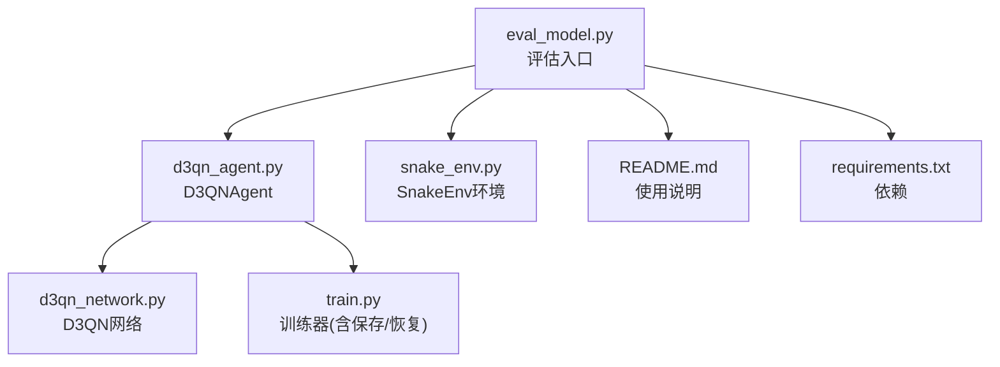
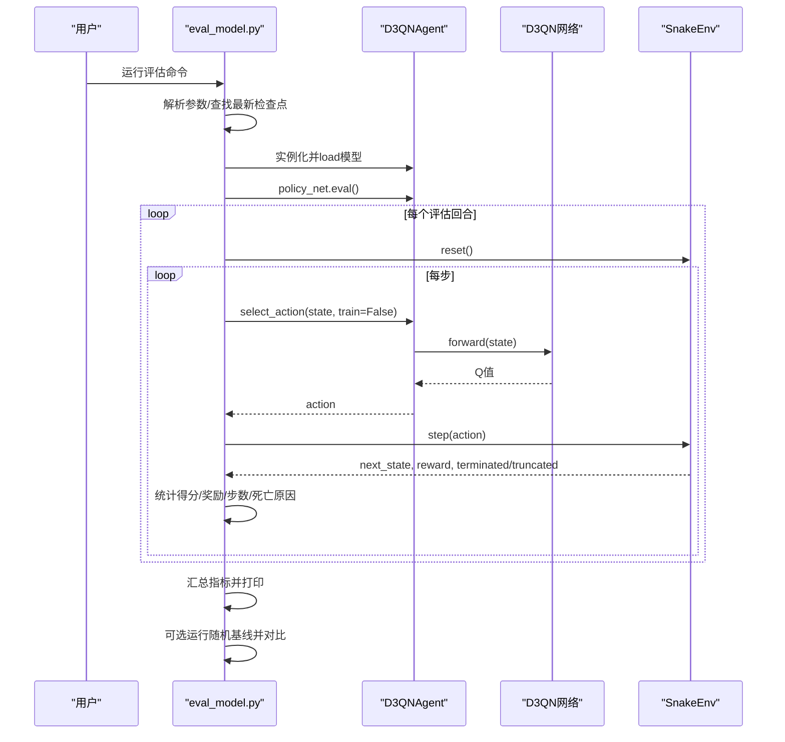
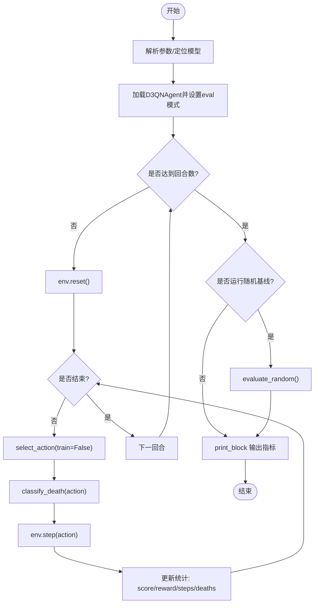
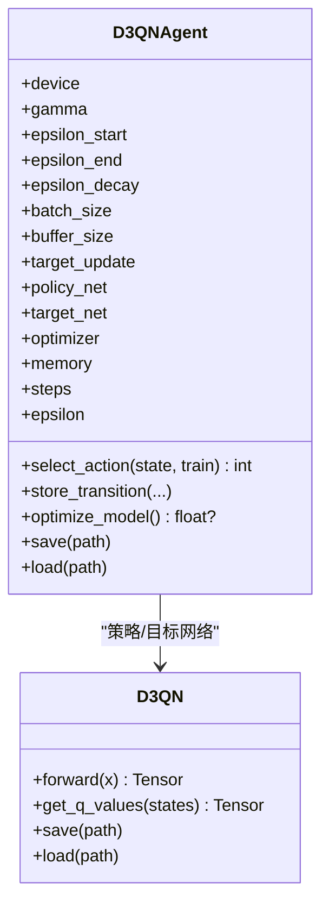
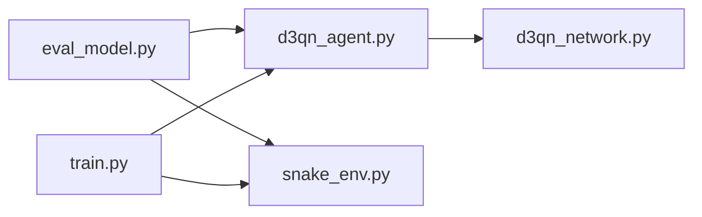

# 模型评估工具

<cite>
**本文引用的文件**
- [eval_model.py](file://eval_model.py)
- [d3qn_agent.py](file://d3qn_agent.py)
- [d3qn_network.py](file://d3qn_network.py)
- [snake_env.py](file://snake_env.py)
- [train.py](file://train.py)
- [README.md](file://README.md)
- [requirements.txt](file://requirements.txt)
</cite>

## 目录
1. [简介](#简介)
2. [项目结构](#项目结构)
3. [核心组件](#核心组件)
4. [架构总览](#架构总览)
5. [详细组件分析](#详细组件分析)
6. [依赖关系分析](#依赖关系分析)
7. [性能与稳定性](#性能与稳定性)
8. [故障排查指南](#故障排查指南)
9. [结论](#结论)
10. [附录：使用方式与参数](#附录使用方式与参数)

## 简介
本仓库实现了一个基于 D3QN（Dueling Double Deep Q-Network）的贪吃蛇AI训练系统。其中，模型评估工具 eval_model.py 提供了一套标准化的评测流程：加载已训练的模型，在纯利用模式（关闭探索、关闭dropout）下运行若干回合，统计得分、奖励、步数与死亡原因，并与随机策略基线进行对比，输出清晰的评估报告与“是否明显学会”的判定。

该工具适合用于：
- 快速验证训练结果是否有效
- 对比不同检查点或超参配置下的模型表现
- 监控训练收敛情况并生成可复现的评估指标

## 项目结构
围绕评估工具的核心文件与职责如下：
- eval_model.py：评估入口，负责加载模型、运行评估、统计指标、与随机基线对比
- d3qn_agent.py：D3QN智能体，包含网络、经验回放、动作选择、训练与保存/加载
- d3qn_network.py：D3QN网络结构（Dueling架构）
- snake_env.py：贪吃蛇环境（Gymnasium风格），提供状态、动作、奖励与渲染
- train.py：训练主循环，负责训练、日志、绘图与模型保存
- README.md：项目说明、用法与配置参考
- requirements.txt：依赖声明

图表来源
- [eval_model.py:15-165](file://eval_model.py#L15-L165)
- [d3qn_agent.py:17-162](file://d3qn_agent.py#L17-L162)
- [d3qn_network.py:10-106](file://d3qn_network.py#L10-L106)
- [snake_env.py:12-227](file://snake_env.py#L12-L227)
- [train.py:29-337](file://train.py#L29-L337)

章节来源
- [README.md:17-31](file://README.md#L17-L31)
- [requirements.txt:1-15](file://requirements.txt#L1-L15)

## 核心组件
- 评估脚本 eval_model.py
  - 自动查找最新检查点或接受指定路径
  - 以贪婪策略运行N回合，收集得分、奖励、步数与死亡原因
  - 可选渲染可视化
  - 计算随机基线并进行对比，给出学习效果的定性判断
- 智能体 d3qn_agent.py
  - 提供 select_action(train=False) 的确定性策略
  - 支持 load/save 检查点，便于评估时复用训练状态
- 网络 d3qn_network.py
  - Dueling架构：价值流V(s)与优势流A(s,a)，聚合得到Q(s,a)
- 环境 snake_env.py
  - 标准Gymnasium接口：reset/step/render/close
  - 观测为10维向量（8方向障碍+食物相对方向）
  - 动作空间为离散4向

章节来源
- [eval_model.py:27-165](file://eval_model.py#L27-L165)
- [d3qn_agent.py:17-162](file://d3qn_agent.py#L17-L162)
- [d3qn_network.py:10-106](file://d3qn_network.py#L10-L106)
- [snake_env.py:12-165](file://snake_env.py#L12-L165)

## 架构总览
评估流程从命令行参数解析开始，定位模型文件，初始化环境与智能体，进入纯利用模式执行多回合，统计并输出指标，最后与随机基线对比。

图表来源
- [eval_model.py:27-165](file://eval_model.py#L27-L165)
- [d3qn_agent.py:56-76](file://d3qn_agent.py#L56-L76)
- [d3qn_network.py:58-90](file://d3qn_network.py#L58-L90)
- [snake_env.py:44-102](file://snake_env.py#L44-L102)

## 详细组件分析

### 评估脚本 eval_model.py
- 功能要点
  - find_latest_checkpoint：按命名规则匹配 models/d3qn_snake_episode_*.pth，返回最新检查点
  - evaluate：以贪婪策略运行N回合，记录 scores/rewards/steps_list，并统计 deaths（wall/self/timeout）
  - classify_death：根据当前动作预测下一步是否会撞墙或自撞
  - evaluate_random：相同回合数的随机策略基线
  - print_block：格式化输出均值、中位数、极值、标准差、达标率等
  - main：参数解析、模型加载、评估、基线对比、清理资源
- 关键行为
  - 加载模型后调用 policy_net.eval() 关闭dropout，确保确定性
  - 通过 agent.select_action(state, train=False) 获取纯利用动作
  - 对每一步尝试预测死亡原因，结合终止信号分类统计
  - 对比训练模型与随机基线的平均得分比率，给出“明显学会/较弱/未学会”的判断

图表来源
- [eval_model.py:27-165](file://eval_model.py#L27-L165)

章节来源
- [eval_model.py:27-165](file://eval_model.py#L27-L165)

### 智能体 d3qn_agent.py
- 角色与职责
  - 维护策略网络与目标网络、优化器、经验回放缓冲区
  - select_action：训练时epsilon-greedy，评估时纯利用
  - optimize_model：Double DQN更新（策略网络选动作，目标网络评估）
  - save/load：持久化检查点（含epsilon、steps、网络与优化器状态）
- 评估相关
  - 评估时通过 select_action(train=False) 获得确定性动作
  - 配合 eval_model.py 的 load(path) 与 policy_net.eval() 保证稳定推理

图表来源
- [d3qn_agent.py:17-162](file://d3qn_agent.py#L17-L162)
- [d3qn_network.py:10-106](file://d3qn_network.py#L10-L106)

章节来源
- [d3qn_agent.py:17-162](file://d3qn_agent.py#L17-L162)

### 网络 d3qn_network.py
- 架构要点
  - 输入维度10，卷积层提取特征，共享全连接层
  - Dueling分支：价值流V(s)与优势流A(s,a)，聚合公式 Q=V+(A-mean(A))
  - Dropout用于正则化，评估阶段关闭
- 评估意义
  - 评估时关闭dropout，保证输出稳定
  - 输出形状为 (batch, num_actions)，供动作选择

章节来源
- [d3qn_network.py:10-106](file://d3qn_network.py#L10-L106)

### 环境 snake_env.py
- 观测与动作
  - 观测：10维向量（8方向障碍距离编码+食物上下左右方向）
  - 动作：上/下/左/右
- 奖励设计
  - 吃食物：+10；撞墙/自撞：-10；超时：-1；普通步：-0.1
- 评估作用
  - 提供稳定的step/reset接口，便于批量评估
  - render可用于可视化调试

章节来源
- [snake_env.py:12-165](file://snake_env.py#L12-L165)

### 训练器 train.py（与评估的关系）
- 负责训练循环、指标记录、模型保存与恢复
- 评估工具依赖其保存的检查点格式与命名约定
- 若需继续训练或对比不同检查点，可直接指定路径

章节来源
- [train.py:29-337](file://train.py#L29-L337)

## 依赖关系分析
- 模块耦合
  - eval_model.py 依赖 d3qn_agent.py 与 snake_env.py
  - d3qn_agent.py 依赖 d3qn_network.py
  - 训练与评估共用同一环境与网络定义，保证一致性
- 外部依赖
  - torch、numpy、gymnasium、matplotlib（训练绘图）、pygame（渲染）
- 潜在风险
  - 检查点路径不存在或版本不兼容会导致加载失败
  - 设备（CPU/GPU）不一致可能导致加载报错

图表来源
- [eval_model.py:15-25](file://eval_model.py#L15-L25)
- [d3qn_agent.py:6-11](file://d3qn_agent.py#L6-L11)
- [train.py:6-13](file://train.py#L6-L13)

章节来源
- [requirements.txt:1-15](file://requirements.txt#L1-L15)

## 性能与稳定性
- 评估效率
  - 关闭渲染可显著提升批量评估速度；需要可视化时可开启
  - 建议合理设置评估回合数（如100~500）以获得稳定统计
- 数值稳定性
  - 使用 target_net 与 Double DQN 更新减少过估计偏差
  - 梯度裁剪防止训练不稳定
- 内存与显存
  - 批大小与网络规模影响显存占用；评估阶段无训练开销，主要受网络前向影响
- 可复现性
  - 固定随机种子可提升评估结果的可重复性（可在环境或智能体初始化处设置）

[本节为通用指导，不直接分析具体代码]

## 故障排查指南
- 找不到检查点
  - 现象：启动评估时报错提示未找到模型
  - 处理：先运行训练或在命令中指定 --model 指向已有检查点
- 设备不匹配
  - 现象：加载模型时报设备错误
  - 处理：确保评估与训练在同一设备（CPU/GPU）
- 渲染卡顿
  - 现象：评估过程缓慢
  - 处理：关闭 --render，或使用较小网格尺寸
- 指标异常
  - 现象：随机基线与训练模型差异不明显
  - 处理：增加评估回合数、检查模型是否真正收敛、调整超参

章节来源
- [eval_model.py:121-165](file://eval_model.py#L121-L165)
- [train.py:16-27](file://train.py#L16-L27)

## 结论
eval_model.py 提供了简洁而完整的模型评估流程，能够以纯利用模式运行并输出详细的统计指标，同时通过与随机基线的对比给出直观的学习效果判断。结合训练器的检查点机制，用户可以方便地比较不同训练配置的效果，快速定位问题并迭代优化。

[本节为总结性内容，不直接分析具体代码]

## 附录：使用方式与参数
- 基本用法
  - 评估默认100回合，自动选择最新检查点
  - 可通过 -n/--episodes 指定回合数
  - 通过 --model 指定检查点路径
  - 通过 --render 开启可视化
  - 通过 --no-baseline 跳过随机基线对比
- 典型命令
  - python eval_model.py
  - python eval_model.py -n 200
  - python eval_model.py --model models/d3qn_snake_episode_5000.pth
  - python eval_model.py --render
- 输出解读
  - 平均得分、中位数、标准差、达标率（如得分≥3的比例）
  - 死亡原因分布（撞墙/自撞/超时）
  - 与随机基线的平均得分比值及“是否明显学会”的结论

章节来源
- [eval_model.py:121-165](file://eval_model.py#L121-L165)
- [README.md:119-137](file://README.md#L119-L137)