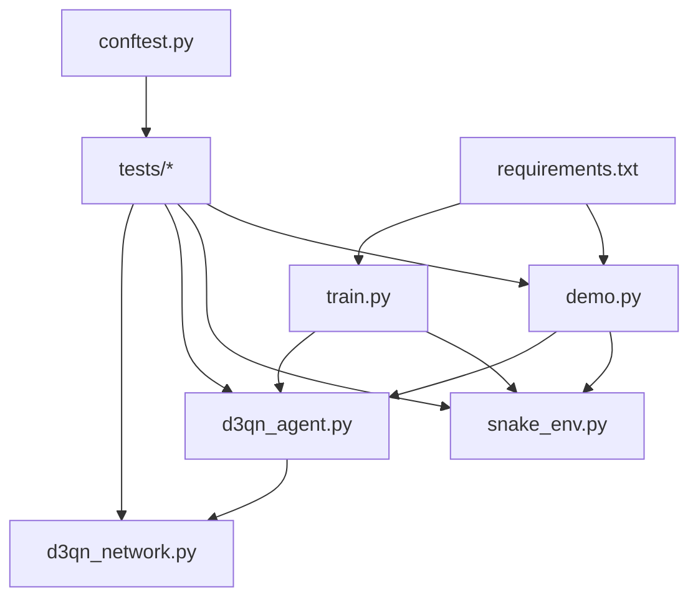
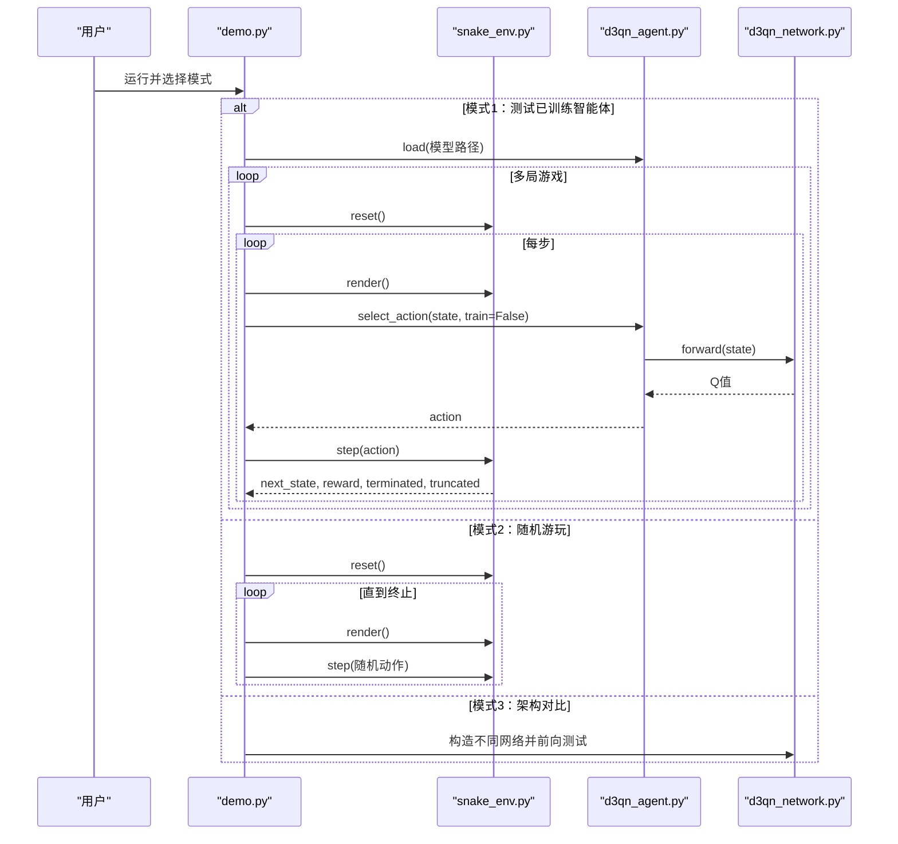
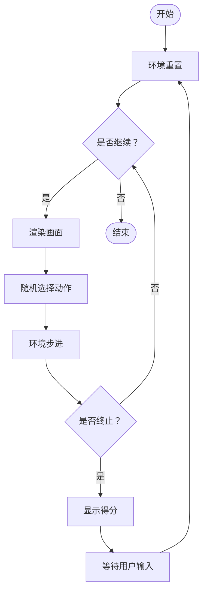
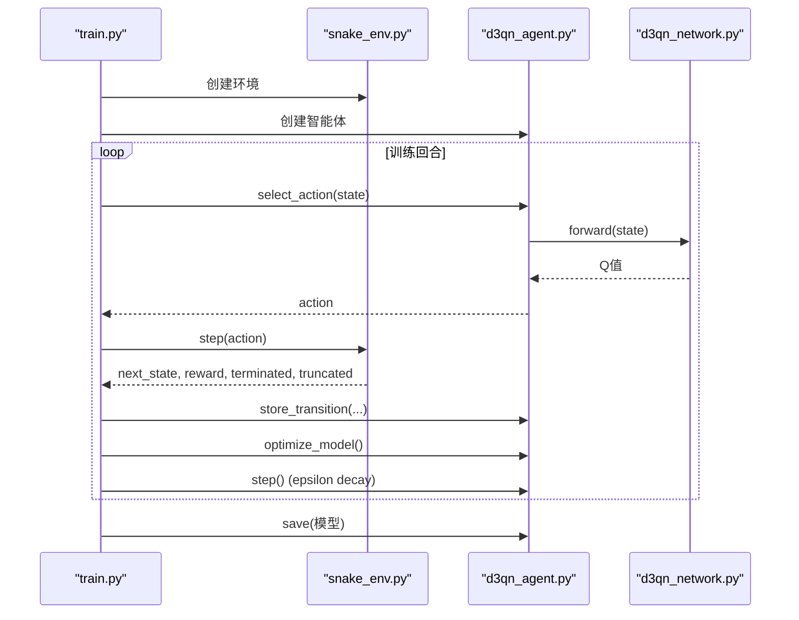
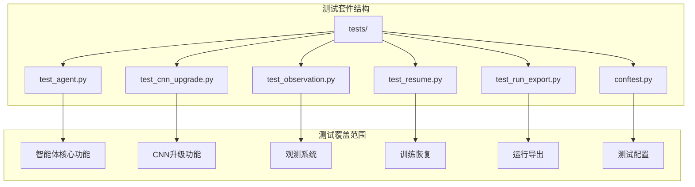
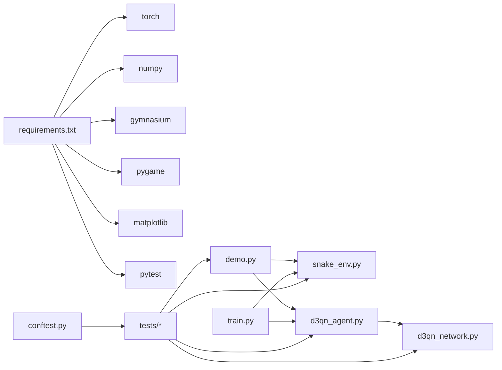

# 演示和测试

<cite>
**本文引用的文件**
- [demo.py](file://scripts/demo.py)
- [README.md](file://README.md)
- [snake_env.py](file://src/envs/snake_env.py)
- [d3qn_agent.py](file://src/agents/d3qn_agent.py)
- [d3qn_network.py](file://src/models/d3qn_network.py)
- [train.py](file://scripts/train.py)
- [requirements.txt](file://requirements.txt)
- [conftest.py](file://tests/conftest.py)
- [test_agent.py](file://tests/test_agent.py)
- [test_cnn_upgrade.py](file://tests/test_cnn_upgrade.py)
- [test_observation.py](file://tests/test_observation.py)
- [test_resume.py](file://tests/test_resume.py)
- [test_run_export.py](file://tests/test_run_export.py)
</cite>

## 更新摘要
**所做更改**
- 新增完整的测试框架章节，涵盖单元测试、集成测试和功能测试
- 更新演示脚本使用指南，反映最新的测试功能
- 添加环境验证工具的使用说明
- 增强故障排查指南，包含测试相关的常见问题
- 扩展性能注意事项，涵盖测试优化建议

## 目录
1. [简介](#简介)
2. [项目结构](#项目结构)
3. [核心组件](#核心组件)
4. [架构总览](#架构总览)
5. [详细组件分析](#详细组件分析)
6. [测试框架](#测试框架)
7. [依赖关系分析](#依赖关系分析)
8. [性能注意事项](#性能注意事项)
9. [故障排查指南](#故障排查指南)
10. [结论](#结论)
11. [附录](#附录)

## 简介
本指南面向希望运行、验证与扩展 D3QN（Dueling Double Deep Q-Network）蛇游戏智能体的开发者与使用者。重点围绕 demo.py 脚本，说明如何：
- 运行交互式演示界面
- 体验随机游玩模式以验证环境
- 加载并测试训练好的模型
- 使用环境验证工具确认自定义环境的正确性
- 利用全面的测试套件进行质量保证
- 解决常见问题（如 Pygame 显示问题、模型加载错误等）
- 扩展演示功能并获得最佳实践建议

## 项目结构
仓库包含环境、网络、智能体、训练与演示脚本，以及全面的测试套件和依赖清单与说明文档。关键文件职责如下：
- snake_env.py：实现 Gymnasium 风格的 Snake 环境，支持视觉/状态观测与渲染
- d3qn_network.py：实现 Dueling 结构的 D3QN 网络，支持CNN升级
- d3qn_agent.py：实现 D3QN 智能体（策略网络、目标网络、经验回放、动作选择、优化）
- train.py：训练主循环、指标记录、模型保存与可视化
- demo.py：演示与测试入口，提供三种模式：测试已训练智能体、随机游玩、网络架构对比
- tests/：完整的测试套件，包含单元测试、集成测试和功能测试
- requirements.txt：第三方依赖版本约束
- README.md：项目概览、快速开始、配置与排错



图表来源
- [demo.py:142-165](file://scripts/demo.py#L142-L165)
- [train.py:14-25](file://scripts/train.py#L14-L25)
- [requirements.txt:1-15](file://requirements.txt#L1-L15)
- [conftest.py:1-20](file://tests/conftest.py#L1-L20)

章节来源
- [README.md:5-59](file://README.md#L5-L59)
- [requirements.txt:1-15](file://requirements.txt#L1-L15)

## 核心组件
- 环境（SnakeEnv）
  - 观测空间：默认"视觉"模式为 10 维向量（8 方向障碍距离 + 食物方向），也支持"状态"模式为网格矩阵
  - 动作空间：离散 4 动作（上、下、左、右）
  - 奖励：吃食物 +10，碰撞 -10，超时 -1，每步微小惩罚 -0.1
  - 渲染：基于 pygame 的实时窗口展示
- 网络（D3QN）
  - 采用 Dueling 架构：共享特征提取层后分价值流 V(s) 与优势流 A(s,a)，聚合得到 Q(s,a)
  - 支持CNN升级：全棋盘CNN观测 + n-step返回
- 智能体（D3QNAgent）
  - 策略网络与目标网络双网结构
  - 经验回放缓冲与批量采样
  - Epsilon 衰减探索策略
  - 动作选择：训练时 epsilon-greedy，测试时可纯利用
  - 模型持久化：保存/加载 checkpoint（含网络参数、优化器状态、epsilon、步数）
  - N-step返回：支持n步回报计算，提升学习效率
- 训练器（Trainer）
  - 训练循环、指标统计、收敛判断、定期保存模型、绘制训练曲线
  - 自动检查点发现与恢复训练
  - 运行导出功能：每个训练会话生成独立文件夹

章节来源
- [snake_env.py:12-101](file://src/envs/snake_env.py#L12-L101)
- [d3qn_network.py:10-90](file://src/models/d3qn_network.py#L10-L90)
- [d3qn_agent.py:17-200](file://src/agents/d3qn_agent.py#L17-L200)
- [train.py:14-216](file://scripts/train.py#L14-L216)

## 架构总览
下图展示了演示程序与核心模块之间的交互关系，包括环境、智能体、网络与训练流程。



图表来源
- [demo.py:18-107](file://scripts/demo.py#L18-L107)
- [snake_env.py:43-101](file://src/envs/snake_env.py#L43-L101)
- [d3qn_agent.py:76-95](file://src/agents/d3qn_agent.py#L76-L95)
- [d3qn_network.py:58-90](file://src/models/d3qn_network.py#L58-L90)

## 详细组件分析

### 演示脚本（demo.py）使用指南
- 启动方式
  - 安装依赖后，在命令行执行 python scripts/demo.py
  - 首次运行会初始化 pygame 窗口
- 交互菜单
  - 选项1：测试已训练智能体
    - 尝试从 models/d3qn_snake_episode_5000.pth 加载模型
    - 若加载失败，将回退到未训练智能体进行演示
    - 默认运行 10 局，每局逐步渲染并打印得分与奖励
  - 选项2：随机游玩模式
    - 用于验证环境与渲染是否正常
    - 每步随机选择动作，遇到终止后按回车重新开始
    - 按 Ctrl+C 退出
  - 选项3：网络架构对比
    - 创建不同配置的 D3QN 网络，统计参数量与前向输出形状
- 与训练好的模型交互
  - 确保存在对应路径的模型文件；否则自动降级为随机策略演示
  - 可通过修改 demo.py 中的 checkpoint_path 指向任意已保存的模型
- 常见行为
  - 每局结束后清空屏幕并更新显示，避免画面残留
  - 关闭 pygame 资源

章节来源
- [demo.py:18-65](file://scripts/demo.py#L18-L65)
- [demo.py:74-107](file://scripts/demo.py#L74-L107)
- [demo.py:109-140](file://scripts/demo.py#L109-L140)
- [demo.py:142-165](file://scripts/demo.py#L142-L165)

### 随机游玩模式的实现原理
- 目的：快速验证环境是否正确工作（观测、动作、奖励、渲染）
- 实现要点
  - 创建 SnakeEnv，调用 reset 获取初始观测
  - 进入主循环：render -> 生成随机动作 -> step -> 更新状态
  - 当 terminated 或 truncated 为真时，提示得分并等待用户输入后重置
  - 异常中断时安全关闭环境
- 展示过程
  - 每步渲染当前网格、蛇身、食物、分数与步数信息
  - 通过 pygame.display.update 刷新画面



图表来源
- [demo.py:74-107](file://scripts/demo.py#L74-L107)
- [snake_env.py:160-203](file://src/envs/snake_env.py#L160-L203)

章节来源
- [demo.py:74-107](file://scripts/demo.py#L74-L107)
- [snake_env.py:160-203](file://src/envs/snake_env.py#L160-L203)

### 加载与测试预训练模型
- 模型文件位置
  - 默认路径：models/d3qn_snake_episode_5000.pth
  - 由训练脚本定期保存到 models 目录
- 加载流程
  - 演示脚本尝试加载指定路径的 checkpoint
  - 成功则使用训练好的策略进行纯利用模式（train=False）
  - 失败则回退到未训练智能体，便于调试
- 性能评估方法
  - 观察多局游戏的得分与奖励分布
  - 调整 grid_size 或观察类型以评估泛化能力
  - 可结合训练脚本生成的 training_curves.png 对照学习曲线
- 自定义模型路径
  - 修改 demo.py 中 checkpoint_path 指向你的模型文件
  - 确保网络结构与保存时一致（input_dim=10, num_actions=4）

章节来源
- [demo.py:25-34](file://scripts/demo.py#L25-L34)
- [train.py:142-147](file://scripts/train.py#L142-L147)
- [d3qn_agent.py:186-200](file://src/agents/d3qn_agent.py#L186-L200)

### 环境验证工具的使用指南
- 内置测试
  - 直接运行 snake_env.py 的 if __name__ == '__main__' 块，将自动创建环境、打印观测与动作空间、并进行随机游玩以验证渲染
- 验证要点
  - 观测空间维度与类型是否符合预期（vision/state）
  - 动作空间是否为 Discrete(4)
  - 渲染窗口是否能正常显示网格、蛇、食物与分数
  - 终止条件（撞墙、自撞、超时）是否触发正确
- 自定义环境检查清单
  - 确保 reset 返回符合声明空间的观测
  - step 返回 (next_obs, reward, terminated, truncated, info)
  - render 能稳定刷新且不阻塞过久
  - close 释放 pygame 资源

章节来源
- [snake_env.py:211-239](file://src/envs/snake_env.py#L211-L239)
- [snake_env.py:12-101](file://src/envs/snake_env.py#L12-L101)

### 训练与测试联动
- 训练流程
  - 训练脚本创建环境与智能体，循环训练并记录指标
  - 每隔若干集保存模型，并在达到收敛条件时提前停止
  - 训练完成后生成 training_curves.png 并保存最终模型
- 测试流程
  - 使用 demo.py 加载最新模型进行测试
  - 可选择随机游玩或架构对比辅助验证



图表来源
- [train.py:39-78](file://scripts/train.py#L39-L78)
- [d3qn_agent.py:76-184](file://src/agents/d3qn_agent.py#L76-L184)
- [d3qn_network.py:58-90](file://src/models/d3qn_network.py#L58-L90)

章节来源
- [train.py:158-216](file://scripts/train.py#L158-L216)
- [d3qn_agent.py:76-184](file://src/agents/d3qn_agent.py#L76-L184)

## 测试框架

### 测试套件概览
项目现在包含一个全面的测试套件，位于 `tests/` 目录下，提供了完整的质量保证覆盖：

- **conftest.py**：测试配置文件，设置Python路径和matplotlib后端
- **test_agent.py**：智能体单元测试，验证核心算法正确性
- **test_cnn_upgrade.py**：CNN升级功能测试，验证全棋盘观测和n步返回
- **test_observation.py**：观测系统测试，验证10维观测的正确性
- **test_resume.py**：训练恢复功能测试，验证检查点机制
- **test_run_export.py**：运行导出功能测试，验证模型导出逻辑

### 运行测试
```bash
# 运行所有测试
pytest tests/

# 运行特定测试文件
pytest tests/test_agent.py
pytest tests/test_cnn_upgrade.py

# 运行带详细输出的测试
pytest tests/ -v

# 运行特定测试用例
pytest tests/test_agent.py::test_q_values_shape_single_and_batch
```

### 智能体测试（test_agent.py）
- **输入维度验证**：确保默认10维输入正确连接
- **Q值形状测试**：验证单样本和批处理时的输出形状
- **动作选择测试**：确保返回的动作索引有效
- **损失函数测试**：验证TD目标广播无形状错误
- **保存加载测试**：确保模型权重、epsilon和目标网络同步

### CNN升级测试（test_cnn_upgrade.py）
- **网格观测测试**：验证3通道20x20网格观测的形状和语义
- **CNN前向测试**：测试不同网格尺寸下的网络前向传播
- **网格智能体测试**：验证grid观测类型的智能体行为
- **N步返回数学测试**：手算验证n步回报计算的准确性
- **终端状态处理**：确保终止状态正确标记

### 观测系统测试（test_observation.py）
- **10维观测验证**：确保观测向量具有正确的10个维度
- **食物方向编码**：验证垂直和水平食物方向的符号编码
- **对角线位置测试**：测试对角线食物位置的编码一致性
- **动作空间几何匹配**：确保观测符号与动作方向一致
- **边界情况测试**：验证角落和边界的距离计算

### 训练恢复测试（test_resume.py）
- **检查点发现**：验证最新检查点的自动查找逻辑
- **数字排序**：确保数值比较而非字符串比较
- **恢复训练**：验证从检查点继续训练的起始集数
- **缺失检查点处理**：确保没有检查点时正常启动

### 运行导出测试（test_run_export.py）
- **最佳模型资格**：验证最小回合数要求
- **改进标准**：确保使用滑动窗口平均而非全局平均
- **退出保存**：验证退出时不覆盖最佳快照
- **自动保存**：测试训练期间的自动保存机制
- **完整运行导出**：验证单个运行文件夹包含所有必需文件
- **短运行回退**：测试无法记录最佳模型时的回退逻辑



图表来源
- [conftest.py:1-20](file://tests/conftest.py#L1-L20)
- [test_agent.py:1-69](file://tests/test_agent.py#L1-L69)
- [test_cnn_upgrade.py:1-108](file://tests/test_cnn_upgrade.py#L1-L108)
- [test_observation.py:1-100](file://tests/test_observation.py#L1-L100)
- [test_resume.py:1-38](file://tests/test_resume.py#L1-L38)
- [test_run_export.py:1-203](file://tests/test_run_export.py#L1-L203)

章节来源
- [conftest.py:1-20](file://tests/conftest.py#L1-L20)
- [test_agent.py:1-69](file://tests/test_agent.py#L1-L69)
- [test_cnn_upgrade.py:1-108](file://tests/test_cnn_upgrade.py#L1-L108)
- [test_observation.py:1-100](file://tests/test_observation.py#L1-L100)
- [test_resume.py:1-38](file://tests/test_resume.py#L1-L38)
- [test_run_export.py:1-203](file://tests/test_run_export.py#L1-L203)

## 依赖关系分析
- 运行时依赖
  - torch：深度学习框架与张量运算
  - numpy：数值计算
  - gymnasium：环境接口标准
  - pygame：图形渲染
  - matplotlib：训练曲线绘图
  - pytest：测试框架
- 模块耦合
  - demo.py 依赖 snake_env.py 与 d3qn_agent.py
  - d3qn_agent.py 依赖 d3qn_network.py
  - train.py 同时依赖环境与智能体
  - 测试套件依赖所有核心模块
- 外部集成点
  - Pygame 窗口管理（初始化、刷新、退出）
  - PyTorch 设备检测（CPU/GPU）



图表来源
- [requirements.txt:1-15](file://requirements.txt#L1-L15)
- [demo.py:142-165](file://scripts/demo.py#L142-L165)
- [train.py:14-25](file://scripts/train.py#L14-L25)
- [conftest.py:1-20](file://tests/conftest.py#L1-L20)

章节来源
- [requirements.txt:1-15](file://requirements.txt#L1-L15)
- [demo.py:142-165](file://scripts/demo.py#L142-L165)
- [train.py:14-25](file://scripts/train.py#L14-L25)

## 性能注意事项
- 训练速度
  - 减少 n_episodes 至 1000-2000 可加速基础学习
  - 使用 GPU 加速（自动检测）
  - 增大 batch_size 提升梯度稳定性
- 表现提升
  - 延长训练轮次（10000+）
  - 调整 epsilon 衰减速率以获得更好的最终性能
  - 减小 grid_size 缩短单局时长，加快迭代
- 可视化开销
  - 渲染会降低训练速度，必要时可关闭渲染
  - 降低 FPS 或减少渲染频率以提升吞吐
- 测试优化
  - 使用 CPU 模式运行测试以提高速度
  - 减少测试回合数以加快CI/CD流水线
  - 并行运行测试套件

[本节为通用指导，不直接分析具体文件]

## 故障排查指南
- Pygame 显示问题
  - 现象：窗口无法打开或卡死
  - 排查：
    - 确认已安装 pygame 且无僵尸进程占用
    - 确保每次演示结束时调用 close 释放资源
    - 在 Windows 上尝试关闭其他可能占用显示的进程
- 模型加载错误
  - 现象：找不到文件或结构不匹配
  - 排查：
    - 检查 models 目录下是否存在对应 episode 的 .pth 文件
    - 确保网络结构与保存时一致（input_dim=10, num_actions=4）
    - 若路径不存在，演示脚本会自动回退到未训练智能体
- CUDA 内存不足
  - 现象：训练过程中 OOM
  - 排查：
    - 减小 batch_size
    - 关闭渲染或降低 FPS
    - 使用 CPU 模式临时验证
- 训练收敛缓慢或不学习
  - 现象：奖励长期低位、得分不增长
  - 排查：
    - 检查渲染是否拖慢训练
    - 确认 epsilon 衰减不过快
    - 适当增大 batch_size 或调整学习率
- 环境不响应或崩溃
  - 现象：step 报错或渲染异常
  - 排查：
    - 使用 snake_env.py 内置测试验证环境
    - 检查观测空间与动作空间是否与智能体期望一致
- 测试相关问题
  - 现象：测试失败或导入错误
  - 排查：
    - 确认 conftest.py 正确设置Python路径
    - 检查matplotlib后端设置为Agg模式
    - 验证所有依赖包版本兼容性

章节来源
- [README.md:232-249](file://README.md#L232-L249)
- [demo.py:25-34](file://scripts/demo.py#L25-L34)
- [snake_env.py:205-209](file://src/envs/snake_env.py#L205-L209)
- [conftest.py:1-20](file://tests/conftest.py#L1-L20)

## 结论
本指南系统介绍了如何使用 demo.py 进行演示与测试，涵盖随机游玩、已训练模型测试与网络架构对比。全新的测试框架提供了全面的质量保证，包括智能体测试、CNN升级测试、观测系统测试、训练恢复测试和运行导出测试。通过对环境与智能体的理解，开发者可以快速验证自定义环境、加载与评估模型，并利用测试套件确保代码质量。建议在正式使用前先运行随机游玩与环境自检，再加载模型进行评测，最后运行完整测试套件以确保系统稳定与结果可靠。

[本节为总结性内容，不直接分析具体文件]

## 附录
- 快速开始
  - 安装依赖：pip install -r requirements.txt
  - 训练：python scripts/train.py
  - 演示：python scripts/demo.py，选择相应选项
  - 测试：pytest tests/
- 常用配置
  - 训练参数：n_episodes、max_steps_per_episode、log_interval、save_interval
  - 智能体超参：gamma、epsilon_start/end/decay、batch_size、buffer_size、target_update
  - 测试配置：conftest.py中的路径设置和matplotlib后端
- 扩展建议
  - 添加 TensorBoard 日志以跟踪损失与指标
  - 引入优先经验回放提升学习效率
  - 增加 Web 界面（Gradio/Streamlit）以便在线演示
  - 支持多智能体对战或课程学习策略
  - 扩展现有测试套件以覆盖更多边缘情况

章节来源
- [README.md:70-119](file://README.md#L70-L119)
- [README.md:191-216](file://README.md#L191-L216)
- [README.md:222-230](file://README.md#L222-L230)
- [conftest.py:1-20](file://tests/conftest.py#L1-L20)