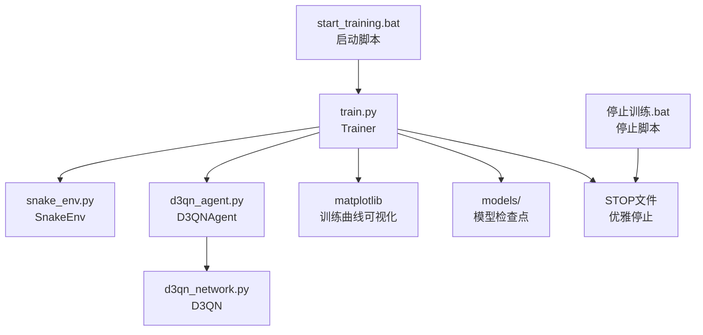
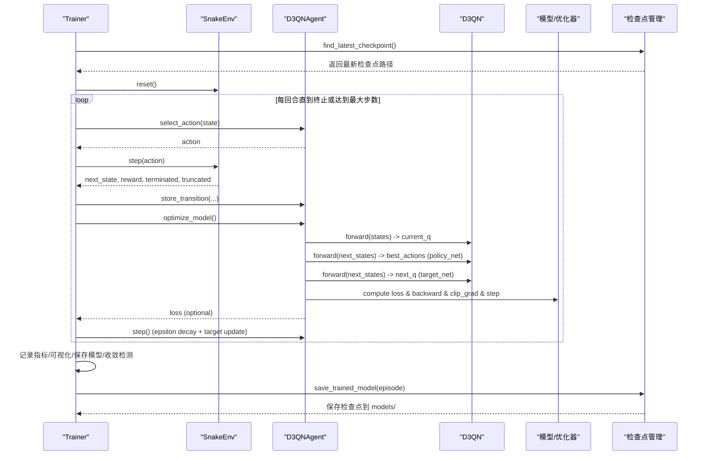
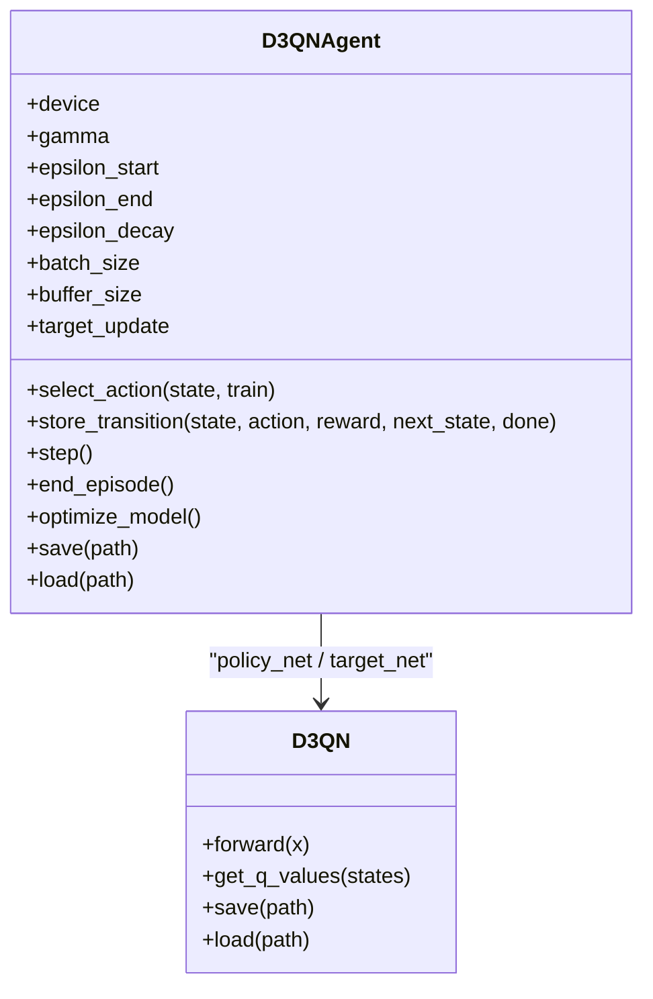
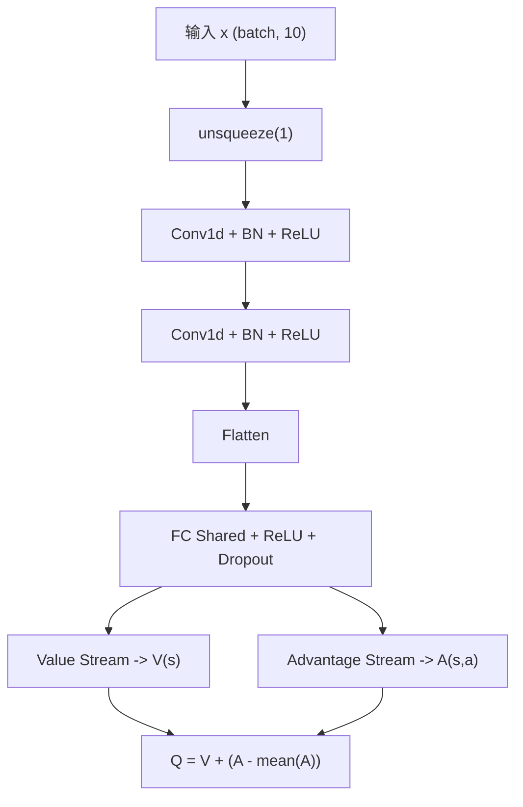
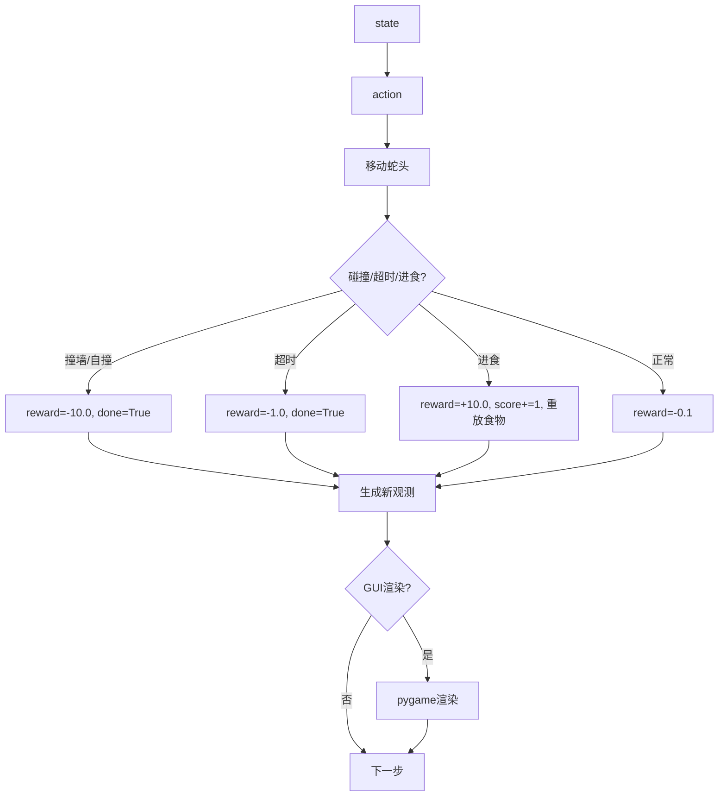
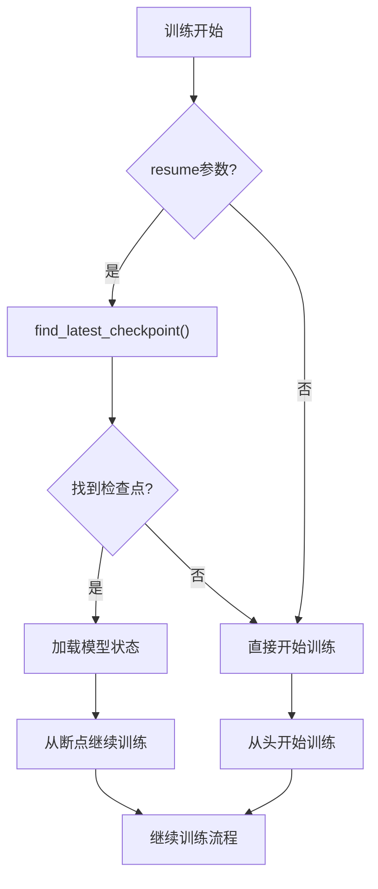
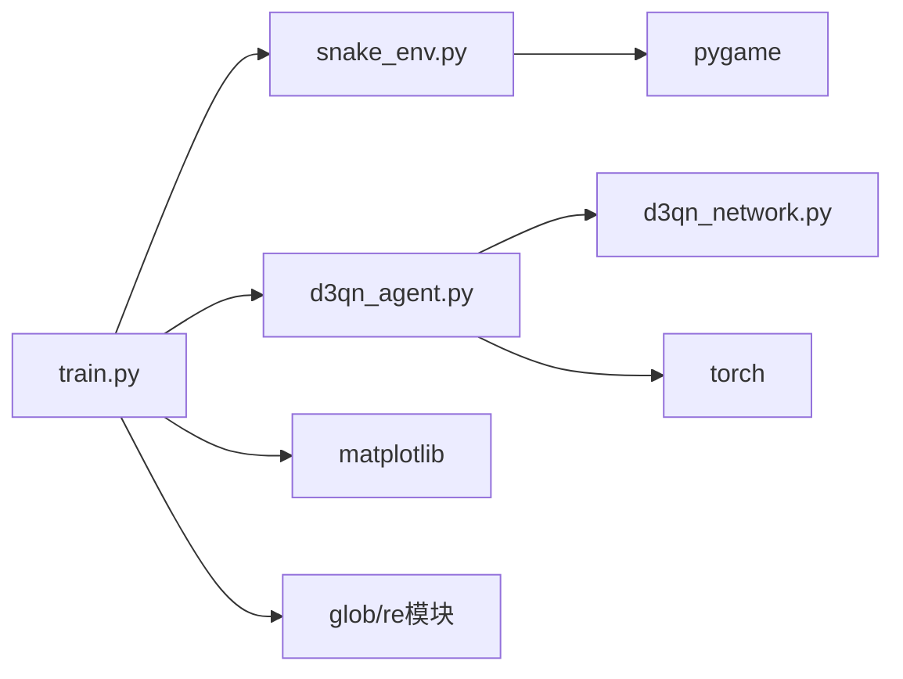

# 训练系统

<cite>
**本文引用的文件**
- [train.py](file://train.py)
- [d3qn_agent.py](file://d3qn_agent.py)
- [d3qn_network.py](file://d3qn_network.py)
- [snake_env.py](file://snake_env.py)
- [demo.py](file://demo.py)
- [README.md](file://README.md)
- [start_training.bat](file://start_training.bat)
- [停止训练.bat](file://停止训练.bat)
</cite>

## 更新摘要
**所做更改**
- 增强了检查点管理和恢复功能
- 添加了智能检查点查找和自动恢复机制
- 改进了训练日志记录和状态监控
- 实现了优雅的停止机制和错误处理
- 增强了GUI集成和实时反馈功能
- 更新了训练流程控制逻辑

## 目录
1. [简介](#简介)
2. [项目结构](#项目结构)
3. [核心组件](#核心组件)
4. [架构总览](#架构总览)
5. [详细组件分析](#详细组件分析)
6. [依赖关系分析](#依赖关系分析)
7. [性能与调优](#性能与调优)
8. [故障排除指南](#故障排除指南)
9. [结论](#结论)
10. [附录：超参数配置建议](#附录超参数配置建议)

## 简介
本训练系统基于 D3QN（Dueling Double Deep Q-Network）在自定义的贪吃蛇环境中进行强化学习训练。系统包含环境封装、网络模型、智能体、训练循环、指标可视化与模型持久化等模块，支持 GPU 加速、经验回放、目标网络更新、探索率衰减、收敛检测与早停策略，并提供完整的训练曲线可视化与模型保存/加载能力。

**最新更新**：系统现已具备强大的检查点管理、恢复功能、改进的日志记录和更好的错误处理能力，确保训练过程的稳定性和可恢复性。

## 项目结构
- 环境与交互
  - snake_env.py：实现 Gymnasium 风格的贪吃蛇环境，提供观测空间、动作空间、奖励机制与渲染。
- 模型与算法
  - d3qn_network.py：D3QN 网络（Dueling 架构），分离价值流与优势流。
  - d3qn_agent.py：D3QN 智能体，集成经验回放、Double DQN 更新、目标网络同步、epsilon 调度与优化步骤。
- 训练与演示
  - train.py：Trainer 类负责训练循环控制、指标收集、可视化、模型保存与收敛检测，新增检查点管理和恢复功能。
  - demo.py：测试与演示脚本，支持加载已训练模型或随机游玩以验证环境。
- 启动脚本
  - start_training.bat：Windows批处理脚本，自动检查虚拟环境并启动训练。
  - 停止训练.bat：创建STOP文件请求优雅停止训练。
- 文档与依赖
  - README.md：快速开始、配置说明、性能提示与故障排除。
  - requirements.txt：依赖清单（由 README 指引安装）。

**图表来源**
- [train.py:16-78](file://train.py#L16-L78)
- [train.py:204-301](file://train.py#L204-L301)
- [start_training.bat:1-33](file://start_training.bat#L1-L33)
- [停止训练.bat:1-10](file://停止训练.bat#L1-L10)

**章节来源**
- [README.md:17-31](file://README.md#L17-L31)
- [train.py:16-337](file://train.py#L16-L337)
- [snake_env.py:12-257](file://snake_env.py#L12-L257)
- [d3qn_agent.py:17-223](file://d3qn_agent.py#L17-L223)
- [d3qn_network.py:10-138](file://d3qn_network.py#L10-L138)
- [demo.py:11-158](file://demo.py#L11-L158)

## 核心组件
- Trainer（训练器）
  - 管理训练轮数、每回合最大步数、日志与保存间隔。
  - 维护奖励、分数、损失、epsilon 值等指标，计算移动平均并绘制训练曲线。
  - 实现收敛检测（最近 N 回合平均奖励阈值）与早停。
  - **新增**：智能检查点管理，支持自动恢复和断点续训。
- D3QNAgent（智能体）
  - 维护主网络与目标网络、Adam 优化器、MSE 损失、经验回放缓冲区。
  - 实现 epsilon-greedy 动作选择、经验存储、Double DQN 目标计算、梯度裁剪与优化。
  - 定期同步目标网络，按步计数更新 epsilon。
  - **增强**：完整的模型状态保存和加载功能。
- D3QN（网络）
  - 使用卷积层提取特征，共享全连接层后分叉为价值流 V(s) 与优势流 A(s,a)，聚合得到 Q(s,a)。
- SnakeEnv（环境）
  - 提供 10 维局部视野观测、4 个离散动作、碰撞/超时/进食奖励与渲染。
  - **增强**：支持GUI集成和优雅停止机制。

**章节来源**
- [train.py:29-78](file://train.py#L29-L78)
- [d3qn_agent.py:17-162](file://d3qn_agent.py#L17-L162)
- [d3qn_network.py:10-106](file://d3qn_network.py#L10-L106)
- [snake_env.py:12-257](file://snake_env.py#L12-L257)

## 架构总览
下图展示了训练过程中各模块的调用关系与数据流向：

**图表来源**
- [train.py:16-27](file://train.py#L16-L27)
- [train.py:61-78](file://train.py#L61-L78)
- [train.py:79-124](file://train.py#L79-L124)
- [train.py:188-194](file://train.py#L188-L194)

## 详细组件分析

### Trainer（训练循环控制、指标与可视化）
- 训练流程
  - 初始化环境与智能体；设置日志与保存间隔。
  - **新增**：智能检查点查找和恢复机制，支持从断点继续训练。
  - 每回合：reset → 选择动作 → 环境步进 → 存储经验 → 优化模型 → 更新 epsilon/步数 → 判断终止。
  - 每 log_interval 打印状态；每 save_interval 保存模型；当最近 100 回合平均奖励超过阈值时触发早停。
- 指标收集与可视化
  - 记录每回合奖励、得分、训练损失、epsilon 值。
  - 计算移动平均（窗口默认 50），绘制四幅图：奖励曲线、得分曲线、损失曲线、探索率衰减图，并保存到 training_curves.png。
- 模型管理
  - 将模型检查点保存到 models/ 目录，文件名包含回合号。
  - **增强**：自动查找最新检查点，支持 resume=True 参数恢复训练。
- 收敛检测与早停
  - 当最近 100 回合平均奖励大于阈值（默认 50.0）时停止训练。
  - **新增**：多种优雅停止机制（Ctrl+C、关闭窗口、STOP文件）。

**图表来源**
- [train.py:16-27](file://train.py#L16-L27)
- [train.py:61-78](file://train.py#L61-L78)
- [train.py:204-301](file://train.py#L204-L301)

**章节来源**
- [train.py:29-337](file://train.py#L29-L337)

### D3QNAgent（经验回放、优化与目标网络）
- 关键设计
  - 主网络与目标网络：主网络用于选择动作与估计当前 Q，目标网络用于稳定目标值。
  - 经验回放：使用 deque 作为固定容量缓冲，采样 mini-batch 进行训练。
  - Double DQN：用主网络选择最佳动作，用目标网络评估该动作的 Q 值，减少过估计偏差。
  - 优化：Adam 优化器，MSE 损失，梯度裁剪防止爆炸。
  - 目标网络同步：每隔 target_update 步复制主网络权重到目标网络。
  - 探索率衰减：每步 epsilon = max(epsilon_end, epsilon * epsilon_decay)。
- 训练步骤
  - 若经验不足 batch_size，跳过优化。
  - 采样批次，构造张量，计算 current_q 与 targets，反向传播并更新参数。
- **增强功能**
  - 完整的模型状态保存：包括网络参数、优化器状态、epsilon值和步数计数器。
  - 稳健的模型加载：支持设备映射和权重加载。

**图表来源**
- [d3qn_agent.py:17-162](file://d3qn_agent.py#L17-L162)
- [d3qn_network.py:10-106](file://d3qn_network.py#L10-L106)

**章节来源**
- [d3qn_agent.py:17-223](file://d3qn_agent.py#L17-L223)

### D3QN（网络架构）
- 架构要点
  - 输入维度 10，通过 1D 卷积层与批归一化提取特征。
  - 共享全连接层后分叉为价值流 V(s) 与优势流 A(s,a)。
  - 聚合公式：Q(s,a) = V(s) + (A(s,a) - mean(A))，提升稳定性与可解释性。
- 前向过程
  - 对输入进行 reshape 与卷积处理，展平后进入共享层，再分别计算 V 与 A，最后聚合输出 Q 值。

**图表来源**
- [d3qn_network.py:20-90](file://d3qn_network.py#L20-L90)

**章节来源**
- [d3qn_network.py:10-138](file://d3qn_network.py#L10-L138)

### SnakeEnv（环境）
- 观测空间
  - 10 维向量：8 个方向障碍物距离（负值表示障碍）、第 9-10 维为食物相对方向的编码。
- 动作空间
  - 离散 4 个方向：上、下、左、右。
- 奖励机制
  - 吃到食物：+10.0
  - 撞墙/自撞：-10.0
  - 普通移动：-0.1（鼓励更快找到食物）
  - 超时：-1.0
- 渲染
  - 使用 pygame 绘制网格、蛇身、食物与分数/步数信息。
  - **增强**：支持GUI集成，显示当前回合数和探索率。
- **新增功能**
  - 优雅停止机制：通过 close_requested 标志位支持外部停止请求。

**图表来源**
- [snake_env.py:59-103](file://snake_env.py#L59-L103)
- [snake_env.py:166-227](file://snake_env.py#L166-L227)

**章节来源**
- [snake_env.py:12-257](file://snake_env.py#L12-L257)

### 检查点管理系统
- **新增功能**：智能检查点查找和恢复
- 自动检测 models/ 目录中的最新检查点文件
- 支持从指定模型路径恢复训练
- 保持训练状态连续性（epsilon、步数计数器等）
- 优雅的错误处理和回退机制

**图表来源**
- [train.py:16-27](file://train.py#L16-L27)
- [train.py:61-78](file://train.py#L61-L78)

**章节来源**
- [train.py:16-78](file://train.py#L16-L78)

## 依赖关系分析
- 模块耦合
  - Trainer 依赖 SnakeEnv 与 D3QNAgent，并通过 matplotlib 进行可视化。
  - D3QNAgent 依赖 D3QN 网络与 PyTorch 优化器/损失函数。
  - SnakeEnv 依赖 gymnasium 与 pygame。
- 外部依赖
  - torch、numpy、matplotlib、gymnasium、pygame。
- **新增依赖**
  - glob、re 模块用于检查点文件管理
  - time 模块用于性能监控

**图表来源**
- [train.py:6-13](file://train.py#L6-L13)
- [d3qn_agent.py:6-11](file://d3qn_agent.py#L6-L11)
- [snake_env.py:6-9](file://snake_env.py#L6-L9)

**章节来源**
- [train.py:6-13](file://train.py#L6-L13)
- [d3qn_agent.py:6-11](file://d3qn_agent.py#L6-L11)
- [snake_env.py:6-9](file://snake_env.py#L6-L9)

## 性能与调优
- GPU 加速
  - 智能体自动检测设备并使用 CUDA（若可用）。可通过调整设备字符串切换 CPU/GPU。
- 内存优化
  - 减小 batch_size 以降低显存占用。
  - 降低 grid_size 以减少每回合步数与环境开销。
  - 关闭渲染（render=False）以提升训练速度。
- 训练稳定性
  - 增大 batch_size 可获得更稳定的梯度。
  - 调整 epsilon_decay 使探索更充分，避免过早收敛到次优策略。
  - 适当增大 buffer_size 以积累更多样化的经验。
- 收敛与早停
  - 根据任务难度调整收敛阈值（例如最近 100 回合平均奖励阈值）。
  - 结合训练曲线观察损失与奖励趋势，必要时延长训练或调整超参。
- **新增优化**
  - 使用检查点功能避免重复训练
  - 合理设置保存间隔平衡磁盘空间和训练效率

## 故障排除指南
- CUDA 显存不足
  - 现象：训练时报错或崩溃。
  - 解决：减小 batch_size；降低网络规模；关闭渲染；确保使用 GPU 时显存足够。
- 训练收敛缓慢
  - 现象：奖励长期停滞。
  - 解决：确认 GPU 被使用；增大 batch_size；减小 grid_size；调整 epsilon_decay；检查渲染是否拖慢训练。
- 智能体不学习
  - 现象：始终无法吃到食物。
  - 解决：关闭渲染；检查 epsilon 是否过快衰减；增加训练回合；调整学习率或目标网络更新频率。
- 游戏无法启动
  - 现象：pygame 相关错误。
  - 解决：安装 pygame；关闭残留的 pygame 窗口；确保显示环境可用。
- **新增问题**
  - 检查点加载失败：确保模型文件完整且格式正确
  - 恢复训练状态不一致：检查设备配置和网络结构是否匹配
  - 优雅停止无效：确认STOP文件或GUI事件正确处理

**章节来源**
- [README.md:295-312](file://README.md#L295-L312)

## 结论
本训练系统以 D3QN 为核心，在贪吃蛇环境中实现了完整的强化学习训练流程。Trainer 负责训练循环控制、指标收集与可视化、模型保存与收敛检测；D3QNAgent 实现经验回放、Double DQN 更新与目标网络同步；D3QN 网络采用 Dueling 架构提升稳定性；SnakeEnv 提供清晰的观测、动作与奖励定义。

**重要更新**：系统现已具备强大的检查点管理、恢复功能、改进的日志记录和更好的错误处理能力。这些增强功能确保了训练过程的稳定性和可恢复性，支持长时间训练任务的可靠运行，并提供灵活的训练中断和继续机制。

系统支持 GPU 加速、内存优化与性能调优，并提供可视化与故障排除指南，便于用户快速上手与迭代改进。

## 附录：超参数配置建议
- 训练轮数（n_episodes）
  - 基础学习：1000–2000 回合可观察到基本行为。
  - 更好表现：10000+ 回合有助于稳定与提升最终性能。
- 每回合最大步数（max_steps_per_episode）
  - 默认 500，可根据网格大小与任务复杂度调整。
- 日志间隔（log_interval）
  - 默认 10；设为 1 可逐回合输出（较慢但信息丰富）。
- 保存间隔（save_interval）
  - 默认 50；根据磁盘与训练时长权衡。
- 探索率（epsilon）
  - 初始 1.0，最终 0.05，衰减率 0.995；可根据任务调整衰减速度与下限。
- 批量大小（batch_size）
  - 默认 64；增大可提升稳定性但增加显存占用。
- 经验回放容量（buffer_size）
  - 默认 100000；更大容量有助于多样性但增加内存。
- 目标网络更新频率（target_update）
  - 默认 1000；过小可能导致不稳定，过大可能延迟目标更新。
- 折扣因子（gamma）
  - 默认 0.99；影响长期回报的权重。
- 学习率（optimizer lr）
  - 默认 1e-4；可根据任务调整。
- 网格大小（grid_size）
  - 默认 20；更小网格加快回合，适合快速实验。
- 观测类型（observation_type）
  - vision：局部视野 10 维；state：完整网格（维度随 grid_size 变化）。
- **新增配置**
  - resume：启用检查点恢复功能
  - model_path：指定恢复的训练模型路径
  - render_training：训练期间实时渲染

**章节来源**
- [README.md:139-162](file://README.md#L139-L162)
- [train.py:32-35](file://train.py#L32-L35)
- [d3qn_agent.py:27-55](file://d3qn_agent.py#L27-L55)
- [snake_env.py:15-33](file://snake_env.py#L15-L33)