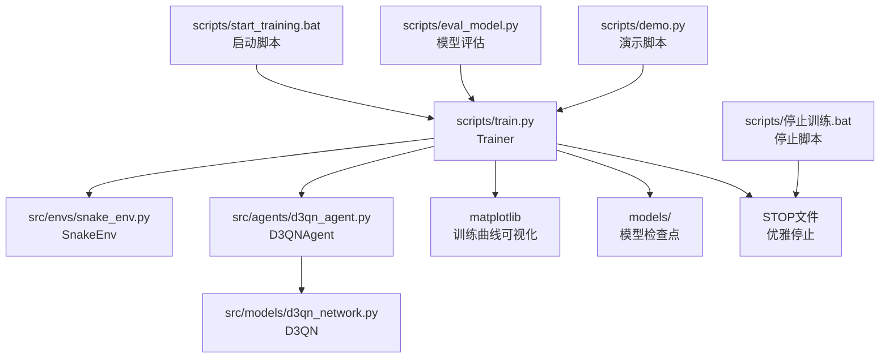
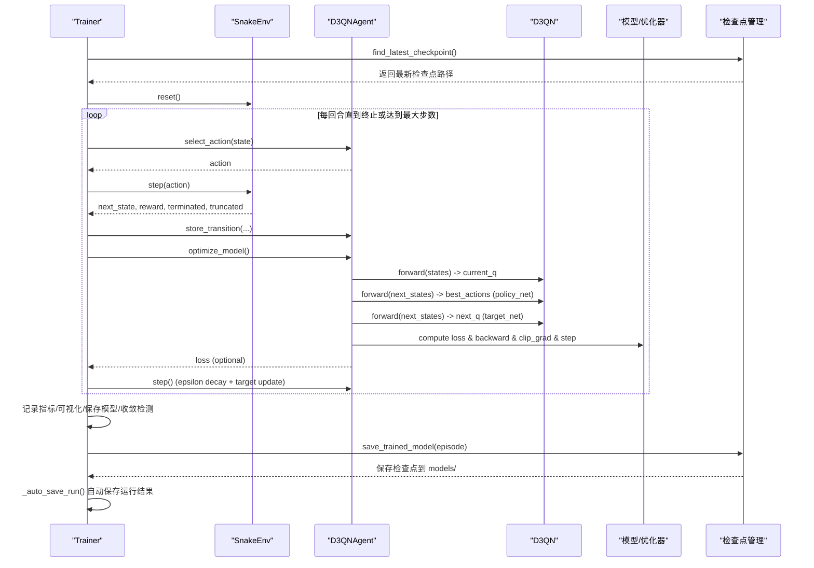
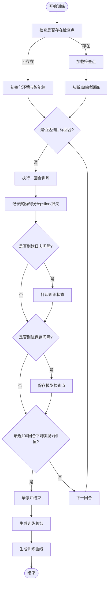
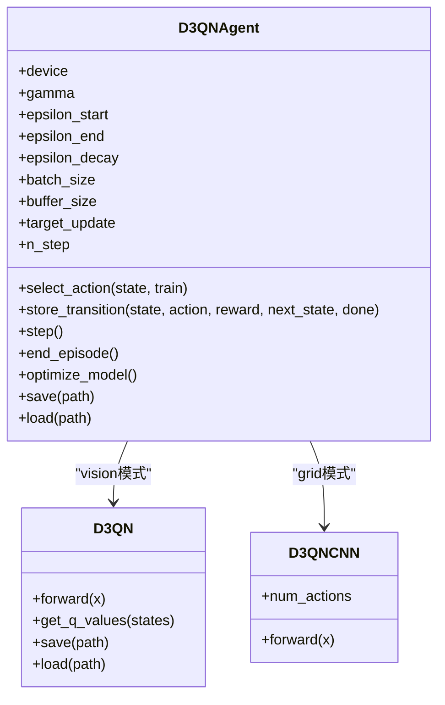
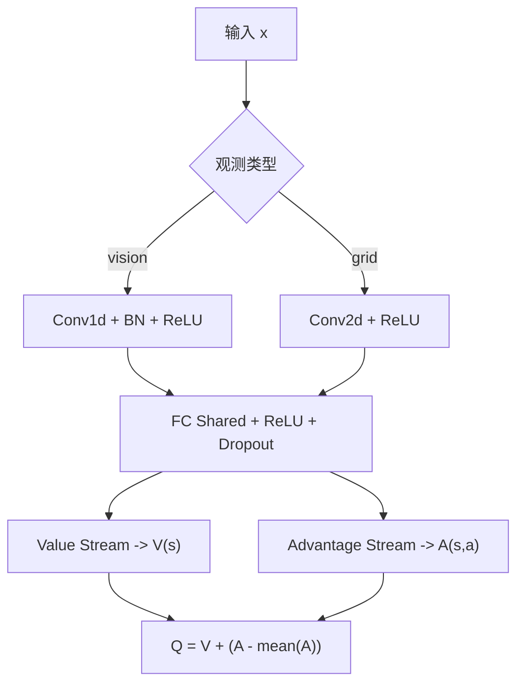
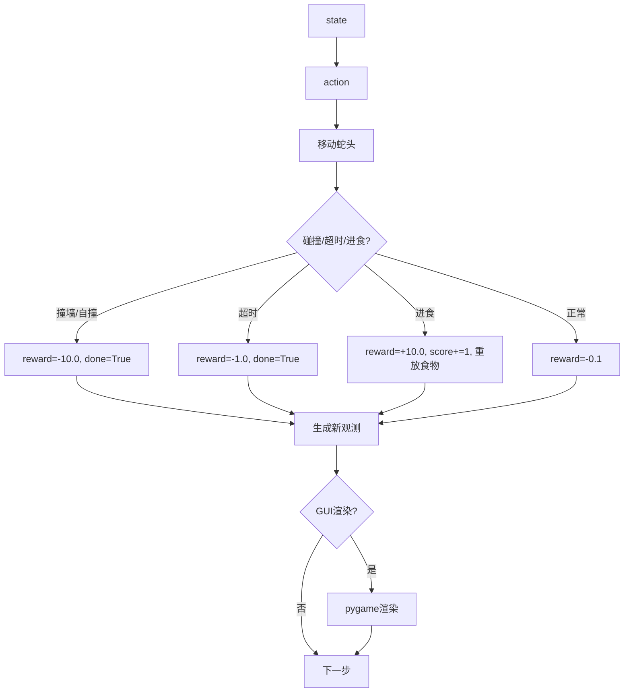
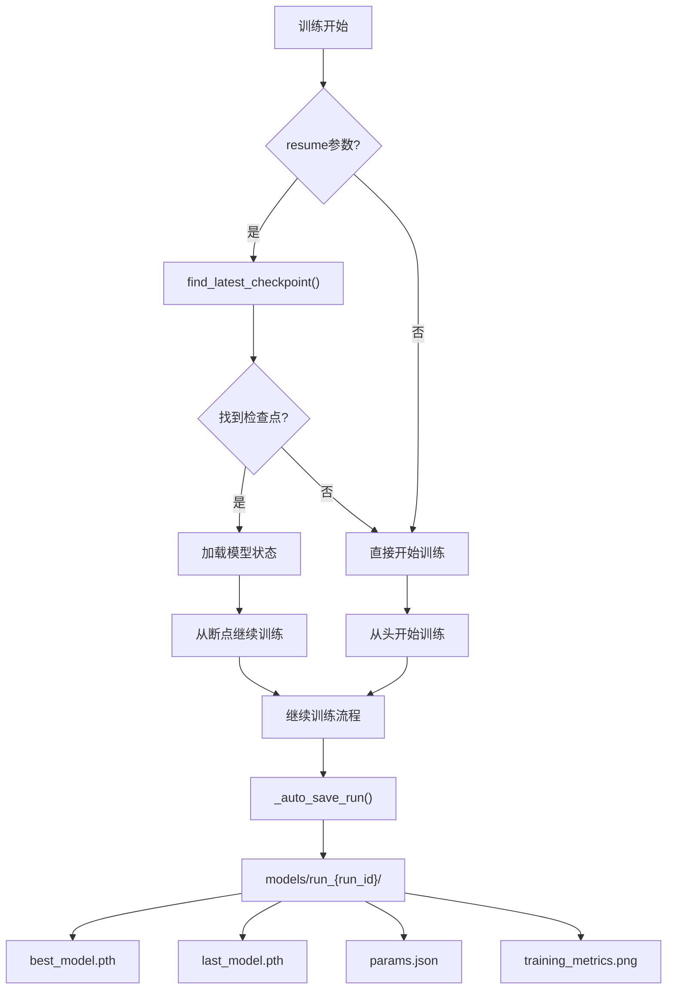
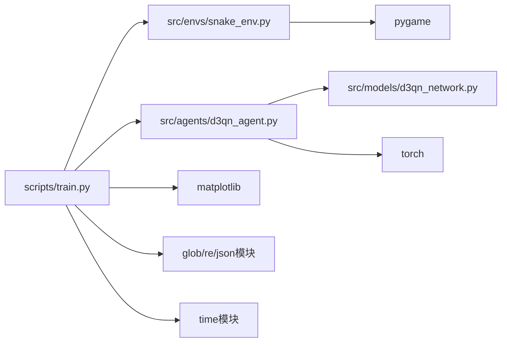

# 训练系统

<cite>
**本文引用的文件**
- [train.py](file://scripts/train.py)
- [d3qn_agent.py](file://src/agents/d3qn_agent.py)
- [d3qn_network.py](file://src/models/d3qn_network.py)
- [snake_env.py](file://src/envs/snake_env.py)
- [demo.py](file://scripts/demo.py)
- [eval_model.py](file://scripts/eval_model.py)
- [README.md](file://README.md)
</cite>

## 更新摘要
**所做更改**
- 训练系统完全重构，Trainer类移至scripts/train.py
- 新增智能检查点管理系统，支持断点续训和自动恢复
- 实现实时训练监控和自动化图表生成
- 增强模型管理功能，支持最佳模型追踪和运行目录组织
- 改进GUI集成和优雅停止机制
- 优化训练流程和性能监控

## 目录
1. [简介](#简介)
2. [项目结构](#项目结构)
3. [核心组件](#核心组件)
4. [架构总览](#架构总览)
5. [详细组件分析](#详细组件分析)
6. [依赖关系分析](#依赖关系分析)
7. [性能与调优](#性能与调优)
8. [故障排除指南](#故障排除指南)
9. [结论](#结论)
10. [附录：超参数配置建议](#附录超参数配置建议)

## 简介
本训练系统基于 D3QN（Dueling Double Deep Q-Network）在自定义的贪吃蛇环境中进行强化学习训练。系统现已完全重构，采用全新的Trainer类设计，提供完整的训练循环控制、智能检查点管理、实时性能监控、自动化可视化以及优雅的模型管理机制。

**最新更新**：系统现已具备强大的检查点管理、恢复功能、改进的日志记录和更好的错误处理能力，确保训练过程的稳定性和可恢复性。训练流程已迁移到scripts/train.py，提供更清晰的模块化结构和更强大的功能。

## 项目结构
- **环境与交互**
  - snake_env.py：实现 Gymnasium 风格的贪吃蛇环境，提供观测空间、动作空间、奖励机制与渲染。
- **模型与算法**
  - d3qn_network.py：D3QN 网络（Dueling 架构），分离价值流与优势流。
  - d3qn_agent.py：D3QN 智能体，集成经验回放、Double DQN 更新、目标网络同步、epsilon 调度与优化步骤。
- **训练与演示**
  - train.py：新的Trainer类负责训练循环控制、指标收集、可视化、模型保存与收敛检测，包含完整的检查点管理功能。
  - demo.py：测试与演示脚本，支持加载已训练模型或随机游玩以验证环境。
  - eval_model.py：模型评估脚本，支持性能分析和基准测试。
- **启动脚本**
  - start_training.bat：Windows批处理脚本，自动检查虚拟环境并启动训练。
  - 停止训练.bat：创建STOP文件请求优雅停止训练。
- **文档与依赖**
  - README.md：快速开始、配置说明、性能提示与故障排除。
  - requirements.txt：依赖清单（由 README 指引安装）。

**图表来源**
- [train.py:41-559](file://scripts/train.py#L41-L559)
- [train.py:27-38](file://scripts/train.py#L27-L38)
- [README.md:32-38](file://README.md#L32-L38)

**章节来源**
- [README.md:5-59](file://README.md#L5-L59)
- [train.py:41-559](file://scripts/train.py#L41-L559)
- [snake_env.py:12-283](file://src/envs/snake_env.py#L12-L283)
- [d3qn_agent.py:17-264](file://src/agents/d3qn_agent.py#L17-L264)
- [d3qn_network.py:10-184](file://src/models/d3qn_network.py#L10-L184)
- [demo.py:18-165](file://scripts/demo.py#L18-L165)

## 核心组件
- **Trainer（训练器）**
  - 管理训练轮数、每回合最大步数、日志与保存间隔。
  - 维护奖励、分数、损失、epsilon 值等指标，计算移动平均并绘制训练曲线。
  - 实现收敛检测（最近 N 回合平均奖励阈值）与早停。
  - **新增**：智能检查点管理，支持自动恢复和断点续训。
  - **增强**：运行目录组织，自动保存最佳模型和参数信息。
- **D3QNAgent（智能体）**
  - 维护主网络与目标网络、Adam 优化器、MSE 损失、经验回放缓冲区。
  - 实现 epsilon-greedy 动作选择、经验存储、Double DQN 目标计算、梯度裁剪与优化。
  - 定期同步目标网络，按步计数更新 epsilon。
  - **增强**：完整的模型状态保存和加载功能。
- **D3QN（网络）**
  - 使用卷积层提取特征，共享全连接层后分叉为价值流 V(s) 与优势流 A(s,a)，聚合得到 Q(s,a)。
  - **新增**：支持CNN架构用于网格观测。
- **SnakeEnv（环境）**
  - 提供多种观测类型：局部视野、完整网格、状态表示。
  - 支持4个离散动作、碰撞/超时/进食奖励与渲染。
  - **增强**：支持GUI集成和优雅停止机制。

**章节来源**
- [train.py:41-111](file://scripts/train.py#L41-L111)
- [d3qn_agent.py:17-203](file://src/agents/d3qn_agent.py#L17-L203)
- [d3qn_network.py:10-152](file://src/models/d3qn_network.py#L10-L152)
- [snake_env.py:12-283](file://src/envs/snake_env.py#L12-L283)

## 架构总览
下图展示了训练过程中各模块的调用关系与数据流向：

**图表来源**
- [train.py:27-38](file://scripts/train.py#L27-L38)
- [train.py:112-157](file://scripts/train.py#L112-L157)
- [train.py:395-518](file://scripts/train.py#L395-L518)

## 详细组件分析

### Trainer（训练循环控制、指标与可视化）
- **训练流程**
  - 初始化环境与智能体；设置日志与保存间隔。
  - **新增**：智能检查点查找和恢复机制，支持从断点继续训练。
  - 每回合：reset → 选择动作 → 环境步进 → 存储经验 → 优化模型 → 更新 epsilon/步数 → 判断终止。
  - 每 log_interval 打印状态；每 save_interval 保存模型；当最近 100 回合平均奖励超过阈值时触发早停。
- **指标收集与可视化**
  - 记录每回合奖励、得分、训练损失、epsilon 值。
  - 计算移动平均（窗口默认 50），绘制四幅图：奖励曲线、得分曲线、损失曲线、探索率衰减图，并保存到 output/training_curves.png。
  - **新增**：自动化的图表生成和保存功能。
- **模型管理**
  - 将模型检查点保存到 models/ 目录，文件名包含回合号。
  - **增强**：自动查找最新检查点，支持 resume=True 参数恢复训练。
  - **新增**：运行目录组织，自动保存最佳模型、最后模型和参数信息。
- **收敛检测与早停**
  - 当最近 100 回合平均奖励大于阈值（默认 50.0）时停止训练。
  - **新增**：多种优雅停止机制（Ctrl+C、关闭窗口、STOP文件）。

**图表来源**
- [train.py:27-38](file://scripts/train.py#L27-L38)
- [train.py:112-157](file://scripts/train.py#L112-L157)
- [train.py:395-518](file://scripts/train.py#L395-L518)

**章节来源**
- [train.py:41-559](file://scripts/train.py#L41-L559)

### D3QNAgent（经验回放、优化与目标网络）
- **关键设计**
  - 主网络与目标网络：主网络用于选择动作与估计当前 Q，目标网络用于稳定目标值。
  - 经验回放：使用 deque 作为固定容量缓冲，采样 mini-batch 进行训练。
  - Double DQN：用主网络选择最佳动作，用目标网络评估该动作的 Q 值，减少过估计偏差。
  - 优化：Adam 优化器，MSE 损失，梯度裁剪防止爆炸。
  - 目标网络同步：每隔 target_update 步复制主网络权重到目标网络。
  - 探索率衰减：每步 epsilon = max(epsilon_end, epsilon * epsilon_decay)。
  - **新增**：支持n-step returns，提高长期信用分配效率。
- **训练步骤**
  - 若经验不足 batch_size，跳过优化。
  - 采样批次，构造张量，计算 current_q 与 targets，反向传播并更新参数。
- **增强功能**
  - 完整的模型状态保存：包括网络参数、优化器状态、epsilon值和步数计数器。
  - 稳健的模型加载：支持设备映射和权重加载。

**图表来源**
- [d3qn_agent.py:17-203](file://src/agents/d3qn_agent.py#L17-L203)
- [d3qn_network.py:10-152](file://src/models/d3qn_network.py#L10-L152)

**章节来源**
- [d3qn_agent.py:17-264](file://src/agents/d3qn_agent.py#L17-L264)

### D3QN（网络架构）
- **架构要点**
  - **传统D3QN**：输入维度 10，通过 1D 卷积层与批归一化提取特征。
  - **CNN版本**：支持完整网格观测，使用2D卷积层处理3通道图像。
  - 共享全连接层后分叉为价值流 V(s) 与优势流 A(s,a)。
  - 聚合公式：Q(s,a) = V(s) + (A(s,a) - mean(A))，提升稳定性与可解释性。
- **前向过程**
  - 对输入进行 reshape 与卷积处理，展平后进入共享层，再分别计算 V 与 A，最后聚合输出 Q 值。

**图表来源**
- [d3qn_network.py:20-90](file://src/models/d3qn_network.py#L20-L90)
- [d3qn_network.py:108-152](file://src/models/d3qn_network.py#L108-L152)

**章节来源**
- [d3qn_network.py:10-184](file://src/models/d3qn_network.py#L10-L184)

### SnakeEnv（环境）
- **观测空间**
  - **vision模式**：10 维向量：8 个方向障碍物距离（负值表示障碍）、第 9-10 维为食物相对方向的编码。
  - **grid模式**：3通道图像：身体、食物、头部。
  - **state模式**：完整网格状态。
- **动作空间**
  - 离散 4 个方向：上、下、左、右。
- **奖励机制**
  - 吃到食物：+10.0
  - 撞墙/自撞：-10.0
  - 普通移动：-0.1（鼓励更快找到食物）
  - 超时：-1.0
- **渲染**
  - 使用 pygame 绘制网格、蛇身、食物与分数/步数信息。
  - **增强**：支持GUI集成，显示当前回合数和探索率。
- **新增功能**
  - 优雅停止机制：通过 close_requested 标志位支持外部停止请求。

**图表来源**
- [snake_env.py:65-108](file://src/envs/snake_env.py#L65-L108)
- [snake_env.py:192-248](file://src/envs/snake_env.py#L192-L248)

**章节来源**
- [snake_env.py:12-283](file://src/envs/snake_env.py#L12-L283)

### 检查点管理系统
- **智能检查点查找和恢复**
- 自动检测 models/ 目录中的最新检查点文件
- 支持从指定模型路径恢复训练
- 保持训练状态连续性（epsilon、步数计数器等）
- 优雅的错误处理和回退机制
- **运行目录组织**
- 每个训练会话创建独立目录：models/run_{run_id}/
- 自动保存最佳模型、最后模型、参数信息和训练曲线
- 支持快照保存和最终导出

**图表来源**
- [train.py:27-38](file://scripts/train.py#L27-L38)
- [train.py:364-384](file://scripts/train.py#L364-L384)

**章节来源**
- [train.py:27-111](file://scripts/train.py#L27-L111)

## 依赖关系分析
- **模块耦合**
  - Trainer 依赖 SnakeEnv 与 D3QNAgent，并通过 matplotlib 进行可视化。
  - D3QNAgent 依赖 D3QN 网络与 PyTorch 优化器/损失函数。
  - SnakeEnv 依赖 gymnasium 与 pygame。
- **外部依赖**
  - torch、numpy、matplotlib、gymnasium、pygame。
- **新增依赖**
  - glob、re 模块用于检查点文件管理
  - time 模块用于性能监控
  - json 模块用于参数序列化

**图表来源**
- [train.py:6-21](file://scripts/train.py#L6-L21)
- [d3qn_agent.py:6-11](file://src/agents/d3qn_agent.py#L6-L11)
- [snake_env.py:6-9](file://src/envs/snake_env.py#L6-L9)

**章节来源**
- [train.py:6-21](file://scripts/train.py#L6-L21)
- [d3qn_agent.py:6-11](file://src/agents/d3qn_agent.py#L6-L11)
- [snake_env.py:6-9](file://src/envs/snake_env.py#L6-L9)

## 性能与调优
- **GPU 加速**
  - 智能体自动检测设备并使用 CUDA（若可用）。可通过调整设备字符串切换 CPU/GPU。
- **内存优化**
  - 减小 batch_size 以降低显存占用。
  - 降低 grid_size 以减少每回合步数与环境开销。
  - 关闭渲染（render=False）以提升训练速度。
  - **新增**：使用CNN观测时注意内存需求，适当调整batch_size。
- **训练稳定性**
  - 增大 batch_size 可获得更稳定的梯度。
  - 调整 epsilon_decay 使探索更充分，避免过早收敛到次优策略。
  - 适当增大 buffer_size 以积累更多样化的经验。
  - **新增**：使用n-step returns提高学习效率。
- **收敛与早停**
  - 根据任务难度调整收敛阈值（例如最近 100 回合平均奖励阈值）。
  - 结合训练曲线观察损失与奖励趋势，必要时延长训练或调整超参。
- **新增优化**
  - 使用检查点功能避免重复训练
  - 合理设置保存间隔平衡磁盘空间和训练效率
  - 利用运行目录组织不同实验结果

## 故障排除指南
- **CUDA 显存不足**
  - 现象：训练时报错或崩溃。
  - 解决：减小 batch_size；降低网络规模；关闭渲染；确保使用 GPU 时显存足够。
- **训练收敛缓慢**
  - 现象：奖励长期停滞。
  - 解决：确认 GPU 被使用；增大 batch_size；减小 grid_size；调整 epsilon_decay；检查渲染是否拖慢训练。
- **智能体不学习**
  - 现象：始终无法吃到食物。
  - 解决：关闭渲染；检查 epsilon 是否过快衰减；增加训练回合；调整学习率或目标网络更新频率。
- **游戏无法启动**
  - 现象：pygame 相关错误。
  - 解决：安装 pygame；关闭残留的 pygame 窗口；确保显示环境可用。
- **新增问题**
  - **检查点加载失败**：确保模型文件完整且格式正确
  - **恢复训练状态不一致**：检查设备配置和网络结构是否匹配
  - **优雅停止无效**：确认STOP文件或GUI事件正确处理
  - **运行目录过大**：定期清理旧的运行目录，只保留重要实验结果

**章节来源**
- [README.md:218-263](file://README.md#L218-L263)

## 结论
本训练系统以 D3QN 为核心，在贪吃蛇环境中实现了完整的强化学习训练流程。全新的Trainer类负责训练循环控制、指标收集与可视化、模型保存与收敛检测；D3QNAgent 实现经验回放、Double DQN 更新与目标网络同步；D3QN 网络采用 Dueling 架构提升稳定性；SnakeEnv 提供清晰的观测、动作与奖励定义。

**重要更新**：系统现已具备强大的检查点管理、恢复功能、改进的日志记录和更好的错误处理能力。这些增强功能确保了训练过程的稳定性和可恢复性，支持长时间训练任务的可靠运行，并提供灵活的训练中断和继续机制。训练流程已迁移到scripts/train.py，提供更清晰的模块化结构和更强大的功能。

系统支持 GPU 加速、内存优化与性能调优，并提供可视化与故障排除指南，便于用户快速上手与迭代改进。新增的运行目录组织和自动化的图表生成功能，使得实验管理和结果分析更加便捷。

## 附录：超参数配置建议
- **训练参数（在 scripts/train.py 中配置）**
  - n_episodes：训练回合数，基础学习1000-2000，更好表现10000+
  - max_steps_per_episode：每回合最大步数，默认500-1000
  - log_interval：日志间隔，默认10-20
  - save_interval：保存间隔，默认50-100
  - render_training：训练期间渲染，False用于headless训练
  - resume：启用检查点恢复，True自动恢复
  - obs_type：观测类型，'vision'或'grid'
  - preview_interval：预览间隔，0禁用，正数定期渲染
- **智能体超参数（在 src/agents/d3qn_agent.py 中配置）**
  - gamma：折扣因子，默认0.99
  - epsilon_start：初始探索率，默认1.0
  - epsilon_end：最终探索率，默认0.05
  - epsilon_decay：探索率衰减，默认0.995
  - batch_size：批量大小，默认64
  - buffer_size：经验回放容量，默认100000
  - target_update：目标网络更新频率，默认1000
  - n_step：n-step返回，默认1，推荐3提高学习效率
- **网络架构参数**
  - grid_size：网格大小，默认20-30
  - input_dim：输入维度，vision模式10，grid模式3×grid_size×grid_size
  - fc1_dim/fc2_dim：全连接层维度，默认128-256
- **新增配置选项**
  - model_path：指定恢复的训练模型路径
  - on_episode：回调函数，用于GUI集成
  - stop_event：停止事件，用于优雅停止

**章节来源**
- [README.md:191-216](file://README.md#L191-L216)
- [train.py:44-49](file://scripts/train.py#L44-L49)
- [d3qn_agent.py:29-48](file://src/agents/d3qn_agent.py#L29-L48)
- [snake_env.py:15-35](file://src/envs/snake_env.py#L15-L35)