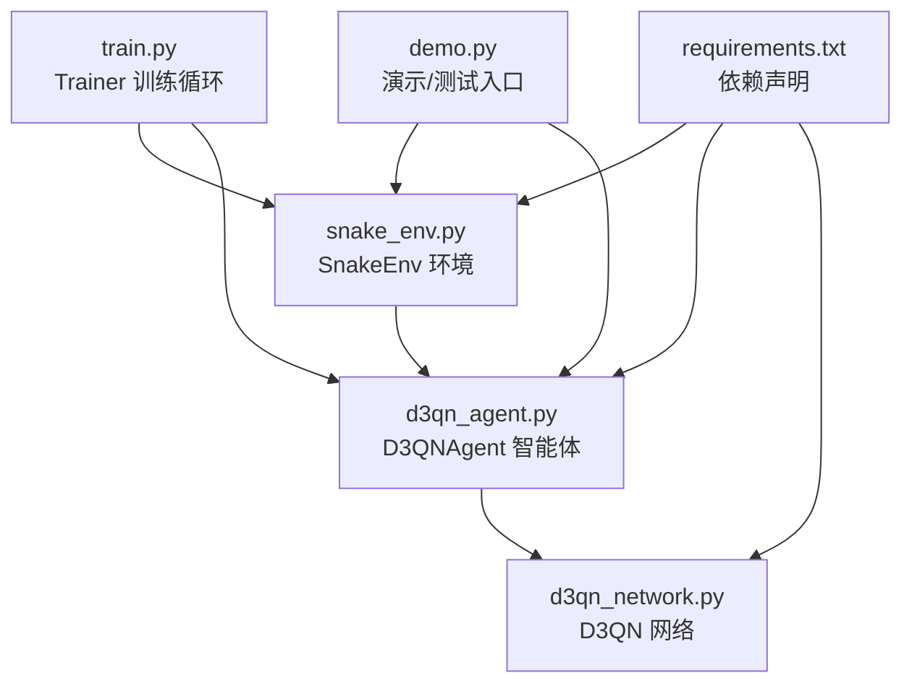
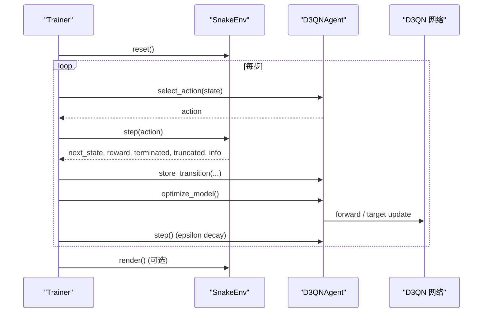
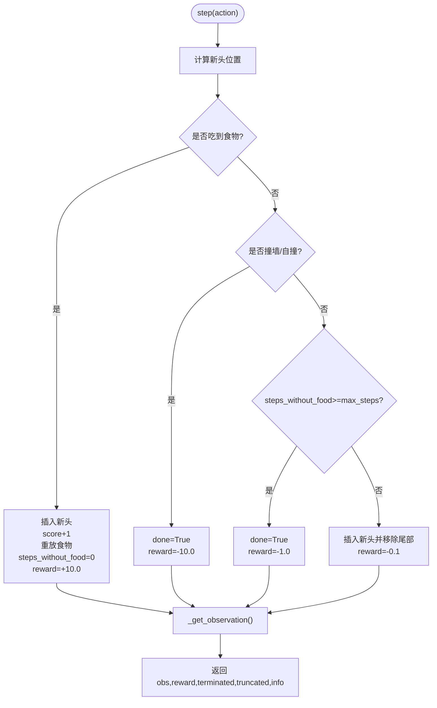
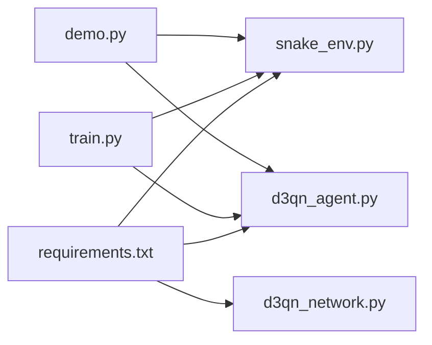

# 贪吃蛇游戏环境

<cite>
**本文引用的文件**
- [snake_env.py](file://snake_env.py)
- [README.md](file://README.md)
- [demo.py](file://demo.py)
- [train.py](file://train.py)
- [d3qn_agent.py](file://d3qn_agent.py)
- [d3qn_network.py](file://d3qn_network.py)
- [requirements.txt](file://requirements.txt)
</cite>

## 目录
1. [简介](#简介)
2. [项目结构](#项目结构)
3. [核心组件](#核心组件)
4. [架构总览](#架构总览)
5. [详细组件分析](#详细组件分析)
6. [依赖关系分析](#依赖关系分析)
7. [性能考量](#性能考量)
8. [故障排查指南](#故障排查指南)
9. [结论](#结论)
10. [附录：使用示例与测试](#附录使用示例与测试)

## 简介
本技术文档聚焦于贪吃蛇游戏环境的实现，围绕 SnakeEnv 类展开，系统阐述环境初始化、状态管理、动作执行、奖励计算、观察空间设计（9维向量与可选网格状态）、碰撞检测、食物生成、游戏结束条件以及 Pygame 可视化渲染。同时说明该环境与 Gymnasium 接口的兼容性，并给出训练与测试的使用路径。

## 项目结构
仓库包含自定义的 Gymnasium 环境、D3QN 智能体与网络、训练脚本与演示脚本，以及依赖声明。整体组织清晰，便于独立运行环境测试或端到端训练。

图表来源
- [snake_env.py:12-101](file://snake_env.py#L12-L101)
- [d3qn_agent.py:17-139](file://d3qn_agent.py#L17-L139)
- [d3qn_network.py:10-90](file://d3qn_network.py#L10-L90)
- [train.py:14-78](file://train.py#L14-L78)
- [demo.py:11-65](file://demo.py#L11-L65)
- [requirements.txt:1-15](file://requirements.txt#L1-L15)

章节来源
- [README.md:17-31](file://README.md#L17-L31)
- [requirements.txt:1-15](file://requirements.txt#L1-L15)

## 核心组件
- SnakeEnv：基于 Gymnasium 的贪吃蛇环境，提供 reset/step/render/close 接口，定义观察空间、动作空间、奖励函数与渲染逻辑。
- D3QNAgent：实现 D3QN（双深度 Q 网络 + Dueling 架构）的智能体，负责动作选择、经验回放、目标网络更新与模型优化。
- D3QN：神经网络模块，采用卷积特征提取与价值/优势双流聚合输出 Q 值。
- Trainer：训练主循环，管理 episode 流程、指标记录、模型保存与收敛判断。
- Demo：交互式演示，支持随机游玩与加载已训练模型进行推理。

章节来源
- [snake_env.py:12-101](file://snake_env.py#L12-L101)
- [d3qn_agent.py:17-139](file://d3qn_agent.py#L17-L139)
- [d3qn_network.py:10-90](file://d3qn_network.py#L10-L90)
- [train.py:14-78](file://train.py#L14-L78)
- [demo.py:11-65](file://demo.py#L11-L65)

## 架构总览
下图展示了训练时各组件的交互顺序与环境调用关系。

图表来源
- [train.py:39-78](file://train.py#L39-L78)
- [d3qn_agent.py:56-139](file://d3qn_agent.py#L56-L139)
- [snake_env.py:43-101](file://snake_env.py#L43-L101)

## 详细组件分析

### SnakeEnv 环境设计与实现
- 初始化
  - 网格大小 grid_size 可配置；默认 20。
  - 观察空间 observation_space：
    - vision 模式：9 维浮点向量（8 方向障碍距离信息 + 1 维食物相对方向）。
    - state 模式：grid_size × grid_size 整型网格（0 空位、1 蛇身、2 食物），用于全图观测。
  - 动作空间 action_space：离散 4 个动作（上、下、左、右）。
  - 方向映射：将动作索引映射为二维位移向量。
  - 调用 reset 完成初始状态设置。

- 状态管理
  - snake：列表存储蛇身坐标，头部在首元素。
  - food：食物位置。
  - score：累计得分（吃到食物次数）。
  - steps_without_food：未吃到食物的步数，用于超时判定。
  - max_steps：最大步数 = grid_size × grid_size。

- 动作执行与奖励机制
  - 根据动作移动蛇头；若新头不在食物位置则增加未吃食物步数。
  - 碰撞检测：
    - 撞墙：done=True，reward=-10.0。
    - 撞自身：done=True，reward=-10.0。
    - 超时：steps_without_food >= max_steps，done=True，reward=-1.0。
  - 吃到食物：插入新头、score+1、重新放置食物、重置未吃食物步数、reward=+10.0。
  - 正常移动：插入新头并移除尾部，reward=-0.1（鼓励更快找到食物）。
  - 返回：next_observation、reward、terminated、truncated=False、info。

- 观察空间编码
  - 8 方向探测：从蛇头沿 8 个方向扫描，遇到墙壁或蛇身即停止，记录负的距离值；否则为 0。
  - 第 9 维：食物相对于蛇头的方向编码，按 x 轴比较，上方为负、下方为正（代码中仅对 x 维度做正负标记）。
  - 可选 state 观察：返回完整网格矩阵（0/1/2），便于全局策略学习。

- 食物生成算法
  - 随机在网格内采样位置，直到不与蛇身重叠为止。

- 游戏结束条件
  - 撞墙、撞自身、超时均导致 done=True。
  - 返回 terminated/truncated 以兼容 Gymnasium v0.29+ 的双终止语义。

- 可视化渲染（Pygame）
  - 首次 human 模式渲染时初始化 pygame 窗口、时钟、字体。
  - 绘制网格线、蛇身（头部亮绿、身体深绿）、食物（红色方块）、分数与步数文本。
  - 控制帧率约 20 FPS。
  - close 方法释放 pygame 资源。

图表来源
- [snake_env.py:58-101](file://snake_env.py#L58-L101)
- [snake_env.py:103-158](file://snake_env.py#L103-L158)

章节来源
- [snake_env.py:15-41](file://snake_env.py#L15-L41)
- [snake_env.py:43-101](file://snake_env.py#L43-L101)
- [snake_env.py:103-158](file://snake_env.py#L103-L158)
- [snake_env.py:160-209](file://snake_env.py#L160-L209)

### 观察空间与动作空间
- 观察空间
  - vision：9 维向量，前 8 维表示 8 方向的障碍距离（负值表示障碍，正值无含义），第 9 维表示食物相对方向（x 轴方向的正负）。
  - state：grid_size × grid_size 的整型矩阵，值为 0/1/2。
- 动作空间
  - Discrete(4)，分别对应上、下、左、右。

章节来源
- [snake_env.py:20-31](file://snake_env.py#L20-L31)
- [snake_env.py:111-158](file://snake_env.py#L111-L158)

### 奖励机制与游戏结束
- 奖励
  - 吃到食物：+10.0
  - 撞墙/撞自身：-10.0
  - 每步惩罚：-0.1
  - 超时惩罚：-1.0
- 结束条件
  - 撞墙、撞自身、超时均触发 done。
  - 返回 terminated/truncated 以符合 Gymnasium 规范。

章节来源
- [snake_env.py:58-101](file://snake_env.py#L58-L101)

### 碰撞检测与食物生成
- 碰撞检测
  - 边界检查：新头坐标是否在 [0, grid_size) 范围内。
  - 自身碰撞：新头是否在 snake[:-1] 中。
- 食物生成
  - 随机采样直至不与蛇身重叠。

章节来源
- [snake_env.py:70-109](file://snake_env.py#L70-L109)

### 可视化渲染系统（Pygame）
- 初始化：首次渲染时创建窗口、时钟、字体。
- 绘制内容：网格线、蛇身、食物、分数与步数。
- 帧率控制：约 20 FPS。
- 资源释放：close 方法关闭 pygame。

章节来源
- [snake_env.py:160-209](file://snake_env.py#L160-L209)

### 与 Gymnasium 接口的兼容性
- 继承 gym.Env，暴露标准接口：reset、step、render、close。
- 返回格式：obs, reward, terminated, truncated, info，符合 Gymnasium v0.29+ 规范。
- 观察/动作空间通过 spaces.Box/Discrete 定义，便于与 RL 库集成。

章节来源
- [snake_env.py:6-31](file://snake_env.py#L6-L31)
- [snake_env.py:43-101](file://snake_env.py#L43-L101)

### D3QN 智能体与网络（简要）
- 智能体
  - 动作选择：epsilon-greedy，训练时探索，推理时利用。
  - 经验回放：固定容量队列，批量采样训练。
  - 目标网络：定期复制策略网络参数以稳定训练。
  - 优化：Double DQN 目标计算，MSE 损失，梯度裁剪。
- 网络
  - 输入：9 维向量，经一维卷积与批归一化提取特征。
  - 双流：Value 流输出 V(s)，Advantage 流输出 A(s,a)。
  - 聚合：Q(s,a) = V(s) + (A(s,a) - mean(A))。

章节来源
- [d3qn_agent.py:17-139](file://d3qn_agent.py#L17-L139)
- [d3qn_network.py:10-90](file://d3qn_network.py#L10-L90)

## 依赖关系分析
- 环境依赖
  - gymnasium：提供 Env 基类与空间定义。
  - numpy：数值计算与随机采样。
  - pygame：可视化渲染。
- 智能体与网络依赖
  - torch：深度学习框架与自动微分。
  - matplotlib：训练曲线绘图（训练脚本）。
- 耦合性
  - Trainer 强依赖 SnakeEnv 与 D3QNAgent。
  - D3QNAgent 依赖 D3QN 网络。
  - demo.py 作为上层入口，组合环境与智能体进行演示。

图表来源
- [requirements.txt:1-15](file://requirements.txt#L1-L15)
- [train.py:1-12](file://train.py#L1-L12)
- [demo.py:1-9](file://demo.py#L1-L9)

章节来源
- [requirements.txt:1-15](file://requirements.txt#L1-L15)
- [train.py:1-12](file://train.py#L1-L12)
- [demo.py:1-9](file://demo.py#L1-L9)

## 性能考量
- 观察计算复杂度
  - 每个 step 的 _get_observation 需对 8 个方向逐格扫描，最坏 O(grid_size) 每方向，总体 O(8·grid_size)。
- 渲染开销
  - Pygame 渲染在每次 step 调用时会刷新画面，建议训练时关闭渲染以提升速度。
- 训练效率
  - 适当增大 batch_size 可提升梯度稳定性。
  - 减少 grid_size 可缩短单局时长，加速探索。
  - 合理设置 epsilon 衰减，避免过早收敛到次优策略。

[本节为通用指导，不直接分析具体文件]

## 故障排查指南
- 训练过慢
  - 关闭渲染：在训练脚本中避免频繁调用 render。
  - 降低网格尺寸或调整超参（batch_size、epsilon_decay）。
- CUDA 内存不足
  - 减小 batch_size。
- 游戏无法启动
  - 确认已安装 pygame，并关闭残留的 pygame 窗口。
- 智能体不学习
  - 检查 epsilon 是否过快衰减。
  - 确保经验回放缓冲区足够大且采样有效。

章节来源
- [README.md:232-249](file://README.md#L232-L249)

## 结论
SnakeEnv 提供了简洁而完整的贪吃蛇环境，遵循 Gymnasium 接口，具备灵活的观察空间（局部视觉与全局网格）、明确的奖励信号与碰撞检测逻辑，并通过 Pygame 实现了直观的可视化。结合 D3QN 智能体与训练脚本，可实现端到端的强化学习训练与评估。对于扩展与定制，建议在保持接口一致的前提下调整观察编码、奖励权重与网络结构。

## 附录：使用示例与测试
- 环境自测
  - 运行 snake_env.py 的 main 块，随机动作驱动游戏并渲染。
- 训练
  - 运行 train.py，默认训练 5000 回合，定期保存模型并绘制训练曲线。
- 演示
  - 运行 demo.py，可选择测试已训练模型或随机游玩。

章节来源
- [snake_env.py:211-239](file://snake_env.py#L211-L239)
- [train.py:237-250](file://train.py#L237-L250)
- [demo.py:135-158](file://demo.py#L135-L158)