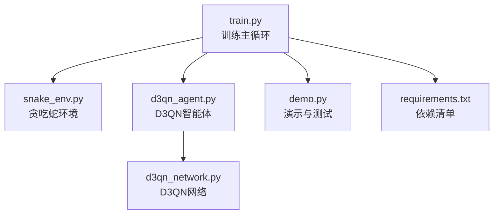
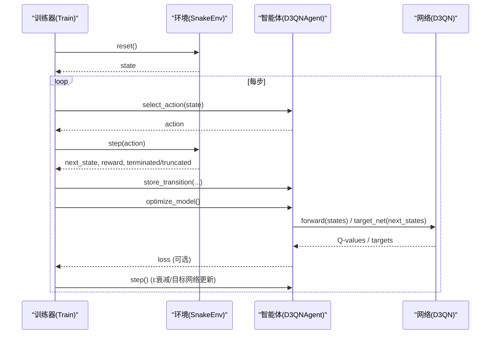
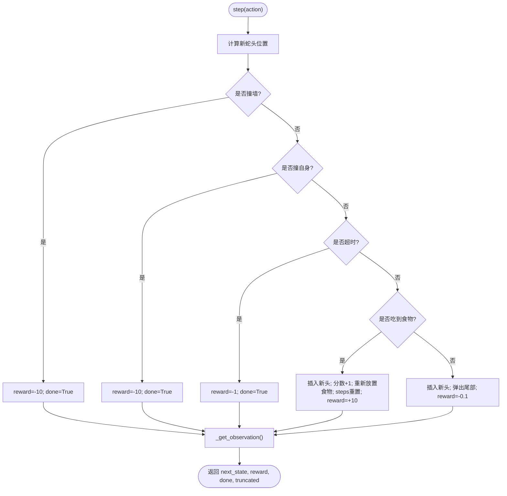
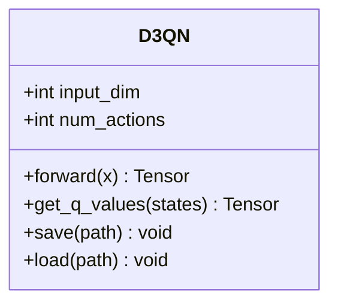
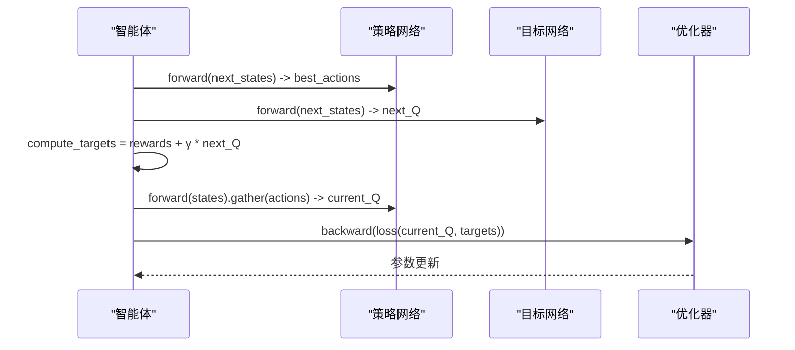
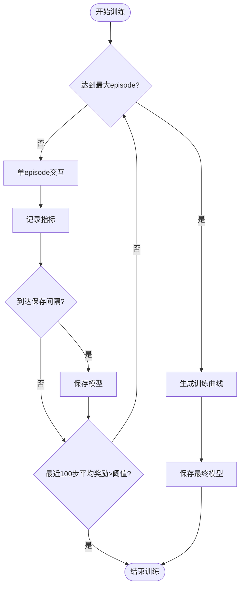
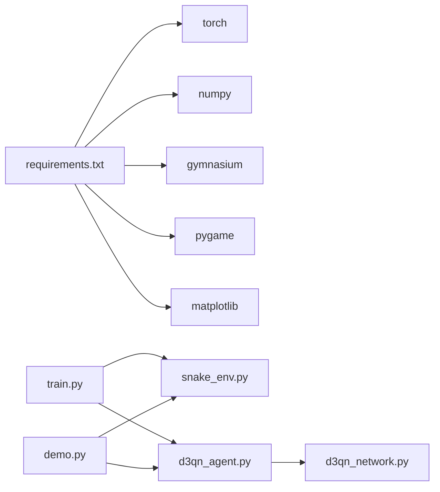

# 项目概述

<cite>
**本文引用的文件**
- [README.md](file://README.md)
- [snake_env.py](file://snake_env.py)
- [d3qn_network.py](file://d3qn_network.py)
- [d3qn_agent.py](file://d3qn_agent.py)
- [train.py](file://train.py)
- [demo.py](file://demo.py)
- [requirements.txt](file://requirements.txt)
</cite>

## 目录
1. [简介](#简介)
2. [项目结构](#项目结构)
3. [核心组件](#核心组件)
4. [架构总览](#架构总览)
5. [详细组件分析](#详细组件分析)
6. [依赖关系分析](#依赖关系分析)
7. [性能与训练建议](#性能与训练建议)
8. [故障排查指南](#故障排查指南)
9. [结论](#结论)
10. [附录：快速开始](#附录快速开始)

## 简介
本项目实现了一个基于 D3QN（Dueling Double Deep Q-Network）的贪吃蛇AI训练系统。系统通过自定义 Gymnasium 环境提供游戏交互，使用 PyTorch 构建并训练神经网络，结合经验回放、目标网络与 Dueling/Double DQN 技术，使智能体在视觉化环境中学习高效寻食与避障策略。项目同时提供训练脚本与演示脚本，支持模型保存/加载、训练曲线可视化与交互式测试。

## 项目结构
仓库采用按功能模块划分的扁平结构，核心文件职责清晰：
- snake_env.py：自定义 Gymnasium 贪吃蛇环境，包含状态空间、动作空间、奖励函数与渲染逻辑
- d3qn_network.py：D3QN 网络定义，包含共享特征提取层与 Dueling 分支（价值流与优势流）
- d3qn_agent.py：D3QN 智能体，封装选择动作、经验回放、目标网络更新与优化步骤
- train.py：训练主循环，负责调度环境交互、指标记录、模型保存与收敛判断
- demo.py：演示与测试入口，支持已训练模型运行、随机游玩与网络对比
- requirements.txt：依赖声明（PyTorch、NumPy、Gymnasium、Pygame、Matplotlib）
- README.md：项目说明、快速开始、配置与排错

图表来源
- [train.py:14-25](file://train.py#L14-L25)
- [snake_env.py:12-41](file://snake_env.py#L12-L41)
- [d3qn_agent.py:17-55](file://d3qn_agent.py#L17-L55)
- [d3qn_network.py:10-56](file://d3qn_network.py#L10-L56)
- [requirements.txt:1-15](file://requirements.txt#L1-L15)

章节来源
- [README.md:17-31](file://README.md#L17-L31)
- [train.py:14-38](file://train.py#L14-L38)
- [snake_env.py:12-41](file://snake_env.py#L12-L41)
- [d3qn_agent.py:17-55](file://d3qn_agent.py#L17-L55)
- [d3qn_network.py:10-56](file://d3qn_network.py#L10-L56)
- [requirements.txt:1-15](file://requirements.txt#L1-L15)

## 核心组件
- 贪吃蛇环境（SnakeEnv）
  - 观察空间：支持“视觉型”9维向量（8方向障碍距离编码 + 食物方向）或“全网格”状态
  - 动作空间：离散上/下/左/右
  - 奖励设计：吃到食物+10，碰撞-10，每步小惩罚-0.1，超时-1
  - 渲染：Pygame 实时绘制网格、蛇身、食物与分数
- D3QN 网络（D3QN）
  - 共享卷积特征提取层 + 全连接共享层
  - Dueling 双分支：价值流 V(s) 与优势流 A(s,a)，聚合为 Q(s,a)=V(s)+(A(s,a)-mean(A))
- D3QN 智能体（D3QNAgent）
  - 策略网络与目标网络，Adam 优化器，MSE 损失
  - 经验回放缓冲（deque），批量采样训练
  - ε-greedy 探索率衰减，周期性目标网络同步
  - 模型保存/加载（含ε、步数、参数与优化器状态）
- 训练器（Trainer）
  - 训练循环：episode 级交互、记录指标、定期保存模型、收敛判定
  - 可视化：训练曲线（奖励、得分、损失、ε衰减）
- 演示脚本（demo.py）
  - 加载已训练模型进行无探索推理
  - 随机游玩以验证环境
  - 不同网络结构对比

章节来源
- [snake_env.py:12-158](file://snake_env.py#L12-L158)
- [d3qn_network.py:10-90](file://d3qn_network.py#L10-L90)
- [d3qn_agent.py:17-157](file://d3qn_agent.py#L17-L157)
- [train.py:14-215](file://train.py#L14-L215)
- [demo.py:11-158](file://demo.py#L11-L158)

## 架构总览
下图展示了从训练主循环到环境、智能体与网络的调用关系，以及数据流向（状态、动作、奖励、下一状态、终止信号）。

图表来源
- [train.py:39-78](file://train.py#L39-L78)
- [d3qn_agent.py:56-139](file://d3qn_agent.py#L56-L139)
- [d3qn_network.py:58-90](file://d3qn_network.py#L58-L90)
- [snake_env.py:43-101](file://snake_env.py#L43-L101)

## 详细组件分析

### 贪吃蛇环境（SnakeEnv）
- 观察生成：基于头部周围8个方向的障碍检测（墙/身体）与食物相对方向编码，形成9维向量
- 动作执行：根据动作更新蛇头位置，处理碰撞、超时与吃食物逻辑
- 奖励机制：正向强化（吃食物）、负向约束（碰撞/超时）、速度鼓励（每步小惩罚）
- 渲染与关闭：Pygame 初始化窗口、绘制网格/蛇/食物/分数，支持退出清理

图表来源
- [snake_env.py:58-101](file://snake_env.py#L58-L101)
- [snake_env.py:111-158](file://snake_env.py#L111-L158)

章节来源
- [snake_env.py:12-158](file://snake_env.py#L12-L158)

### D3QN 网络（D3QN）
- 输入：9维观察向量，经一维卷积与批归一化提取特征
- 共享层：全连接层 + ReLU + Dropout
- Dueling 分支：
  - 价值流 V(s)：输出标量状态价值
  - 优势流 A(s,a)：输出各动作的优势值
- 聚合：Q(s,a) = V(s) + (A(s,a) - mean(A))，稳定训练并分离价值与优势估计

图表来源
- [d3qn_network.py:10-90](file://d3qn_network.py#L10-L90)

章节来源
- [d3qn_network.py:10-106](file://d3qn_network.py#L10-L106)

### D3QN 智能体（D3QNAgent）
- 策略选择：ε-greedy，训练时按概率随机探索，推理时取最优动作
- 经验回放：deque 缓冲，批量采样用于训练
- 优化流程（Double DQN）：
  - 用策略网络选择下一状态的最优动作
  - 用目标网络评估该动作的 Q 值
  - 计算目标值并最小化 MSE 损失
  - 梯度裁剪与 Adam 更新
- 目标网络更新：每隔固定步数复制策略网络参数
- 模型持久化：保存/加载网络参数、优化器状态、ε与步数

图表来源
- [d3qn_agent.py:56-139](file://d3qn_agent.py#L56-L139)

章节来源
- [d3qn_agent.py:17-157](file://d3qn_agent.py#L17-L157)

### 训练器（Trainer）
- 训练循环：每个 episode 内逐步交互、存储转移、优化模型、更新ε与目标网络
- 指标记录：奖励、得分、损失、ε轨迹；移动平均平滑
- 收敛判定：最近100个episode的平均奖励超过阈值则提前结束
- 模型保存：按间隔保存检查点；最终保存完整模型
- 可视化：生成训练曲线图（奖励、得分、损失、ε衰减）

图表来源
- [train.py:39-215](file://train.py#L39-L215)

章节来源
- [train.py:14-215](file://train.py#L14-L215)

### 演示与测试（demo.py）
- 加载已训练模型进行推理（关闭探索）
- 随机游玩以验证环境与渲染
- 网络结构对比（参数量、输出形状）

章节来源
- [demo.py:11-158](file://demo.py#L11-L158)

## 依赖关系分析
- 运行时依赖
  - PyTorch：张量运算与神经网络
  - NumPy：数值计算与数组操作
  - Gymnasium：标准化环境接口
  - Pygame：图形渲染与交互
  - Matplotlib：训练曲线可视化
- 模块耦合
  - train.py 依赖 SnakeEnv 与 D3QNAgent
  - D3QNAgent 依赖 D3QN 网络
  - demo.py 复用 SnakeEnv 与 D3QNAgent
  - 所有模块均遵循轻量、单一职责原则，便于扩展与替换

图表来源
- [requirements.txt:1-15](file://requirements.txt#L1-L15)
- [train.py:6-11](file://train.py#L6-L11)
- [d3qn_agent.py:6-11](file://d3qn_agent.py#L6-L11)
- [demo.py:6-8](file://demo.py#L6-L8)

章节来源
- [requirements.txt:1-15](file://requirements.txt#L1-L15)
- [train.py:6-11](file://train.py#L6-L11)
- [d3qn_agent.py:6-11](file://d3qn_agent.py#L6-L11)
- [demo.py:6-8](file://demo.py#L6-L8)

## 性能与训练建议
- 加速训练
  - 减少 n_episodes 至 1000-2000 以快速验证
  - 启用 GPU（自动检测）
  - 增大 batch_size 提升梯度稳定性
- 提升表现
  - 延长训练时长（10000+ episodes）
  - 调整 ε 衰减速率以获得更好最终性能
  - 减小网格尺寸（如 15）缩短单局时间
- 可视化
  - 设置 log_interval=1 可逐帧渲染（较慢但直观）
  - 观察 ε 从 1.0 衰减至 0.05 的过程
  - 关注智能体开始稳定吃食物的阶段

[本节为通用指导，不直接分析具体代码文件]

## 故障排查指南
- CUDA 内存不足：降低 batch_size
- 训练收敛过慢：确认 GPU 使用、增大 batch size、减小网格大小
- 智能体不学习：检查渲染是否拖慢训练、尝试关闭渲染、检查 ε 衰减过快
- 游戏无法启动：确保安装 pygame，关闭残留的 pygame 窗口

章节来源
- [README.md:232-249](file://README.md#L232-L249)

## 结论
本项目以清晰的模块化设计实现了 D3QN 在贪吃蛇游戏中的端到端训练与演示。通过 Dueling 与 Double DQN 的结合，系统在稳定性与学习效率方面具备良好表现；配合经验回放、目标网络与可视化，既适合初学者理解深度强化学习流程，也为有经验的开发者提供了可扩展的技术基础。

[本节为总结性内容，不直接分析具体代码文件]

## 附录：快速开始
- 安装依赖
  - 使用 pip 安装 requirements.txt 中的依赖
- 启动训练
  - 运行训练脚本，默认训练若干 episode，定期保存模型并生成训练曲线
- 测试已训练模型
  - 运行演示脚本，选择测试已训练模型选项，观看智能体游玩
- 随机游玩
  - 运行演示脚本，选择随机游玩以验证环境与渲染

章节来源
- [README.md:33-74](file://README.md#L33-L74)
- [train.py:237-245](file://train.py#L237-L245)
- [demo.py:135-158](file://demo.py#L135-L158)
- [requirements.txt:1-15](file://requirements.txt#L1-L15)