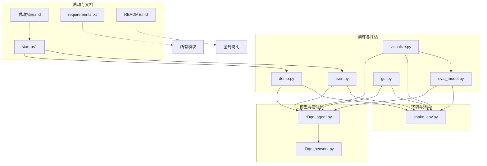
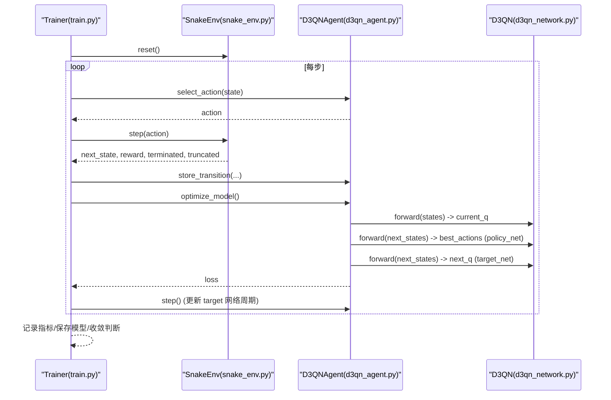
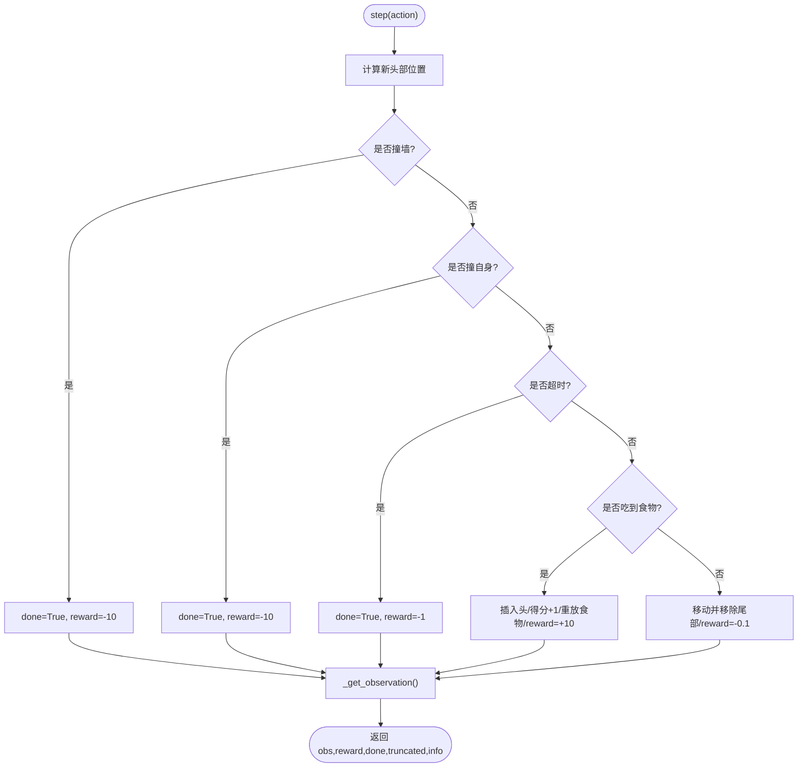
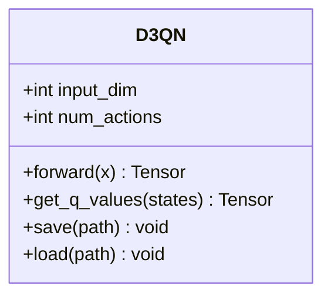
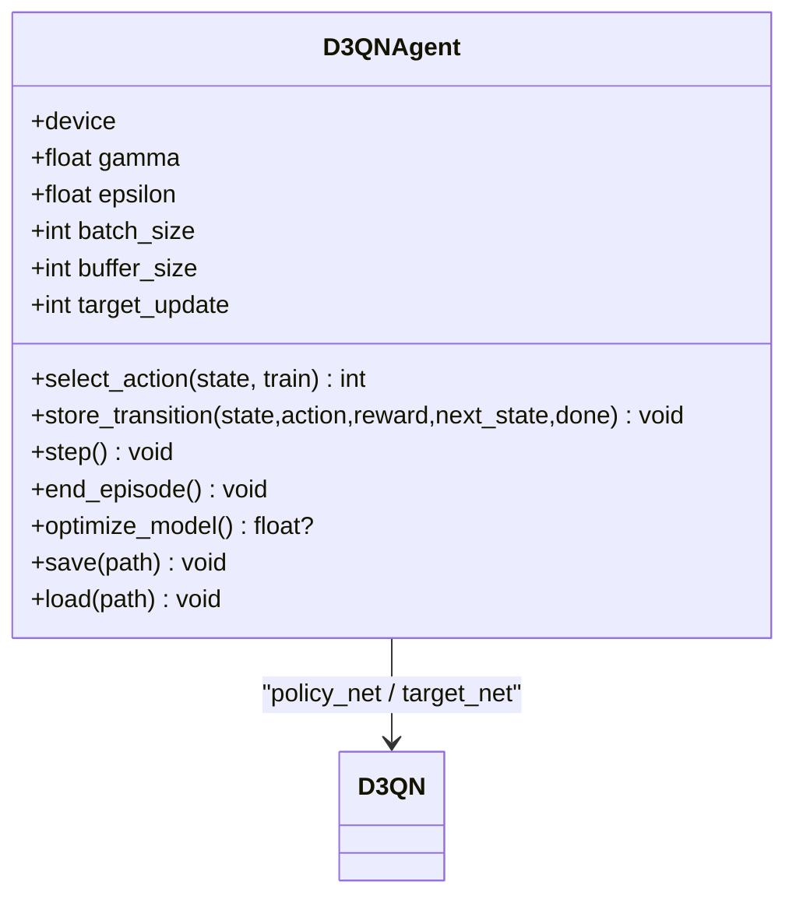
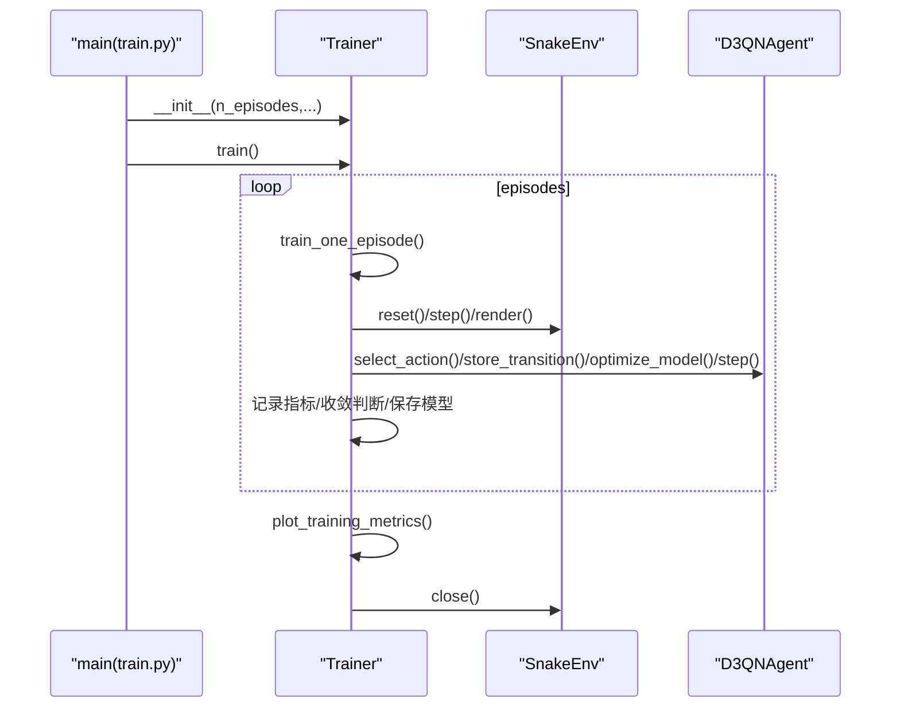
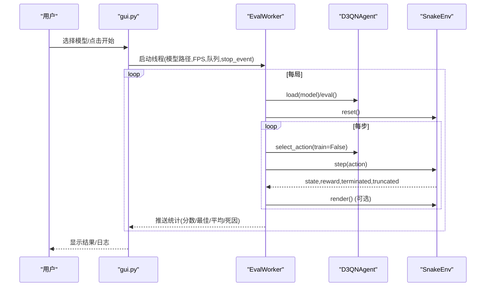
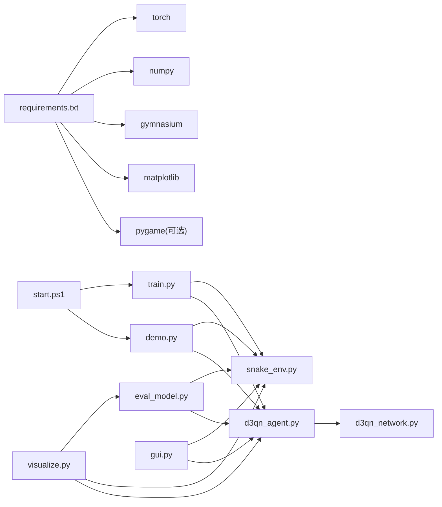

# 项目基础设施

<cite>
**本文引用的文件**
- [README.md](file://README.md)
- [requirements.txt](file://requirements.txt)
- [train.py](file://train.py)
- [d3qn_agent.py](file://d3qn_agent.py)
- [d3qn_network.py](file://d3qn_network.py)
- [snake_env.py](file://snake_env.py)
- [demo.py](file://demo.py)
- [gui.py](file://gui.py)
- [eval_model.py](file://eval_model.py)
- [visualize.py](file://visualize.py)
- [start.ps1](file://start.ps1)
- [启动指南.md](file://启动指南.md)
</cite>

## 目录
1. [简介](#简介)
2. [项目结构](#项目结构)
3. [核心组件](#核心组件)
4. [架构总览](#架构总览)
5. [详细组件分析](#详细组件分析)
6. [依赖关系分析](#依赖关系分析)
7. [性能与资源特性](#性能与资源特性)
8. [故障排查指南](#故障排查指南)
9. [结论](#结论)
10. [附录：快速上手与配置](#附录快速上手与配置)

## 简介
本项目实现了一个基于 D3QN（Dueling Double Deep Q-Network）的蛇游戏强化学习训练系统。系统包含自定义 Gym 环境、D3QN 网络与智能体、训练主循环、可视化与评估工具，以及跨平台的启动脚本与中文启动指南。整体设计强调可复现实验、断点续训、实时可视化与模型持久化。

## 项目结构
仓库采用“按功能模块组织”的结构：环境与渲染、网络与智能体、训练流程、演示与评估、可视化工具、启动脚本与文档。关键入口包括训练脚本、演示脚本、GUI 验证控制台、评估脚本与可视化报告生成器。

图表来源
- [train.py:29-78](file://train.py#L29-L78)
- [d3qn_agent.py:17-55](file://d3qn_agent.py#L17-L55)
- [d3qn_network.py:10-90](file://d3qn_network.py#L10-L90)
- [snake_env.py:12-102](file://snake_env.py#L12-L102)
- [eval_model.py:27-81](file://eval_model.py#L27-L81)
- [demo.py:11-66](file://demo.py#L11-L66)
- [gui.py:64-127](file://gui.py#L64-L127)
- [visualize.py:45-155](file://visualize.py#L45-L155)
- [start.ps1:58-74](file://start.ps1#L58-L74)
- [requirements.txt:1-15](file://requirements.txt#L1-L15)
- [README.md:17-31](file://README.md#L17-L31)

章节来源
- [README.md:17-31](file://README.md#L17-L31)
- [requirements.txt:1-15](file://requirements.txt#L1-L15)

## 核心组件
- 环境 SnakeEnv：提供离散动作空间与观测空间（视觉型或状态型），实现碰撞检测、奖励机制、渲染与窗口关闭信号。
- 网络 D3QN：卷积特征提取 + 共享全连接层 + Dueling 双分支（价值流 V(s) 与优势流 A(s,a)），输出 Q(s,a)。
- 智能体 D3QNAgent：封装策略选择（ε-greedy）、经验回放、Double DQN 目标更新、优化与检查点保存/加载。
- 训练器 Trainer：管理训练循环、指标记录、收敛判定、模型保存、可视化与中断处理。
- 评估与演示：eval_model.py 提供批量贪心评估与随机基线对比；demo.py 提供交互式演示；gui.py 提供 Tkinter 验证控制台。
- 可视化 visualize.py：从训练日志解析曲线并叠加评估结果，生成综合报告图。
- 启动脚本 start.ps1：自动检测虚拟环境、安装依赖、启动训练或演示。

章节来源
- [snake_env.py:12-102](file://snake_env.py#L12-L102)
- [d3qn_network.py:10-90](file://d3qn_network.py#L10-L90)
- [d3qn_agent.py:17-162](file://d3qn_agent.py#L17-L162)
- [train.py:29-320](file://train.py#L29-L320)
- [eval_model.py:27-165](file://eval_model.py#L27-L165)
- [demo.py:11-158](file://demo.py#L11-L158)
- [gui.py:64-350](file://gui.py#L64-L350)
- [visualize.py:45-155](file://visualize.py#L45-L155)
- [start.ps1:58-74](file://start.ps1#L58-L74)

## 架构总览
下图展示了训练期的数据与控制流：Trainer 驱动环境步进，Agent 选择动作并存储转移，随后采样批次进行 Double DQN 更新；网络使用 Dueling 结构输出 Q 值。

图表来源
- [train.py:79-123](file://train.py#L79-L123)
- [d3qn_agent.py:56-143](file://d3qn_agent.py#L56-L143)
- [d3qn_network.py:58-90](file://d3qn_network.py#L58-L90)
- [snake_env.py:59-102](file://snake_env.py#L59-L102)

## 详细组件分析

### 环境 SnakeEnv
- 观测空间：默认视觉型 10 维向量（8 方向障碍物距离编码 + 食物相对方向）。
- 动作空间：离散上/下/左/右。
- 奖励：吃食物 +10，碰撞 -10，超时 -1，每步小惩罚 -0.1 鼓励效率。
- 渲染：pygame 绘制网格、蛇、食物、分数、步数、当前回合与 ε；关闭窗口设置 close_requested 以优雅停止训练。

图表来源
- [snake_env.py:59-102](file://snake_env.py#L59-L102)
- [snake_env.py:112-164](file://snake_env.py#L112-L164)
- [snake_env.py:166-227](file://snake_env.py#L166-L227)

章节来源
- [snake_env.py:12-227](file://snake_env.py#L12-L227)

### 网络 D3QN
- 输入：(batch, input_dim)，通过一维卷积与批归一化提取特征。
- 共享层：全连接 + ReLU + Dropout。
- Dueling 分支：价值流输出 V(s)，优势流输出 A(s,a)；聚合公式 Q = V + (A - mean(A))。
- 支持参数保存/加载。

图表来源
- [d3qn_network.py:10-106](file://d3qn_network.py#L10-L106)

章节来源
- [d3qn_network.py:10-138](file://d3qn_network.py#L10-L138)

### 智能体 D3QNAgent
- 策略：ε-greedy，训练时探索，测试时纯利用。
- 经验回放：固定容量 deque，随机采样 batch。
- 更新：Double DQN 目标值计算（policy_net 选动作，target_net 评估），MSE 损失，梯度裁剪。
- 生命周期：end_episode 衰减 ε；step 周期性同步 target 网络；save/load 检查点。

图表来源
- [d3qn_agent.py:17-162](file://d3qn_agent.py#L17-L162)

章节来源
- [d3qn_agent.py:17-223](file://d3qn_agent.py#L17-L223)

### 训练器 Trainer
- 训练循环：episode 级控制，记录 rewards/scores/losses/epsilon，定期打印与保存模型。
- 收敛判定：最近 100 回合平均奖励 > 50 则提前结束。
- 可视化：训练曲线（奖励、分数、损失、ε 衰减）保存到 training_curves.png。
- 中断：支持 Ctrl+C、关闭窗口、STOP 文件等优雅停止。

图表来源
- [train.py:29-320](file://train.py#L29-L320)

章节来源
- [train.py:29-337](file://train.py#L29-L337)

### 评估与演示
- eval_model.py：对最新或指定 checkpoint 执行 N 局贪心评估，统计分数分布与死因，并与随机基线对比。
- demo.py：交互式菜单，支持测试已训练模型、随机游玩、架构对比。
- gui.py：Tkinter 控制台，线程化评估工作进程，支持开始/停止、FPS 调节、实时统计与日志。

图表来源
- [gui.py:64-127](file://gui.py#L64-L127)
- [eval_model.py:51-81](file://eval_model.py#L51-L81)
- [demo.py:11-66](file://demo.py#L11-L66)

章节来源
- [eval_model.py:27-165](file://eval_model.py#L27-L165)
- [demo.py:11-158](file://demo.py#L11-L158)
- [gui.py:64-350](file://gui.py#L64-L350)

### 可视化 visualize.py
- 从训练日志解析每回合分数与 ε，绘制学习曲线与移动平均。
- 可选对新模型进行贪心评估，展示评估分数序列、分布与死因饼图。
- 输出综合报告图到文件。

章节来源
- [visualize.py:45-155](file://visualize.py#L45-L155)

## 依赖关系分析
- 运行时依赖：torch、numpy、gymnasium、matplotlib；pygame 用于可视化（Python 3.14 需特殊处理）。
- 模块耦合：
  - train.py 依赖 snake_env.py 与 d3qn_agent.py。
  - d3qn_agent.py 依赖 d3qn_network.py。
  - eval_model.py、demo.py、gui.py、visualize.py 均依赖 snake_env.py 与 d3qn_agent.py。
  - start.ps1 调用 train.py 与 demo.py。
- 外部集成：PyTorch 设备自动选择（CPU/GPU），Pygame 渲染窗口事件驱动训练退出。

图表来源
- [requirements.txt:1-15](file://requirements.txt#L1-L15)
- [train.py:6-13](file://train.py#L6-L13)
- [d3qn_agent.py:6-11](file://d3qn_agent.py#L6-L11)
- [d3qn_network.py:6-7](file://d3qn_network.py#L6-L7)
- [snake_env.py:6-9](file://snake_env.py#L6-L9)
- [eval_model.py:15-24](file://eval_model.py#L15-L24)
- [demo.py:6-8](file://demo.py#L6-L8)
- [gui.py:11-20](file://gui.py#L11-L20)
- [visualize.py:17-28](file://visualize.py#L17-L28)
- [start.ps1:58-74](file://start.ps1#L58-L74)

章节来源
- [requirements.txt:1-15](file://requirements.txt#L1-L15)
- [README.md:1-16](file://README.md#L1-L16)

## 性能与资源特性
- 设备选择：智能体自动检测 CUDA 可用性，优先 GPU 加速。
- 训练稳定性：
  - Target 网络周期性同步减少过估计偏差。
  - 梯度裁剪防止爆炸。
  - 经验回放缓冲提升样本效率。
- 收敛策略：最近 100 回合平均奖励阈值触发早停。
- 可视化开销：训练时可渲染，但会显著降低速度；可通过关闭渲染或使用 GUI 控制 FPS。
- 内存占用：经验回放容量可调；batch_size 影响显存与稳定性。

章节来源
- [d3qn_agent.py:27-55](file://d3qn_agent.py#L27-L55)
- [d3qn_agent.py:82-143](file://d3qn_agent.py#L82-L143)
- [train.py:268-273](file://train.py#L268-L273)
- [snake_env.py:166-227](file://snake_env.py#L166-L227)

## 故障排查指南
- 无虚拟环境：使用 start.ps1 自动创建或手动 uv venv --python 3.14。
- 依赖缺失：确保在 .venv 中安装 torch、numpy、gymnasium、matplotlib；pygame 需按指南处理。
- pygame 兼容性问题：Python 3.14 可能需要离线 wheel 或降级 Python 版本；也可暂时禁用渲染。
- 训练不收敛：检查设备是否为 GPU、增大 batch_size、减小网格尺寸、调整 ε 衰减。
- 窗口无法关闭：确保 pygame 正确 quit；必要时清理僵尸进程。
- 中断训练：Ctrl+C、关闭窗口、或在根目录放置 STOP 文件。

章节来源
- [启动指南.md:45-82](file://启动指南.md#L45-L82)
- [启动指南.md:182-221](file://启动指南.md#L182-L221)
- [train.py:254-266](file://train.py#L254-L266)
- [snake_env.py:166-227](file://snake_env.py#L166-L227)

## 结论
该项目提供了完整的 D3QN 蛇游戏训练管线，涵盖环境建模、网络设计、智能体算法、训练流程、评估与可视化，以及跨平台启动脚本与中文指南。其模块化设计与丰富的工具链便于扩展与二次开发，适合教学与实验场景。

## 附录：快速上手与配置
- 推荐方式：使用 PowerShell 脚本一键启动训练或演示。
- 依赖安装：通过 requirements.txt 或 uv pip 安装核心依赖；pygame 按指南解决。
- 训练参数：可在 train.py 中调整回合数、最大步数、日志间隔与保存间隔；智能体超参在 d3qn_agent.py 中配置。
- 模型管理：训练过程自动保存检查点到 models/，支持断点续训与评估。

章节来源
- [README.md:33-137](file://README.md#L33-L137)
- [README.md:139-162](file://README.md#L139-L162)
- [start.ps1:58-74](file://start.ps1#L58-L74)
- [requirements.txt:1-15](file://requirements.txt#L1-L15)