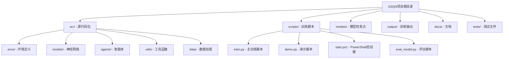
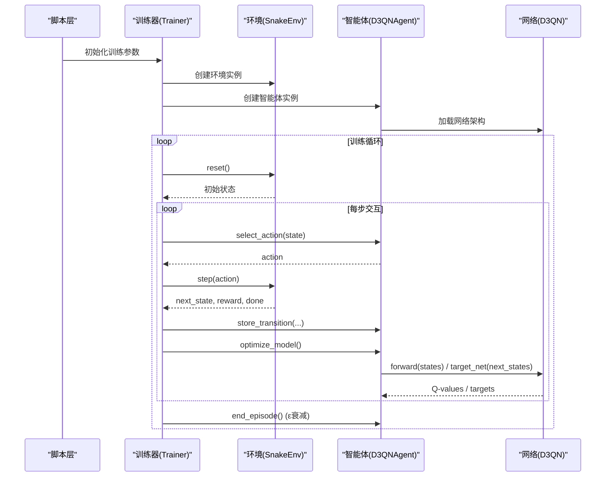
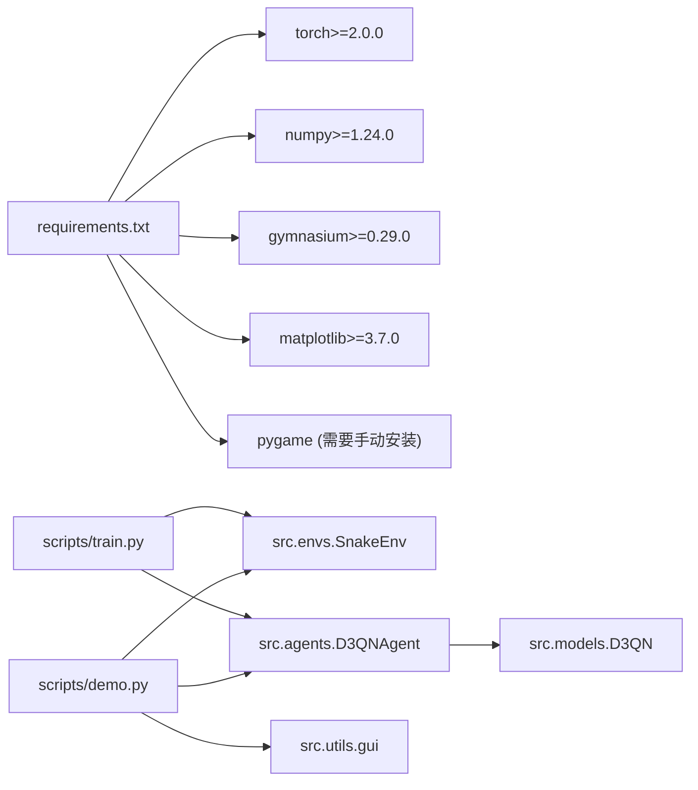

# 项目概述

<cite>
**本文引用的文件**
- [README.md](file://README.md)
- [requirements.txt](file://requirements.txt)
- [snake_env.py](file://src/envs/snake_env.py)
- [d3qn_network.py](file://src/models/d3qn_network.py)
- [d3qn_agent.py](file://src/agents/d3qn_agent.py)
- [train.py](file://scripts/train.py)
- [demo.py](file://scripts/demo.py)
- [gui.py](file://src/utils/gui.py)
- [启动指南.md](file://docs/启动指南.md)
</cite>

## 更新摘要
**变更内容**
- 项目架构从扁平文件布局重构为模块化Python包结构，核心代码迁移至src/目录
- 新增scripts/目录组织训练脚本和启动器
- 增强训练系统，支持断点续训、自动保存和可视化输出
- 更新依赖管理和环境配置说明
- 改进模块导入路径和包结构

## 目录
1. [简介](#简介)
2. [项目结构](#项目结构)
3. [核心组件](#核心组件)
4. [架构总览](#架构总览)
5. [详细组件分析](#详细组件分析)
6. [依赖关系分析](#依赖关系分析)
7. [性能与训练建议](#性能与训练建议)
8. [故障排查指南](#故障排查指南)
9. [结论](#结论)
10. [附录：快速开始](#附录快速开始)

## 简介
本项目实现了一个基于 D3QN（Dueling Double Deep Q-Network）的贪吃蛇AI训练系统。经过重大架构重构后，项目采用模块化Python包设计，将核心功能组织在src/目录下，包括环境定义、神经网络模型、智能体逻辑和工具函数。系统通过自定义 Gymnasium 环境提供游戏交互，使用 PyTorch 构建并训练神经网络，结合经验回放、目标网络与 Dueling/Double DQN 技术，使智能体在视觉化环境中学习高效寻食与避障策略。

## 项目结构
项目已重构为清晰的模块化Python包结构，主要目录组织如下：



**章节来源**
- [README.md:5-59](file://README.md#L5-L59)

## 核心组件
项目重构后的核心组件分布如下：

### 环境层（src/envs/）
- **SnakeEnv**：基于Gymnasium标准的贪吃蛇游戏环境
- 支持多种观察类型：视觉型（10维向量）、网格型（3通道图像）、状态型（完整网格）
- 内置Pygame渲染引擎，支持实时可视化

### 模型层（src/models/）
- **D3QN**：Dueling Double DQN网络架构
- **D3QNCNN**：针对网格输入的卷积神经网络变体
- 共享特征提取层 + Dueling双分支（价值流V(s)和优势流A(s,a)）

### 智能体层（src/agents/）
- **D3QNAgent**：完整的D3QN智能体实现
- 经验回放缓冲、ε-greedy探索策略、目标网络同步
- 支持n-step返回和优先级经验回放

### 工具层（src/utils/）
- **GUI界面**：Tkinter图形用户界面，用于模型验证和监控
- **可视化工具**：训练曲线生成和性能分析

**章节来源**
- [snake_env.py:12-283](file://src/envs/snake_env.py#L12-L283)
- [d3qn_network.py:10-184](file://src/models/d3qn_network.py#L10-L184)
- [d3qn_agent.py:17-264](file://src/agents/d3qn_agent.py#L17-L264)
- [gui.py:1-350](file://src/utils/gui.py#L1-L350)

## 架构总览
重构后的系统架构采用分层设计，各模块职责清晰：



**图表来源**
- [train.py:41-547](file://scripts/train.py#L41-L547)
- [d3qn_agent.py:76-184](file://src/agents/d3qn_agent.py#L76-L184)
- [snake_env.py:50-108](file://src/envs/snake_env.py#L50-L108)

## 详细组件分析

### 贪吃蛇环境（SnakeEnv）
重构后的环境类位于`src/envs/snake_env.py`，提供了三种观察模式：

- **视觉型观察**：10维向量编码（8方向障碍距离 + 食物方向）
- **网格型观察**：3通道图像（蛇身、食物、头部位置）
- **状态型观察**：完整网格状态表示

环境支持动态网格大小调整、实时渲染和事件处理。

**章节来源**
- [snake_env.py:15-190](file://src/envs/snake_env.py#L15-L190)

### D3QN网络架构
网络模块包含两个主要类：

- **D3QN**：适用于向量化输入的网络，使用一维卷积进行特征提取
- **D3QNCNN**：专为网格图像设计的卷积神经网络，支持端到端像素输入

两者都实现了Dueling架构，分离价值估计和优势估计。

**章节来源**
- [d3qn_network.py:10-152](file://src/models/d3qn_network.py#L10-L152)

### D3QN智能体
智能体实现了完整的强化学习算法流程：

- **策略选择**：ε-greedy探索策略，支持训练和推理模式切换
- **经验管理**：基于deque的经验回放缓冲，支持n-step返回
- **优化过程**：Double DQN更新规则，MSE损失函数，梯度裁剪
- **模型持久化**：完整的模型保存/加载功能，包含优化器状态

**章节来源**
- [d3qn_agent.py:17-203](file://src/agents/d3qn_agent.py#L17-L203)

### 训练系统增强
训练脚本`scripts/train.py`提供了增强的训练功能：

- **断点续训**：自动检测并加载最新检查点
- **自动保存**：定期保存最佳模型和运行记录
- **可视化输出**：自动生成训练曲线和性能报告
- **多模式支持**：支持headless模式和交互式训练

**章节来源**
- [train.py:41-547](file://scripts/train.py#L41-L547)

### GUI验证界面
新增的Tkinter GUI界面提供了直观的模型验证功能：

- **模型选择**：自动扫描可用检查点文件
- **实时监控**：显示得分、死亡原因统计等指标
- **速度控制**：可调节的游戏播放速度
- **线程安全**：后台线程执行验证，UI保持响应

**章节来源**
- [gui.py:129-350](file://src/utils/gui.py#L129-L350)

## 依赖关系分析
项目依赖经过重新组织，主要依赖关系如下：



**图表来源**
- [requirements.txt:1-15](file://requirements.txt#L1-L15)
- [train.py:14-22](file://scripts/train.py#L14-L22)
- [demo.py:10-16](file://scripts/demo.py#L10-L16)

**章节来源**
- [requirements.txt:1-15](file://requirements.txt#L1-L15)

## 性能与训练建议
基于重构后的架构，提供以下优化建议：

### 训练优化
- **GPU加速**：PyTorch自动检测CUDA设备，建议使用GPU训练
- **批量大小调整**：CNN模式建议使用更大的batch_size（128+）
- **观察类型选择**：视觉型观察训练更快，网格型观察性能更好

### 内存管理
- **经验回放缓冲**：根据任务复杂度调整buffer_size
- **模型保存策略**：合理设置save_interval避免磁盘占用过大
- **头less训练**：生产环境建议关闭实时渲染提升性能

### 超参数调优
- **ε衰减率**：CNN模式建议使用更慢的衰减（0.999）
- **学习率**：Adam优化器默认1e-4通常表现良好
- **目标网络更新频率**：1000步是合理的默认值

## 故障排查指南
针对重构后的项目结构，常见问题及解决方案：

### 导入错误
- **问题**：ModuleNotFoundError: No module named 'src'
- **解决**：确保从项目根目录运行，或正确设置PYTHONPATH

### 环境配置问题
- **问题**：pygame安装失败（Python 3.14兼容性）
- **解决**：参考启动指南中的解决方案，或使用Python 3.11

### 训练中断恢复
- **问题**：训练意外中断后无法继续
- **解决**：使用resume=True参数自动加载最新检查点

### 内存不足
- **问题**：CUDA out of memory错误
- **解决**：降低batch_size或减少网格尺寸

**章节来源**
- [启动指南.md:48-84](file://docs/启动指南.md#L48-L84)

## 结论
经过重大架构重构，D3QN贪吃蛇AI训练系统现在采用了更加模块化和专业的Python包设计。新的结构不仅提高了代码的可维护性和可扩展性，还增强了训练系统的功能特性。通过清晰的模块划分、增强的训练流程和完善的工具链，项目既适合初学者理解深度强化学习的核心概念，也为有经验的开发者提供了强大的研究和实验平台。

## 附录：快速开始

### 环境准备
项目现在支持多种启动方式：

#### 方式1：PowerShell脚本（推荐）
```powershell
cd scripts
.\start.ps1 -Train      # 开始训练
.\start.ps1 -Demo       # 运行演示
.\start.ps1 -Install    # 仅安装依赖
```

#### 方式2：批处理文件
```batch
cd scripts
.\start_training.bat    # Windows批处理启动
```

#### 方式3：直接执行
```powershell
cd scripts
python train.py         # 直接运行训练
python demo.py          # 运行演示
python eval_model.py    # 评估模型性能
```

### 配置选项
训练参数可在`scripts/train.py`中配置：

```python
trainer = Trainer(
    n_episodes=20000,           # 训练回合数
    max_steps_per_episode=1000, # 每回合最大步数
    log_interval=20,            # 日志间隔
    save_interval=100,          # 保存间隔
    render_training=False,      # 训练时渲染
    resume=True,                # 断点续训
    obs_type='grid',            # 观察类型
    n_step=3                    # n-step返回
)
```

### 输出文件
训练完成后会生成以下文件：
- `models/`：训练好的模型检查点
- `output/training_curves.png`：训练曲线可视化
- `models/run_*/`：详细的训练运行记录

**章节来源**
- [README.md:70-189](file://README.md#L70-L189)
- [启动指南.md:110-158](file://docs/启动指南.md#L110-L158)
- [train.py:529-547](file://scripts/train.py#L529-L547)